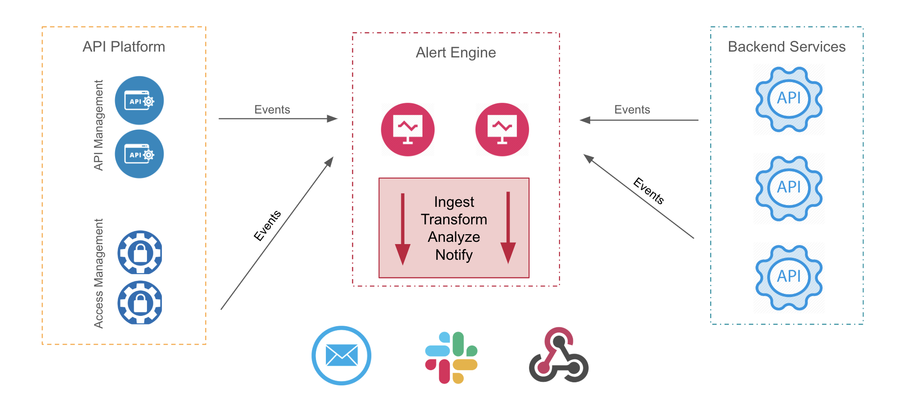

# Architecture

Gravitee Alert Engine (AE) exists as the sole component and does not require any external components or a database as it does not store anything. It receives events and sends notifications under the conditions which have been pre-configured upstream with triggers.

AE can integrate with your existing Gravitee API Management and Access Management instances to layer on intelligent API Monitoring services on top of your entire API platform. It sits between your API platform and your backend services, and can then "talk" to your various notification channels. Please see the architecture diagram below to learn more:

<figure><figcaption>
Gravitee AE architecture diagram
</figcaption></figure>
