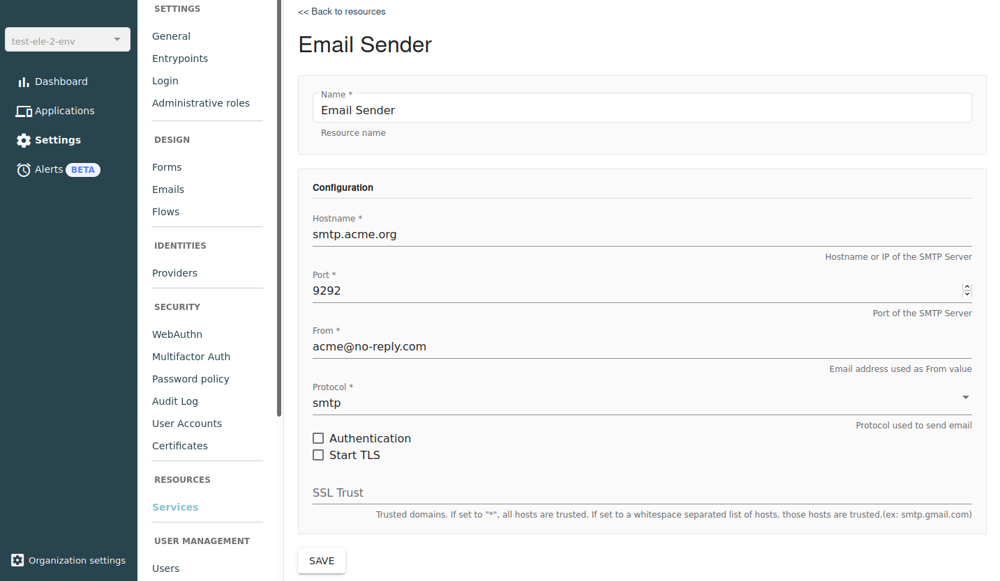

# SMTP Resource

SMTP is a resource you can use to send email over SMTP.

Once you have created your SMTP resource, you can reference it in the [Email factor configuration.](../multi-factor-authentication/factors.md#email)

To create an SMTP resource:

1. Log in to AM Console.
2. Click **Settings**.
3. In the **Resources** section, click **Services**.
4. Click "+".
5.  Select your new SMTP resource and complete the configuration form.

    <figure><figcaption>
SMTP configuration
</figcaption></figure>
