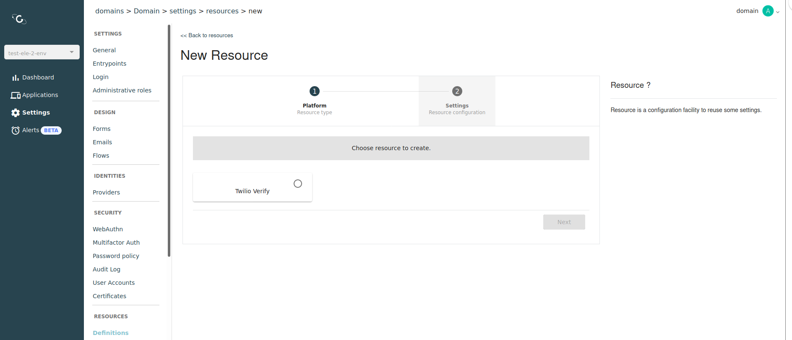
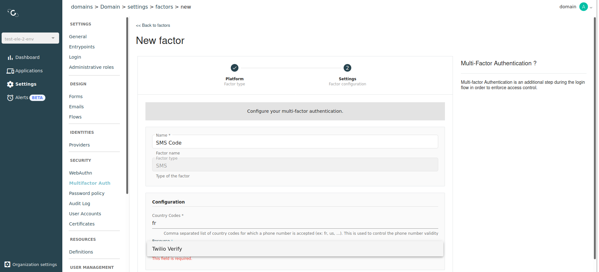

# Resources

## Overview

Resources provide a way to define reusable sets of configuration.

## Create a new resource

1. Log in to AM Console.
2. Click **Settings > Resources**.
3. Click the plus icon .
4.  Select the resource type and click **Next**.

    <figure><figcaption>
Create a new resource
</figcaption></figure>
5. Enter the resource details and click **Create**.
6.  Your resource is now available to be used in AM.

    <figure><figcaption>
Available resources
</figcaption></figure>
