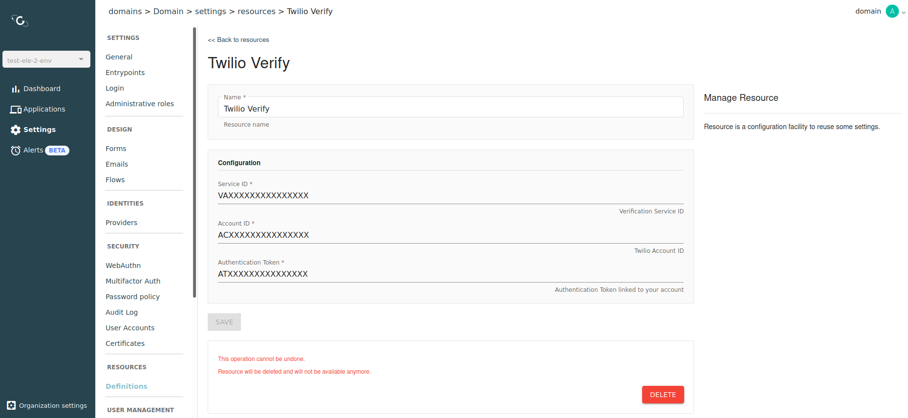

# Twilio

## Overview

Twilio Verify is a resource you can use to configure a Twilio account to use the `Twilio Verify` service for Multi-factor Authentication. Once you have created your Twilio resource, you can reference it in SMS factor configuration.

<figure><figcaption>
Twilio resource
</figcaption></figure>
