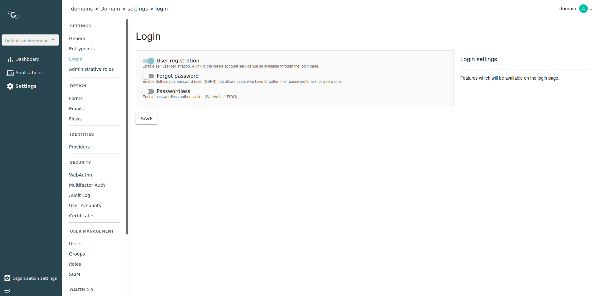
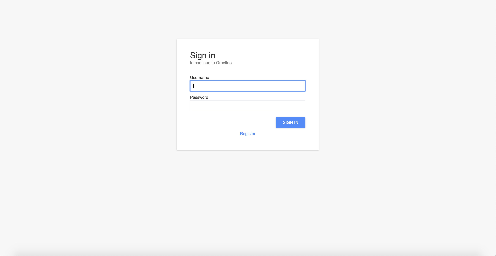
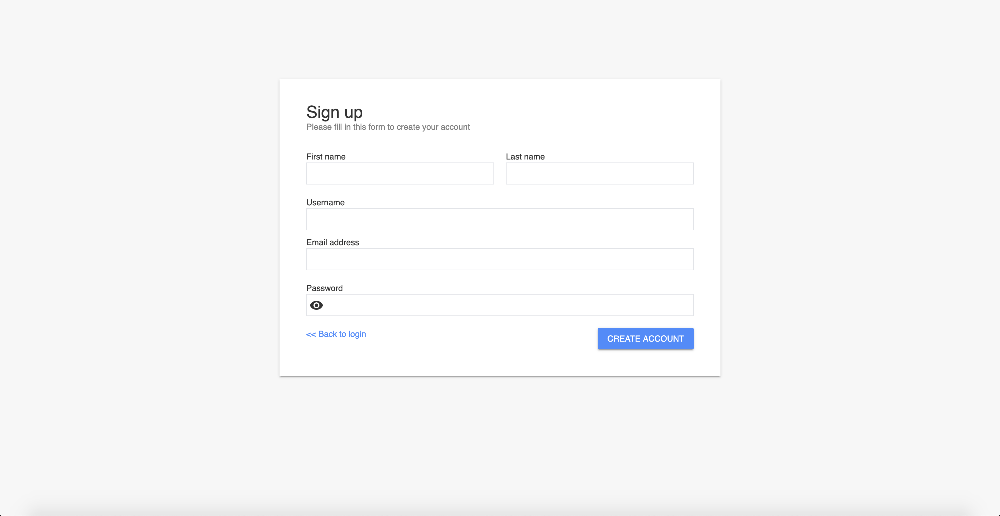

# User Registration

## Overview

AM comes with a basic user registration feature.

## Enable user registration

1. Log in to AM Console.
2.  Click **Settings > Login** and toggle on the **User registration** switch.

    <figure><figcaption>
Enable user registration
</figcaption></figure>

A new `Register` link will be available on the login form.

<figure><figcaption>
Sign in register link
</figcaption></figure>

The link will redirect the user to the registration page to create an account.

<figure><figcaption>
Create a new account
</figcaption></figure>


You can change the look and feel of the login form and registration form. See [Custom forms](../branding/README.md#custom-pages) for more information.

