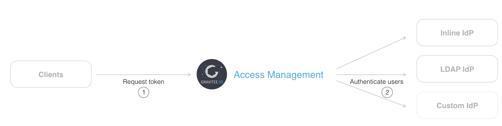

---
metaLinks:
  alternates:
    - >-
      https://app.gitbook.com/s/H4VhZJXn1S232OEmh8Wv/guides/identity-providers/create-an-identity-provider
---

# Create an Identity Provider

## Overview

This section gives a general overview of creating identity providers (IdPs). For more details on connecting your applications with specific identity provider types, see the following sections:

* [Enterprise identity providers](enterprise-identity-providers/)
* [Social identity providers](social-identity-providers/)
* [Legal identity providers](legal-identity-providers/)
* [Database identity providers](database-identity-providers/)

## Create a new identity provider

In this example, we are creating an inline identity provider.

1. Log in to AM Console.
2. Click **Settings > Providers**.
3. In the Providers page, click the plus icon .
4. Choose an **Inline** identity provider type and click **Next**.

<figure><figcaption><p>Select an Identity Provider to add</p></figcaption></figure>

5. Give your identity provider a **Name**.
6. Add as many users as required, by clicking **Add User** for each new user, then click **Create**.

<figure><figcaption></figcaption></figure>


```sh
curl -H "Authorization: Bearer :accessToken" \
     -H "Content-Type:application/json;charset=UTF-8" \
     -X POST \
     -d '{
           "external": false,
           "type": "inline-am-idp",
           "configuration": "{\"users\":[{\"firstname\":\"John\",\"lastname\":\"Doe\",\"username\":\"johndoe\",\"password\":\"johndoepassword\"}]}",
           "name": "Inline IdP"
         }' \
     http://GRAVITEEIO-AM-MGT-API-HOST/management/organizations/DEFAULT/environments/DEFAULT/domains/:securityDomainPath/identities
```


## Custom identity provider

<figure><figcaption><p>Custom IdP overview</p></figcaption></figure>

AM is designed to be extended based on a pluggable module architecture. You can develop your own identity provider using a _plugin_, and provide an authentication method to register your users so they can use AM.

## Test an identity provider

The fastest way to test your newly created identity provider is to request an OAuth2 access token, as described in [ID Token](../../getting-started/tutorial-getting-started-with-am/get-user-profile-information.md#id-token). If you successfully retrieve an access token, your identity provider is all set.
