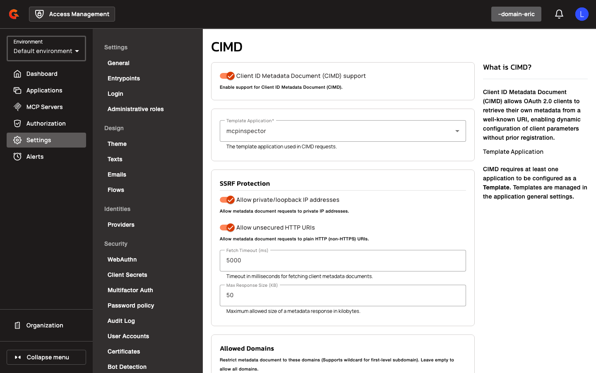

# CIMD Gateway Configuration Reference

## Gateway Configuration

### CIMD Settings

<figure><figcaption></figcaption></figure>

| Property | Description | Example |
|:---------|:------------|:--------|
| `oidc.cimdSettings.enabled` | Enable Client ID Metadata Document support | `true` |
| `oidc.cimdSettings.templateId` | Application ID of the template used for CIMD clients (required when enabled) | `app-template-123` |
| `oidc.cimdSettings.allowPrivateIpAddress` | Allow metadata document requests to private IP addresses | `false` |
| `oidc.cimdSettings.allowUnsecuredHttpUri` | Allow metadata document requests to plain HTTP URIs | `false` |
| `oidc.cimdSettings.fetchTimeoutMs` | Timeout in milliseconds for fetching client metadata documents | `3000` |
| `oidc.cimdSettings.maxResponseSizeKb` | Maximum allowed size of a metadata response in kilobytes | `20` |
| `oidc.cimdSettings.allowedDomains` | Restrict metadata document to these domains (empty = allow all; supports wildcard for first-level subdomain, e.g., `*.example.com`) | `["example.com", "*.trusted.com"]` |
| `oidc.cimdSettings.cacheTtlSeconds` | Time-to-live for cached metadata responses in seconds | `3600` |
| `oidc.cimdSettings.cacheMaxEntries` | Maximum number of entries to store in the metadata cache | `500` |
| `oidc.cimdSettings.revokeOnDocumentChange` | Revoke all tokens and consents when CIMD metadata document changes | `false` |

All numeric properties must be greater than zero. The **Template Id** must reference an existing application configured as a template. Wildcard `*` in **Allowed Domains** is only allowed for first-level subdomains.
