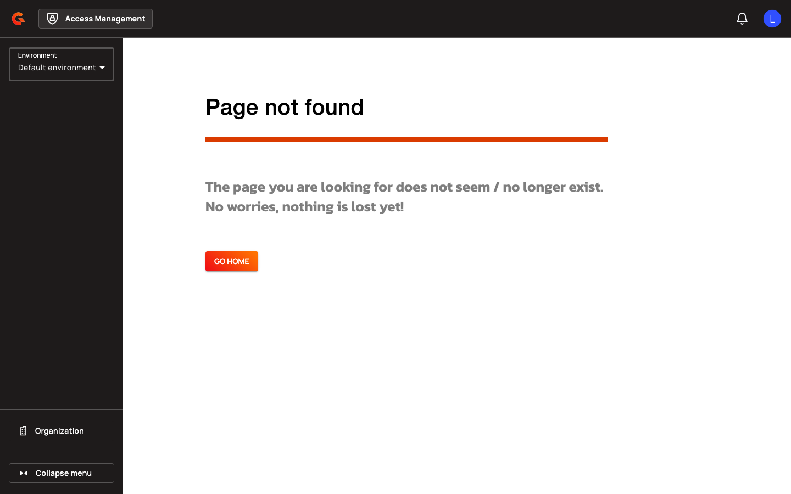

# CIMD Gateway Configuration

## Gateway Configuration

### CIMD Settings

Configure CIMD at the domain level in `gravitee.yml` or via the Management API.

| Property | Description | Example |
|:---------|:------------|:--------|
| `oidc.cimdSettings.enabled` | Enable Client ID Metadata Document support | `true` |
| `oidc.cimdSettings.templateId` | Application ID of the template used for CIMD clients (required when enabled) | `a1b2c3d4-e5f6-7890-abcd-ef1234567890` |
| `oidc.cimdSettings.allowPrivateIpAddress` | Allow metadata document requests to private, loopback, link-local, or any-local IP addresses | `false` |
| `oidc.cimdSettings.allowUnsecuredHttpUri` | Allow metadata document requests to plain HTTP (non-HTTPS) URIs | `false` |
| `oidc.cimdSettings.fetchTimeoutMs` | Timeout in milliseconds for fetching client metadata documents (must be > 0) | `3000` |
| `oidc.cimdSettings.maxResponseSizeKb` | Maximum allowed size of a metadata response in kilobytes (must be > 0) | `20` |
| `oidc.cimdSettings.allowedDomains` | Restrict metadata document to these domains (supports wildcard for first-level subdomain, e.g., `*.example.com`). Empty list allows all domains | `["example.com", "*.trusted.com"]` |
| `oidc.cimdSettings.cacheTtlSeconds` | Time-to-live for cached metadata responses in seconds (must be > 0) | `3600` |
| `oidc.cimdSettings.cacheMaxEntries` | Maximum number of entries to store in the metadata cache (must be > 0) | `500` |
| `oidc.cimdSettings.revokeOnDocumentChange` | Revoke all tokens and consents when CIMD metadata document changes | `false` |

### SSRF Protection

When **Allow Private/Loopback IP Addresses** is disabled (default), the Authorization Server rejects metadata requests to loopback addresses (`127.0.0.1`, `::1`, `localhost`), private IP ranges (RFC 1918: `10.0.0.0/8`, `172.16.0.0/12`, `192.168.0.0/16`), link-local addresses (`169.254.0.0/16`, `fe80::/10`), unique-local IPv6 (`fc00::/7`), any-local addresses (`0.0.0.0`, `::`), and the AWS IMDS endpoint (`169.254.169.254`).

When **Allowed Domains** is non-empty, only domains matching the allowlist are permitted. Exact matches (e.g., `example.com`) allow `https://example.com/path`, while wildcard subdomains (e.g., `*.example.com`) allow `https://sub.example.com/path` but not `https://example.com/path`. Wildcards are only allowed for first-level subdomains.

### OIDC Discovery

When CIMD is enabled, the OIDC discovery document (`/.well-known/openid-configuration`) includes `"client_id_metadata_document_supported": true`.

<figure><figcaption></figcaption></figure>
