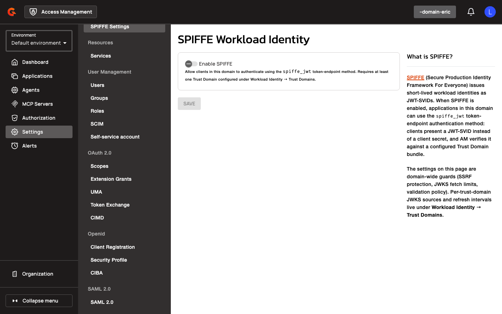

# Configuring SPIFFE and CIMD Gateway Settings

## Gateway configuration

Access Management provides gateway-level configuration properties for SPIFFE workload identity authentication and CIMD (Client Identity Metadata Document) flows. These settings control security policies, caching behavior, and validation parameters at the domain level.

### SPIFFE Settings

<figure><figcaption></figcaption></figure>

<figure><figcaption></figcaption></figure>

<figure><figcaption></figcaption></figure>

SPIFFE settings govern how the gateway validates JWT-SVIDs (SPIFFE Verifiable Identity Documents) and fetches trust bundles. Configure these properties under `gravitee.oidc.spiffeSettings` in your gateway configuration file.
| Property | Description | Example |
|:---------|:------------|:--------|
| `gravitee.oidc.spiffeSettings.enabled` | Enables SPIFFE workload identity authentication | `true` |
| `gravitee.oidc.spiffeSettings.allowPrivateIpAddress` | Permits JWKS URLs resolving to private IP addresses | `false` |
| `gravitee.oidc.spiffeSettings.allowUnsecuredHttpUri` | Permits HTTP (non-TLS) JWKS URLs | `false` |
| `gravitee.oidc.spiffeSettings.cacheMaxEntries` | Maximum number of cached JWKS entries | `100` |
| `gravitee.oidc.spiffeSettings.cacheTtlSeconds` | TTL for cached JWKS entries | `3600` |
| `gravitee.oidc.spiffeSettings.clockSkewSeconds` | Allowed clock skew for JWT validation | `30` |
| `gravitee.oidc.spiffeSettings.defaultAllowedAlgorithms` | Default signing algorithms accepted for JWT-SVIDs | `["RS256", "ES256"]` |
| `gravitee.oidc.spiffeSettings.fetchTimeoutMs` | HTTP timeout for JWKS fetches | `5000` |
| `gravitee.oidc.spiffeSettings.maxJwtLifetimeSeconds` | Maximum allowed JWT lifetime | `300` |
| `gravitee.oidc.spiffeSettings.maxResponseSizeKb` | Maximum JWKS response size | `512` |

**SSRF Protection**: The `allowPrivateIpAddress` and `allowUnsecuredHttpUri` properties control Server-Side Request Forgery (SSRF) protections. When `allowPrivateIpAddress` is `false`, the gateway rejects JWKS URLs that resolve to private, loopback, or link-local IP addresses. When `allowUnsecuredHttpUri` is `false`, the gateway rejects HTTP URLs and requires HTTPS.

**Caching Behavior**: The gateway caches fetched JWKS entries to reduce network overhead. The `cacheMaxEntries` property limits the number of cached trust bundles, and `cacheTtlSeconds` defines how long each entry remains valid. When a cached entry expires, the gateway fetches a fresh copy from the trust domain's JWKS URL.

**JWT Validation Settings**: The `clockSkewSeconds` property accounts for clock drift between the gateway and SPIRE server when validating `iat` and `exp` claims. The `maxJwtLifetimeSeconds` property enforces an upper bound on JWT lifetime (`exp - iat`). The `defaultAllowedAlgorithms` property restricts which signing algorithms the gateway accepts for JWT-SVID signatures.

### CIMD Settings

<figure><figcaption></figcaption></figure>

<figure><figcaption></figcaption></figure>

<figure><figcaption></figcaption></figure>

CIMD settings govern how the gateway fetches and validates Client Identity Metadata Documents during application creation. Configure these properties under `gravitee.oidc.cimdSettings` in your gateway configuration file.
| Property | Description | Example |
|:---------|:------------|:--------|
| `gravitee.oidc.cimdSettings.enabled` | Enables CIMD (Client Identity Metadata Document) flows | `true` |
| `gravitee.oidc.cimdSettings.allowedDomains` | Whitelist of domains permitted for CIMD URLs | `["example.com", "trusted.org"]` |
| `gravitee.oidc.cimdSettings.allowPrivateIpAddress` | Permits CIMD URLs resolving to private IPs | `false` |
| `gravitee.oidc.cimdSettings.allowUnsecuredHttpUri` | Permits HTTP CIMD URLs | `false` |
| `gravitee.oidc.cimdSettings.fetchTimeoutMs` | HTTP timeout for CIMD document fetches | `5000` |
| `gravitee.oidc.cimdSettings.maxResponseSizeKb` | Maximum CIMD document size | `256` |

**SSRF Protection**: The `allowPrivateIpAddress` and `allowUnsecuredHttpUri` properties control SSRF protections for CIMD document fetches. When `allowPrivateIpAddress` is `false`, the gateway rejects CIMD URLs that resolve to private, loopback, or link-local IP addresses. When `allowUnsecuredHttpUri` is `false`, the gateway rejects HTTP URLs and requires HTTPS.

**Domain Whitelist**: The `allowedDomains` property restricts CIMD URLs to a list of trusted domains. When the list is non-empty, the gateway rejects CIMD URLs whose host does not match one of the allowed domains.

**Fetch Timeouts and Size Limits**: The `fetchTimeoutMs` property enforces a timeout for CIMD document fetches. The `maxResponseSizeKb` property limits the size of CIMD documents to prevent resource exhaustion.
