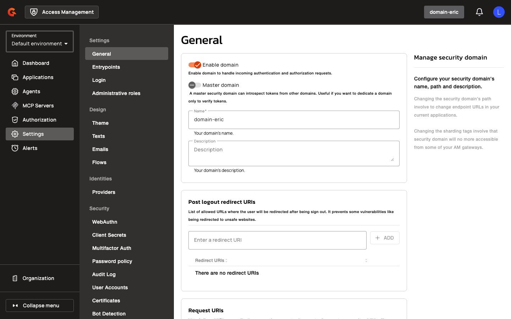
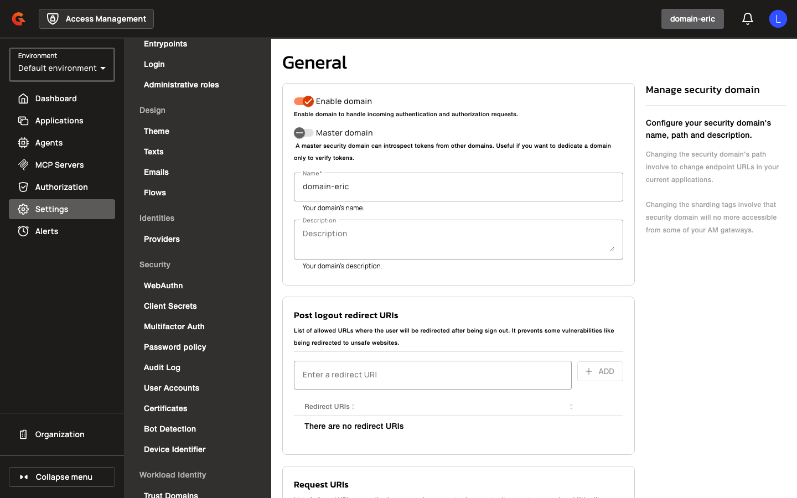

# Enable and Configure the Automation API

## Gateway Configuration

### Automation API Enablement

1. Navigate to **Settings** in the Access Management console.
2. Select **General** from the Settings menu.

    <figure><figcaption></figcaption></figure>

3. Scroll to the Automation API configuration section.
4. Enable the Automation API by setting `api.http.api.automation.enabled: true` in your `gravitee.yml` configuration file.

    <figure><figcaption></figcaption></figure>

5. Optionally, configure a custom base path for the Automation API using `api.http.api.automation.entrypoint` (default is `/management/automation`).

    <figure><figcaption></figcaption></figure>

| Property | Description | Example |
|:---------|:------------|:--------|
| `api.http.api.automation.enabled` | Enables the Automation API HTTP endpoint | `true` |
| `api.http.api.automation.entrypoint` | Custom base path for the Automation API | `/management/automation` |
| `http.blockingGet.timeoutMillis` | Timeout in milliseconds for blocking repository lookups during authentication; set to `0` to disable timeout | `120000` |

### Environment Variable Configuration

| Property | Description | Example |
|:---------|:------------|:--------|
| `GRAVITEE_HTTP_API_AUTOMATION_ENABLED` | Enables the Automation API in Docker Compose deployments | `true` |
