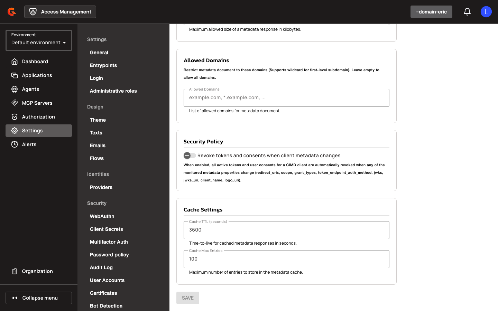
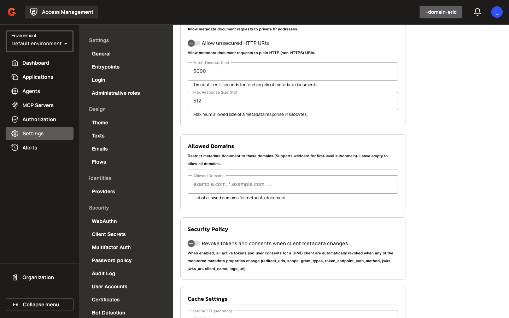
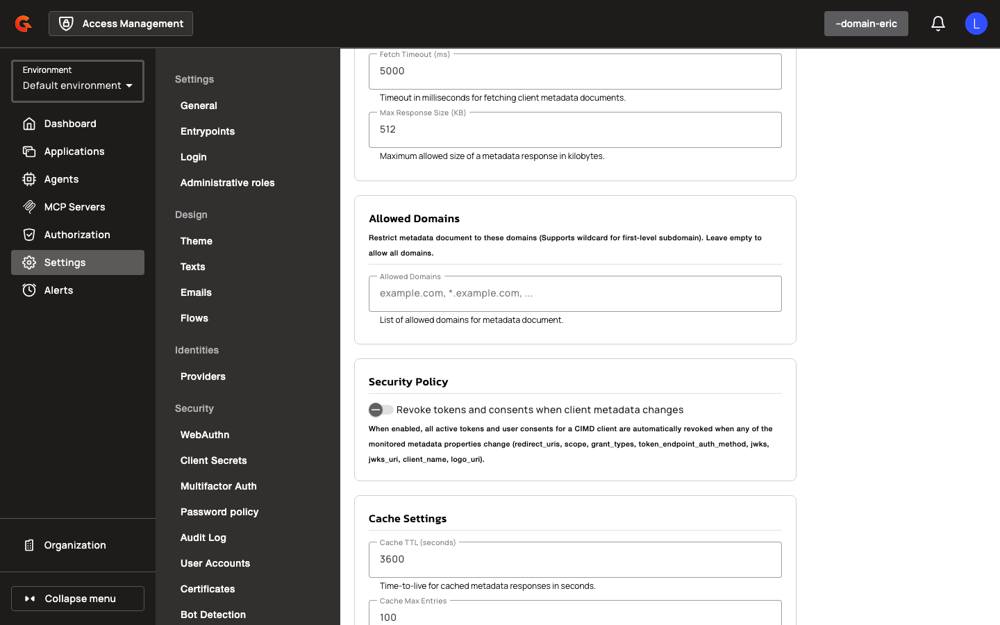

# Gateway Configuration for SPIFFE and CIMD

## Gateway Configuration

### SPIFFE Settings

Configure SPIFFE workload identity at the domain level using the following properties:

| Property | Description | Example |
|:---------|:------------|:--------|
| `gravitee.oidc.spiffeSettings.enabled` | Enables SPIFFE workload identity authentication | `true` |
| `gravitee.oidc.spiffeSettings.allowPrivateIpAddress` | Permits SPIFFE trust bundle URLs resolving to private IP addresses | `false` |
| `gravitee.oidc.spiffeSettings.allowUnsecuredHttpUri` | Permits HTTP (non-TLS) trust bundle URLs | `false` |
| `gravitee.oidc.spiffeSettings.cacheMaxEntries` | Maximum number of cached trust bundle entries | `100` |
| `gravitee.oidc.spiffeSettings.cacheTtlSeconds` | Trust bundle cache TTL in seconds | `3600` |
| `gravitee.oidc.spiffeSettings.clockSkewSeconds` | Allowed clock skew for JWT-SVID validation | `30` |
| `gravitee.oidc.spiffeSettings.defaultAllowedAlgorithms` | Default signing algorithms accepted for JWT-SVIDs | `["RS256", "ES256"]` |
| `gravitee.oidc.spiffeSettings.fetchTimeoutMs` | HTTP timeout for trust bundle fetches | `5000` |
| `gravitee.oidc.spiffeSettings.maxJwtLifetimeSeconds` | Maximum allowed lifetime for JWT-SVIDs | `300` |
| `gravitee.oidc.spiffeSettings.maxResponseSizeKb` | Maximum trust bundle response size in KB | `512` |

### CIMD Settings

Configure CIMD (Client Identity Metadata Document) application creation at the domain level using the following properties. Both validation and application creation endpoints require `APPLICATION[CREATE]` permission and a CIMD-enabled domain.

<figure><figcaption></figcaption></figure>

<figure><figcaption></figcaption></figure>

<figure><figcaption></figcaption></figure>

<figure><figcaption></figcaption></figure>

| Property | Description | Example |
|:---------|:------------|:--------|
| `gravitee.oidc.cimdSettings.enabled` | Enables CIMD (Client Identity Metadata Document) flows | `true` |
| `gravitee.oidc.cimdSettings.allowedDomains` | Whitelist of domains permitted for CIMD document URLs | `["example.com", "agents.acme.org"]` |
| `gravitee.oidc.cimdSettings.allowPrivateIpAddress` | Permits CIMD URLs resolving to private IPs | `false` |
| `gravitee.oidc.cimdSettings.allowUnsecuredHttpUri` | Permits HTTP CIMD URLs | `false` |
