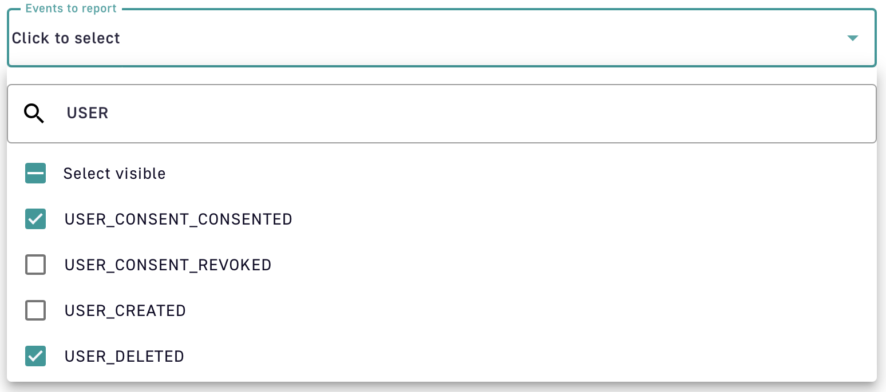
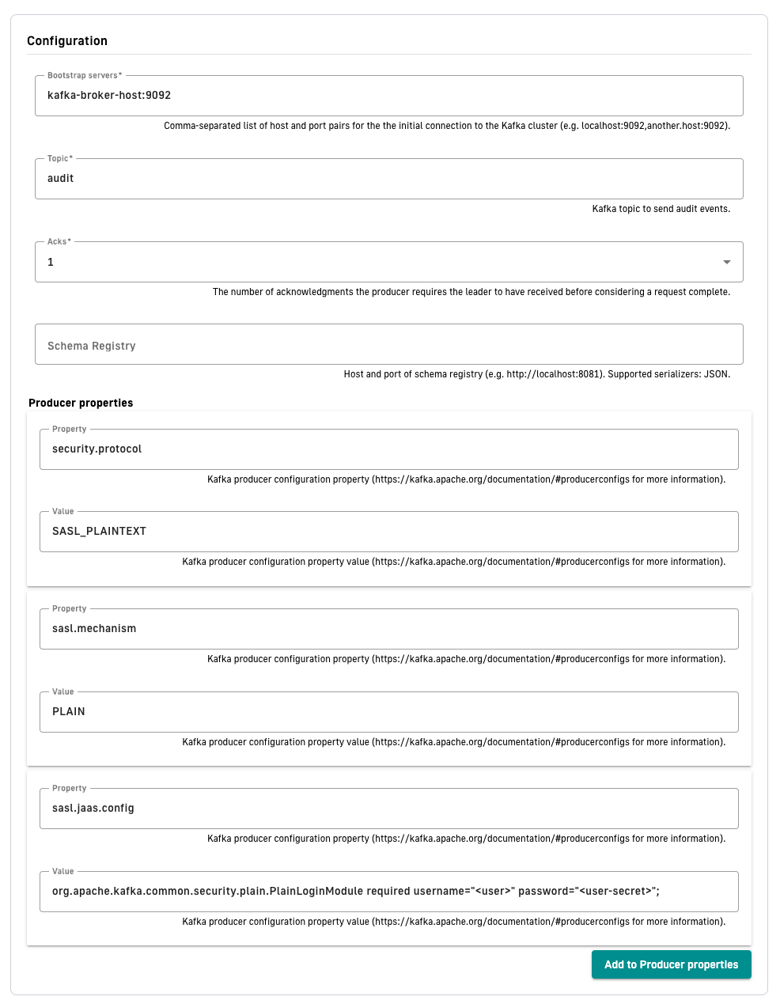
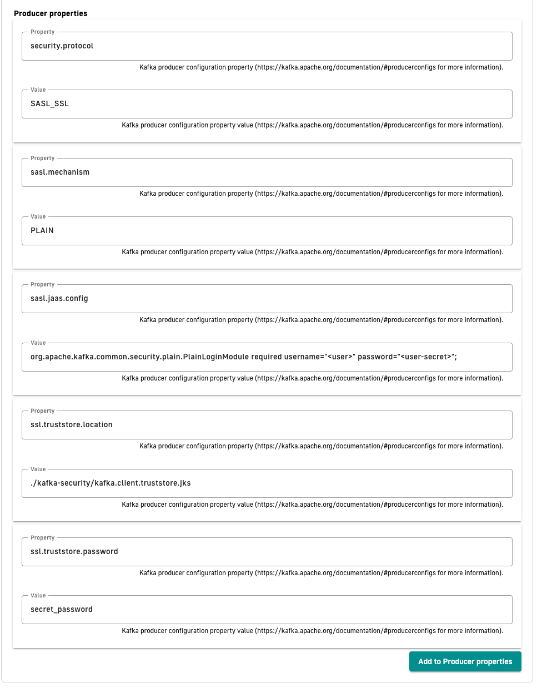

---
metaLinks:
  alternates:
    - >-
      https://app.gitbook.com/s/H4VhZJXn1S232OEmh8Wv/getting-started/configuration/configure-reporters
---

# Reporters

## Overview

Reporters are used by AM Gateway and API instances to report many types of events:

* Administration metrics: administrative tasks (CRUD on resources)
* Authentication / Authorization metrics: (sign-in activity, sign-up activity)

A default reporter is created using a MongoDB or JDBC implementation according to the backend configured in the `gravitee.yml` file.

From AM version 3.6, you can create additional reporters.

## MongoDB reporter

When you create a domain, the MongoDB reporter is created automatically based on the repository's configuration. This configuration cannot be edited, but you can specify the `readPreference` for the audit entries in the Management API's `gravitee.yaml`.

### Configuration

When MongoDB is used as a backend, the `readPreference` option can be specified in the `reporters` section of the `gravitee.yaml` file:

```
reporters:
  mongodb: # Configuration of read preference for querying audit records from mongodb, defaults to primary if not provided
    readPreference: secondary # primary, secondary, primaryPreferred, secondaryPreferred, nearest
    readPreferenceMaxStaleness: 120000 # Milliseconds value, min 90000. Lets users specify a maximum replication lag, or "staleness", for reads from secondaries.
```

## File reporter

This implementation is a file-based reporter for writing events to a dedicated file. You can use it for ingesting events into a third party system.

### Configuration

File reporters are configurable in the `gravitee.yml` file `reporter` section with the following properties:

<table><thead><tr><th width="121">property</th><th width="83">type</th><th width="97">required</th><th>description</th></tr></thead><tbody><tr><td>directory</td><td>string</td><td>N</td><td>Path to the file creation directory. The directory must exist (default: <code>${gravitee.home}/audit-logs/</code>)</td></tr><tr><td>output</td><td>string</td><td>N</td><td>Format used to export events. Possible values: JSON, MESSAGE_PACK, ELASTICSEARCH, CSV (default: JSON)</td></tr><tr><td>retainDays</td><td>integer</td><td>N</td><td>Number of days a file is retained on disk. (default: -1 for indefinitely)</td></tr></tbody></table>

```yaml
reporters:
  file:
    #directory:  # directory where the files are created (this directory must exist): default value = ${gravitee.home}/audit-logs/
    #output: JSON # JSON, ELASTICSEARCH, MESSAGE_PACK, CSV
    #retainDays: -1 # -1 for indefinitely
```

Audit logs will be created in a directory tree that represents the resource hierarchy from the organization to the domain. For example, audit logs for domain `my-domain` in environment `dev` and organization `my-company` will be created in the following directory tree: `${reporters.file.directory}/my-company/dev/my-domain/audit-2021_02_11.json`

For details on how to create a file reporter for a domain, see the [Audit trail](../../guides/audit-trail.md) documentation.

## TCP reporter


**Available from:** AM 4.12.


This implementation writes audit events to a TCP socket. It is particularly suited for SaaS/Cloud deployments where audit events are forwarded to an external collector (for example, Logstash) over the network.

### Configuration

The TCP reporter has two configuration layers:

* **`gravitee.yml`** — controls the local fallback behavior only.
* **Management Console / API** — controls all connection and security settings (host, port, output format, SSL/TLS).

#### gravitee.yml — fallback settings

When the TCP link is unavailable, the fallback mechanism persists audit events locally on disk. As soon as the connection is restored, the buffered events are replayed to the TCP server. If the connection is broken for too long and the maximum number of files is reached, the oldest files are discarded.

```yaml
reporters:
  tcp:
    fallback:
      enabled: true           # enable local fallback (default: false)
      directory: ${gravitee.home}/audit-logs/tcp-fallback/  # where fallback files are stored
      maxSize: 50             # max size per file in MB
      maxFiles: 10            # max number of fallback files; oldest are deleted when exceeded
```


Fallback limits apply **per TCP reporter instance**. If you configure multiple TCP reporters, each instance independently enforces its own `maxSize` and `maxFiles` limits.


#### Management Console / API settings

All other TCP reporter settings — including connection details and SSL/TLS — are configured per domain or organization via the Management Console or API. The following properties are available:

| Property | Type | Description | Default |
| -------- | ---- | ----------- | ------- |
| `host` | string | TCP server hostname or IP address. | `localhost` |
| `port` | integer | TCP server port. | `9000` |
| `output` | string | Serialization format for audit events written to the TCP stream: `JSON`, `MESSAGE_PACK`, `ELASTICSEARCH`, `CSV`. | `JSON` |
| `connectTimeout` | integer | Maximum time to wait for the TCP connection to be established, in milliseconds. | `10000` |
| `reconnectAttempts` | integer | Number of reconnection attempts before giving up. Use `-1` for infinite retries. | `10` |
| `reconnectInterval` | integer | Time to wait between reconnection attempts, in milliseconds. | `500` |
| `retryTimeout` | integer | Time to wait before starting a new reconnection cycle after all attempts are exhausted, in milliseconds. | `5000` |
| `ssl.enabled` | boolean | Enable SSL/TLS. | `false` |
| `ssl.trustAll` | boolean | Accept any server certificate without validation. Not recommended for production. | `false` |
| `ssl.verifyHost` | boolean | Verify that the server hostname matches the TLS certificate CN/SAN. | `true` |
| `ssl.keystore.type` | string | Keystore format: `PEM`, `JKS`, or `PKCS12`. | — |
| `ssl.keystore.value` | string | Base64-encoded keystore content (JKS or PKCS12 only). | — |
| `ssl.keystore.password` | string | Keystore password (JKS or PKCS12 only). | — |
| `ssl.keystore.certValue` | string | PEM certificate content (PEM type only). | — |
| `ssl.keystore.keyValue` | string | PEM private key content (PEM type only). | — |
| `ssl.truststore.type` | string | Truststore format: `PEM`, `JKS`, or `PKCS12`. | — |
| `ssl.truststore.value` | string | Base64-encoded truststore content (JKS or PKCS12 only). | — |
| `ssl.truststore.password` | string | Truststore password (JKS or PKCS12 only). | — |
| `ssl.truststore.certValue` | string | PEM CA certificate content (PEM type only). | — |

## Kafka reporter

This reporter sends all audit logs to Kafka Broker using JSON serialization.

### **Minimal configuration**

The following table shows the properties that Kafka reporter requires:

| Property          | Description                                                                                                            |
| ----------------- | ---------------------------------------------------------------------------------------------------------------------- |
| Name              | The reporter human readable name used to identify the plugin in the UI                                                 |
| Bootstrap servers | Comma-separated list of host and port pairs for the the initial connection to the Kafka cluster                        |
| Topic             | Kafka topic to send audit events.                                                                                      |
| Acks              | The number of acknowledgments the producer requires the leader to have received before considering a request complete. |

### **Additional properties**

To add additional properties to the producer, add property config name and value to the Producers properties section. For more information about supported properties, go to [Kafka](https://kafka.apache.org/documentation/#producerconfigs).

### Events Filtering

To control audit traffic and reduce event noise, you can use the Kafka reporter to selectively propagate specific event types with the "events to report" list. You can configure this option at both the domain and organization levels.


Use the search box to quickly locate and select specific event types.


<figure><figcaption></figcaption></figure>

### **Schema Registry**

Kafka reporter supports Schema registry. This configuration is optional. When the schema registry URL is not provided, then messages is sent to Kafka Broker in JSON format. When the schema registry URL is provided, then the schema of the message will be stored in Schema Registry and ID and version of the schema is attached at the beginning of the JSON message.

Currently, only JSON schema is supported.

### **Partition key**

Kafka reporter sends all messages to separate partitions based on domain id or organization id. This means that all audit log messages from one domain is sent to the same partition key.

### Secured Kafka connection

#### SASL/PLAIN

1. To create secured connection between Kafka Reporter and Kafka Broker, configure your Kafka broker.
2. As described in the following Kafka documentation, add to your broker configuration JAAS configuration:

* [https://kafka.apache.org/documentation/#security\_sasl\_jaasconfig](https://kafka.apache.org/documentation/#security_sasl_jaasconfig)
* [https://kafka.apache.org/documentation/#security\_sasl\_brokerconfig](https://kafka.apache.org/documentation/#security_sasl_brokerconfig)

3. When you configure your broker correctly, add additional **Producer properties** to your Kafka Reporter:

`security.protocol = SASL_PLAINTEXT`

`sasl.mechanism = PLAIN`

`sasl.jaas.config = org.apache.kafka.common.security.plain.PlainLoginModule required username="<user>" password="<user-secret>";`

<figure><figcaption><p>Kafka plaintext security config</p></figcaption></figure>

**TLS/SSL encryption**

If the Kafka broker is using SSL/TLS encryption, you must add additional steps to secure this connection.

1. Place trusted truststore certificate along with AM Management installation.
2. Specify location and password of this trust store and change `security.protocol` in **Producer properties:**

\
`security.protocol = SASL_SSL`

`sasl.mechanism = PLAIN`

`sasl.jaas.config = org.apache.kafka.common.security.plain.PlainLoginModule required username="<user>" password="<user-secret>";`

`ssl.truststore.location = "/path/to/kafka.client.truststore.jks`

`ssl.truststore.password = "secret_password"`

<figure><figcaption><p>Kafka TLS/SSL security config</p></figcaption></figure>

## Audit data retention


**Available for:** MongoDB Reporter and JDBC Reporter only.



**Deleted audit data can't be recovered.** Ensure your retention period meets your organization's compliance and operational requirements before enabling this feature.


Access Management lets you automatically purge old audit logs based on a configurable retention period.

The audit retention feature deletes audit records older than a specified number of days. The purge process:

* Runs as a scheduled task (default: daily at 11 PM)
* Works across all audit supported reporters for all domains

### Configuration

Audit retention is configured in the `gravitee.yml` file under the Management API configuration.

**Enable audit retention**

Add the following configuration to your Management API `gravitee.yml`:

```yaml
services:
  purge:
    enabled: true
    cron: 0 0 23 * * *
    audits:
      retention:
        days: 90
```

#### Configuration options

| Property                               | Description                         | Notes                                |
| -------------------------------------- | ----------------------------------- | ------------------------------------ |
| `services.purge.enabled`               | Enable or disable the purge service | Affects both event and audit purging |
| `services.purge.cron`                  | Cron expression for purge schedule  | Spring cron syntax                   |
| `services.purge.audits.retention.days` | Number of days to retain audit data | Value must be greater than `0`       |

#### Disable audit retention

To disable audit purging while keeping other purge tasks active:

```yaml
services:
  purge:
    enabled: true
    audits:
      retention:
        days: 0
```

To disable all purge operations:

```yaml
services:
  purge:
    enabled: false
```

#### MongoDB index for audit retention

When purge is `enabled` and `retention.days > 0`, the service ensures an index optimized for purge queries is created on startup:

* **Index:** `(timestamp ASC, _id ASC)`

This index is used to efficiently scan and delete old documents in a stable order.


In Access Management with MongoDB, index creation happens on startup only if index management is enabled: `ensureIndexOnStart=true` (default is `true`). In environments where index creation is managed externally, make sure this index exists before enabling purge.


#### Startup impact

When purge is enabled for the first time (enabling it on an existing large dataset), the first purge execution may take noticeable time because it starts removing historical audit records.

* Deletion is performed **in batches**, which helps control database load.
* The system remains **operational** during the purge process.
* You may observe increased I/O and CPU usage on MongoDB during the initial cleanup, depending on the amount of historical data.

#### Helm chart configuration

When deploying with Helm, configure audit retention in your `values.yaml`:

```yaml
api:
  services:
    purge:
      enabled: true
      cron: "0 0 23 * * *"
      audits:
        retention:
          days: 90
```
