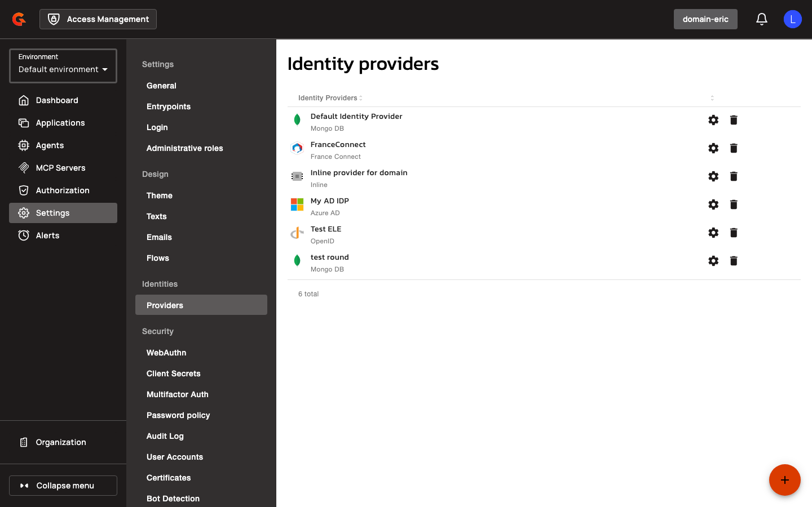
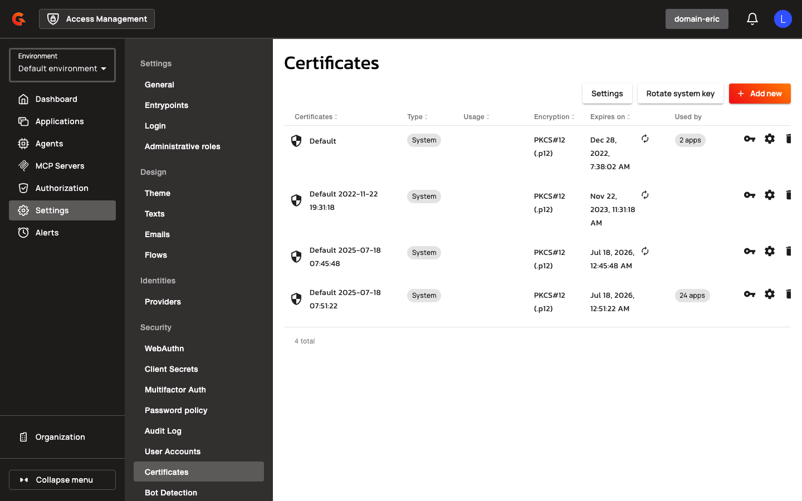
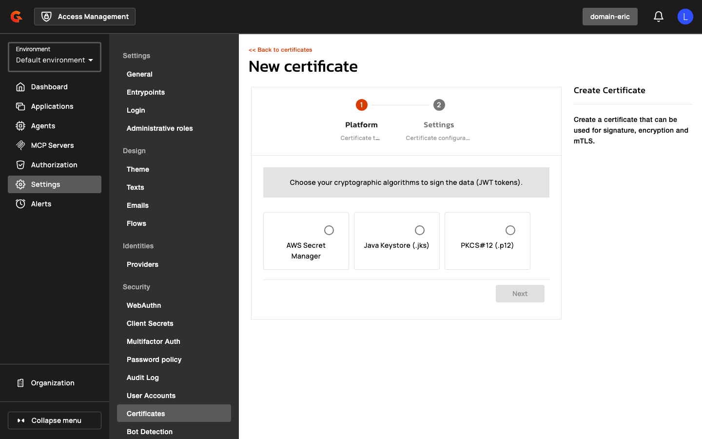
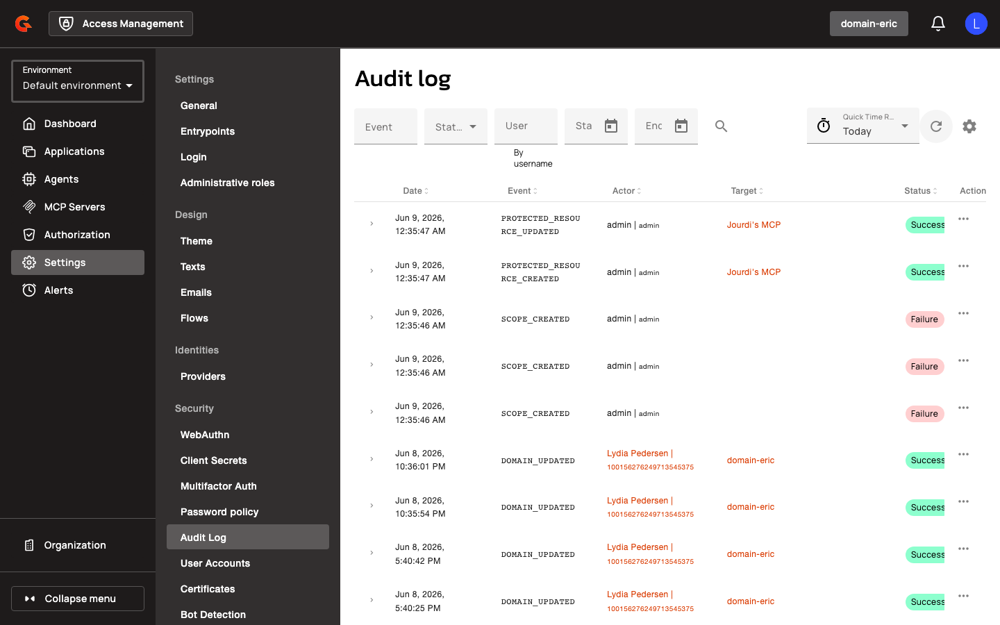
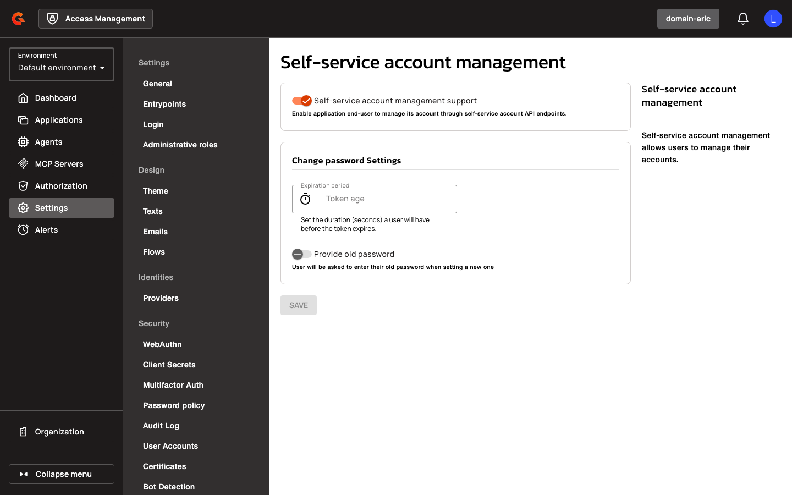

# Create and Manage Resources with the Automation API

## Creating Domains and Resources

1. Navigate to the Automation API base path at `/management/automation` (or the custom entrypoint configured via `api.http.api.automation.entrypoint`).
2. Authenticate using a bearer token (JWT or opaque user service-account access token in the format `Base64(tokenId + "." + value)`) or HTTP Basic credentials.
3. To create or update a domain, send a PUT request to `/organizations/{orgId}/environments/{envId}/domains` with a JSON body containing the domain key and configuration. The domain key must match the pattern `^[a-z0-9]([a-z0-9-]*[a-z0-9])?$` and is immutable after creation.
4. To create identity providers under a domain, navigate to **Settings** > **Identities** > **Providers** in the Access Management console.

    <figure><figcaption></figcaption></figure>

5. Click the **+** button to add a new identity provider.
6. Select the identity provider type from the available options.

    <figure><figcaption></figcaption></figure>

7. For API-based creation, send a PUT request to `/domains/{domainKey}/identities` with the resource key and configuration in the request body.
8. For non-system resources, include `name`, `type`, and `configuration` fields; for system resources, set `system: true` and provide only the `key` field.
9. To create certificates or reporters, send PUT requests to `/domains/{domainKey}/certificates` or `/domains/{domainKey}/reporters` respectively.

## Managing Resources

### Listing and Retrieving Resources

1. Send a GET request to `/organizations/{orgId}/environments/{envId}/domains` to list all domains.
2. To list identity providers, send a GET request to `/domains/{domainKey}/identities` or navigate to **Settings** > **Identities** > **Providers** in the console.
3. To list certificates, send a GET request to `/domains/{domainKey}/certificates` or navigate to **Settings** > **Certificates** in the console.

    <figure><figcaption></figcaption></figure>

4. To view certificate type options, click **Add new** on the Certificates page.

    <figure><figcaption></figcaption></figure>

5. To list reporters, send a GET request to `/domains/{domainKey}/reporters`.
6. To retrieve a single resource, append the resource key to the collection path (for example, `/domains/{domainKey}/identities/{identityKey}`).
7. All timestamp fields (`createdAt`, `updatedAt`, `expiresAt`) are read-only and returned in ISO-8601 / RFC 3339 UTC format.

### Deleting Resources

1. Send a DELETE request to `/domains/{domainKey}`, `/domains/{domainKey}/identities/{identityKey}`, `/domains/{domainKey}/certificates/{certKey}`, or `/domains/{domainKey}/reporters/{reporterKey}` to remove the corresponding resource.
2. Deletion is permanent and can't be undone.

### Automation API Specification

The OpenAPI specification is served at the configured entrypoint when the Automation API is enabled. Unlike the API Management Automation API, which is primarily documented through Terraform provider guidelines, the Access Management Automation API can be configured directly using `gravitee.yml` or Helm chart values. The specification is located at `docs/automation/openapi.yaml` in the [source repository](https://github.com/gravitee-io/gravitee-access-management) and can be regenerated using `bash scripts/regen-automation-oas.sh`. CI checks validate specification staleness via `.circleci/scripts/oas-automation-staleness-check.sh` and breaking changes via `.circleci/scripts/oas-automation-compat-check.sh`.

## Restrictions

* Cookie-based JWT authentication isn't supported for the Automation API.
* Database reporter types (`mongodb`, `reporter-am-jdbc`) can't be created manually via the Automation API and are system-only.

    <figure><figcaption></figcaption></figure>

* A domain can have only one system identity provider managed through the Automation API.
* The `type` field is immutable for certificates, identity providers, and reporters after creation. Previously this field was ignored on PUT operations, but hardening now enforces immutability and rejects type changes with HTTP 400.
* The `system` flag is immutable for identity providers after creation.
* Attempting to create a system identity provider when one already exists returns HTTP 400 with the message "The domain already has a system identity provider."
* Identity provider keys must be unique within a domain. Conflicts return HTTP 400 with the message "Identity provider key conflicts with an existing identity provider."
* Non-system identity providers require `name`, `type`, and `configuration` fields. Blank or empty `configuration` returns HTTP 400 with the message "Field 'configuration' is required for a non-system identity provider."
* Plugin type validation is enforced before resource creation or update. Unknown types throw `PluginNotDeployedException` and return HTTP 400.
* Configuration schema validation is enforced before resource creation or update. Invalid configuration throws `InvalidPluginConfigurationException` and returns HTTP 400.
* Certificate configurations with embedded files (for example, keystores) are normalized to filename-only form. Raw base64 content isn't persisted in the configuration field.
* Repository lookups during authentication honor `http.blockingGet.timeoutMillis`. Setting this value to `0` disables the timeout but may cause indefinite blocking.

## Related Changes

* The identity provider resource path has been renamed from `/identity-providers` to `/identities`, and the path parameter has been renamed from `idpKey` to `identityKey`. API clients must update to the new path and parameter name.
* Hardening has been applied that affects both the Automation API and the Management REST API. The `type` field is now enforced as immutable for certificates, identity providers, and reporters, whereas previously these values were ignored on PUT operations.
* The OpenAPI specification now correctly uses `integer` type for date/time values instead of `string` to match the existing wire format.
* Certificate PUT responses are normalized to use file names consistently with POST responses, replacing the previous behavior of returning raw base64 content.
* Domain reference reconciliation automatically rewrites stale key-based identity provider IDs in `accountSettings.defaultIdentityProviderForRegistration` to the real `default-idp-<domainId>` ID when a system identity provider is created and the configured key matches.

    <figure><figcaption></figcaption></figure>

* Validation error messages now resolve JSON property names for improved clarity.
