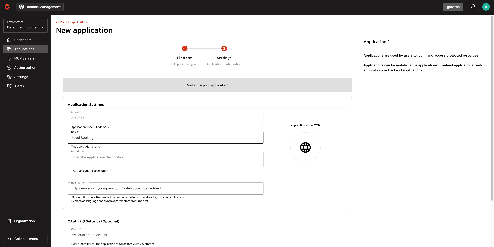
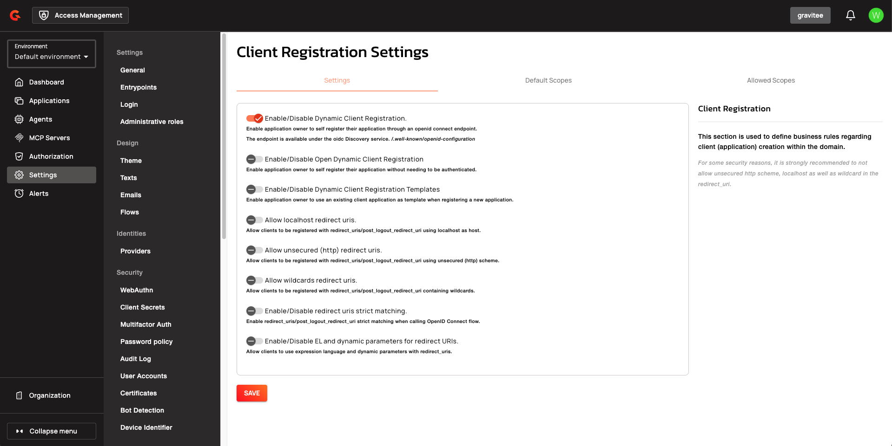
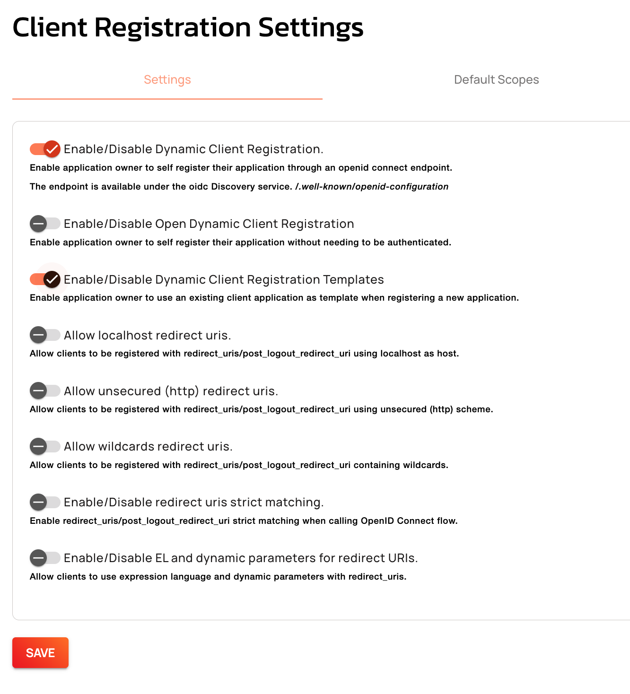

---
metaLinks:
  alternates:
    - https://app.gitbook.com/s/H4VhZJXn1S232OEmh8Wv/guides/applications
---

# Applications

## Overview

_Applications_ act on behalf of the user to request tokens, hold user identity information, and retrieve protected resources from remote services and APIs.

Application definitions apply at the _security domain_ level.

## Create an application

### AM Console

1. Log in to AM Console.
2. If you want to create your application in a different security domain, select the domain from the user menu at the top right.
3. Click **Applications**.
4. Click the plus icon .
5. Select the application type and click **Next**.

<figure><figcaption><p>Select the Application type</p></figcaption></figure>

6. Specify the application details and click **Create**.

<figure><figcaption><p>Application settings</p></figcaption></figure>


A top-level **Agents** navigation entry provides a dedicated agent list and creation flow, separate from the standard **Applications** area. The **Applications** list excludes agent applications by default.


### AM API


```sh
curl -H "Authorization: Bearer :accessToken" \
     -H "Content-Type:application/json;charset=UTF-8" \
     -X POST \
     -d '{"name":"My App", "type": "SERVICE"}' \
     http://GRAVITEEIO-AM-MGT-API-HOST/management/organizations/DEFAULT/environments/DEFAULT/domains/:domainId/applications
```


### Configure the application

After you have created the new application, you will be redirected to the application's `Overview` page, which contains some documentation and code samples to help you start configuring the application.

<figure><figcaption><p>Application overview</p></figcaption></figure>

### Test the application

The quickest way to test your newly created application is to request an OAuth2 access token, as described in [set up your first application](../../getting-started/tutorial-getting-started-with-am/set-up-your-first-application.md). If you manage to retrieve an access token, your application is all set.

## Application identity providers

AM allows your application to use different identity providers (IdPs). If you haven't configured your providers yet, visit the [Identity Provider guide.](../identity-providers/)

The application identity providers are separated into two sections:

* The regular Identity Providers (called also **internal**) that operate inside AM without redirecting to another provider
* The Social/Enterprise Identity Providers that require an external service to perform authentication (usually via SSO)

<figure><figcaption><p>Application Identity Provider selection options</p></figcaption></figure>

You can enable/disable them to include them within your authentication flow.

### Priority

Identity provider priority enables processing authentication in a certain order. It gives more control over the authentication flow by deciding which provider should evaluate credentials first.

In order to change the priority of the providers:

* Make sure your provider is **selected**
* Simply **drag-and-drop** the providers
* Save your settings

### Selection rules

Identity provider selection rules also give you more control over the authentication via Gravitee's Expression Language.

When coupled with [flows](../flows/) you can decide which provider will be used to authenticate your end users.

<figure><figcaption><p>Selection rule</p></figcaption></figure>

To apply a selection rule:

* Click on the **Selection rule** icon
* Enter your expression language rule
* Validate and save your settings

When applying rules on **regular** Identity Providers:

* If the rule is empty, the provider **will be** taken into account (this is to be retro-compatible when migrating from a previous version)
* Otherwise, AM will authenticate with the first identity provider where the rule matches.

If you are not using [identifier-first login](../login/identifier-first-login-flow.md), the rule won't be effective on Social/Enterprise providers

However, if you are using identifier-first login:

* If the rule is empty, the provider **WILL NOT BE** taken into account (this is to be retro-compatible when migrating from a previous version)
* Otherwise, AM will authenticate with the first identity provider where the rule matches.

## Agent applications

Agent applications represent workload identities and enforce specific constraints to support secure machine-to-machine authentication. Agent applications are available in three kinds:

* **USER_EMBEDDED**: Agents that act on behalf of a user and require user interaction.
* **HOSTED_DELEGATED**: Agents that act on behalf of a user but are hosted by a third party.
* **AUTONOMOUS**: Agents that act independently without user interaction.

### Agent Kind configuration

When creating an agent application, the application creation wizard includes an **Agent Kind** dropdown to select USER_EMBEDDED, HOSTED_DELEGATED, or AUTONOMOUS. Application forms also include a **Subject Match Mode** dropdown (EXACT, PREFIX) in the Workload Identity Settings section.

### Restrictions

Agent applications enforce the following constraints:

* **SPIFFE PREFIX subject matching**: Only `HOSTED_DELEGATED` and `AUTONOMOUS` agent applications can use PREFIX subject matching mode. `USER_EMBEDDED` agents must use EXACT matching.
* **PREFIX subject format**: When `subjectMatchMode` is set to PREFIX, the configured `subject` must end with `/` to ensure prefix matching occurs at path boundaries (e.g., `spiffe://example.org/hotel-agent/`).
* **Forbidden grant types**: Agent applications cannot use `implicit`, `password`, or `refresh_token` grant types.
* **Grant type constraints (USER_EMBEDDED and HOSTED_DELEGATED)**: `USER_EMBEDDED` and `HOSTED_DELEGATED` agents cannot use the `client_credentials` grant type.
* **Grant type constraints (AUTONOMOUS)**: `AUTONOMOUS` agents cannot use the `authorization_code` grant type.
* **Redirect URI requirements**: `USER_EMBEDDED` and `HOSTED_DELEGATED` agents require at least one redirect URI. `AUTONOMOUS` agents cannot configure redirect URIs.
* **CIMD URL scheme**: CIMD URLs must use `https://` unless `cimdSettings.allowUnsecuredHttpUri` is enabled on the domain.
* **CIMD URL IP restrictions**: CIMD URLs must resolve to public IP addresses unless `cimdSettings.allowPrivateIpAddress` is enabled.
* **CIMD URL domain restrictions**: When `cimdSettings.allowedDomains` is non-empty, CIMD URLs must match one of the allowed domains.
* **CIMD authentication methods**: CIMD clients cannot use `client_secret_basic`, `client_secret_post`, or `client_secret_jwt` token endpoint authentication methods.
* **JWKS URL scheme**: JWKS URLs for trust domains must use `https://` unless `spiffeSettings.allowUnsecuredHttpUri` is enabled.
* **JWKS URL IP restrictions**: JWKS URLs for trust domains must resolve to public IP addresses unless `spiffeSettings.allowPrivateIpAddress` is enabled.
* **Trust domain deletion**: Trust domains cannot be deleted if they are referenced by active applications.
* **JWT-SVID signing algorithms**: JWT-SVIDs must use allowed signing algorithms only. The `none` algorithm and HMAC algorithms are forbidden.
* **JWT-SVID subject validation**: The JWT-SVID `sub` claim must be a SPIFFE ID within the configured trust domain.
* **JWT-SVID audience validation**: The JWT-SVID `aud` claim must contain the token endpoint URL.
* **JWT-SVID time validation**: JWT-SVID `iat`, `exp`, and `nbf` claims are validated with clock skew tolerance.
* **SPIFFE JWT assertion type**: When using `spiffe_jwt` authentication, the `client_assertion_type` must be `urn:ietf:params:oauth:client-assertion-type:jwt-spiffe`.
* **Agent JWT-bearer assertion type**: When using agent JWT-bearer authentication, the `client_assertion_type` must be `urn:ietf:params:oauth:client-assertion-type:agent-jwt-bearer`.
* **SPIRE local-stack HTTP warning**: The SPIRE local-stack overlay uses plain HTTP for the OIDC provider (`insecure_addr = ":8443"`). Production deployments must serve over TLS.

### Token claims for agent applications

* Tokens issued to user-bound agents (USER_EMBEDDED, HOSTED_DELEGATED) now set `act.sub` to the agent instance ID when known, falling back to `client_id` when no instance ID is available.
* AUTONOMOUS agents continue to use the instance ID as the top-level `sub`.
* All agent tokens emit `client_profile` and `sub_profile` claims, propagated through `act` delegation chains in token exchange, ID tokens, and audit logs.

## Dynamic Client Registration (DCR)

Another way to create applications in AM is to use the OpenID Connect Dynamic Client Registration endpoint. This specification enables Relying Parties (clients) to register applications in the OpenID Provider (OP).

### Enable Dynamic Client Registration with AM Console

By default this feature is disabled. You can enable it through the domain settings:

1. Log in to AM Console.
2. Click **Settings**, then in the **OPENID** section click **Client Registration**.
3. Click the toggle button to **Enable Dynamic Client Registration**.


There is another parameter called **Enable\Disable Open Dynamic Client Registration**. This parameter is used to allow any unauthenticated requests to register new clients through the registration endpoint. It is part of the OpenID specification, but for security reasons, it is disabled by default.


<figure><figcaption><p>Enable DCR</p></figcaption></figure>


The application creation wizard includes a **Manual / CIMD** toggle (visible when CIMD is enabled) and a **CIMD confirm** step that displays a read-only preview of parsed metadata before creation.


### Enable Dynamic Client Registration with AM API

```sh
curl -X PATCH \
  -H 'Authorization: Bearer :accessToken' \
  -H 'Content-Type: application/json' \
  -d '{ "oidc": {
        "clientRegistrationSettings": { \
            "isDynamicClientRegistrationEnabled": true,
            "isOpenDynamicClientRegistrationEnabled": false
      }}}' \
  http://GRAVITEEIO-AM-MGT-API-HOST/management/domains/:domainId
```

### Register a new client

#### Obtain an access token

Unless you enabled open dynamic registration, you need to obtain an access token via the `client_credentials` flow, with a `dcr_admin` scope.


The `dcr_admin` scope grants CRUD access to any clients in your domain. You must only allow this scope for trusted RPs (clients).



```sh
#Request a token
curl -X POST \
  'http://GRAVITEEIO-AM-GATEWAY-HOST/:domain/oauth/token?grant_type=client_credentials&scope=dcr_admin&client_id=:clientId&client_secret=:clientSecret'
```


#### Register new RP (client)

Once you obtain the access token, you can call AM Gateway through the registration endpoint. You can specify many client properties, such as `client_name`, but only the `redirect_uris` property is mandatory. See the [OpenID Connect Dynamic Client Registration](https://openid.net/specs/openid-connect-registration-1_0.html) specification for more details.

The endpoint used to register an application is available in the OpenID discovery endpoint (e.g., `http(s)://your-am-gateway-host/your-domain/oidc/.well-known/openid-configuration`) under the `registration_endpoint` property.

The response will contain some additional fields, including the `client_id` and `client_secret` information.

You will also find the `registration_access_endpoint` and the `registration_client_uri` in the response. These are used to read/update/delete the client id and client secret.


According to the [specification](https://tools.ietf.org/html/rfc6749#section-10.6), an Authorization Server MUST require public clients and SHOULD require confidential clients to register their redirection URIs.\
Confidential clients are clients that can keep their credentials secret, for example:\
\- web applications (using a web server to save their credentials): `authorization_code`\
\- server applications (treating credentials saved on a server as safe): `client_credentials`\
Unlike confidential clients, public clients are clients who cannot keep their credentials secret, for example:\
\- Single Page Applications: `implicit`\
\- Native mobile application: `authorization_code`\
**Because mobile and web applications use the same grant, we force `redirect_uri` only for implicit grants.**


**Register Web application example**

The following example creates a web application (`access_token` is kept on a backend server).

```sh
curl -X POST \
  -H 'Authorization: Bearer :accessToken' \
  -H 'Content-Type: application/json' \
  -d '{ \
        "redirect_uris": ["https://myDomain/callback"], \
        "client_name": "my web application", \
        "grant_types": [ "authorization_code","refresh_token"], \
        "scope":"openid" \
      }' \
  http://GRAVITEEIO-AM-GATEWAY-HOST/::domain/oidc/register
```


`response_types` metadata is not required here as the default value (code) corresponds to the `authorization_code` grant type.


**Register Single Page Application (SPA) example**

As a SPA does not use a backend, we recommend you use the following implicit flow:

```sh
curl -X POST \
  -H 'Authorization: Bearer :accessToken' \
  -H 'Content-Type: application/json' \
  -d '{ \
        "redirect_uris": ["https://myDomain/callback"], \
        "client_name": "my single page application", \
        "grant_types": [ "implicit" ], \
        "response_types": [ "token" ], \
        "scope":"openid" \
      }' \
  http://GRAVITEEIO-AM-GATEWAY-HOST/::domain/oidc/register
```


`response_types` metadata must be set to token in order to override the default value.


**Register Server to Server application example**

Sometimes you may have a bot/software that needs to be authenticated as an application and not as a user.\
For this, you need to use a `client_credentials` flow:

```sh
curl -X POST \
  -H 'Authorization: Bearer :accessToken' \
  -H 'Content-Type: application/json' \
  -d '{ \
        "redirect_uris": [], \
        "application_type": "server", \
        "client_name": "my server application", \
        "grant_types": [ "client_credentials" ], \
        "response_types": [ ] \
      }' \
  http://GRAVITEEIO-AM-GATEWAY-HOST/::domain/oidc/register
```


`response_types` metadata must be set as an empty array in order to override the default value.\
`redirect_uris` is not needed, but this metadata is required in the [specification](https://openid.net/specs/openid-connect-registration-1_0.html), so it must be set as an empty array.\
**We strongly discourage you from using this flow in addition to a real user authentication flow. The recommended approach is to create multiple clients instead.**


**Register mobile application example**

For a mobile app, the `authorization_code` grant is recommended, in addition to [Proof Key for Code Exchange](https://tools.ietf.org/html/rfc7636):

```sh
curl -X POST \
  -H 'Authorization: Bearer :accessToken' \
  -H 'Content-Type: application/json' \
  -d '{ \
        "redirect_uris": ["com.mycompany.app://callback"], \
        "application_type": "native", \
        "client_name": "my mobile application", \
        "grant_types": [ "authorization_code","refresh_token" ], \
        "response_types": [ "code" ] \
      }' \
  http://GRAVITEEIO-AM-GATEWAY-HOST/::domain/oidc/register
```

**Register agent application example**

To register an agent application programmatically, send a POST request to the DCR endpoint with `application_type` set to `"agent"`. The system strips forbidden grant types (`implicit`, `password`, `refresh_token`) from the request. If no valid grant types remain after stripping, the system defaults to `["authorization_code"]`. The `redirect_uris` field is required. If `token_endpoint_auth_method` is omitted, the system defaults to `client_secret_basic`. The DCR flow validates agent constraints and strips forbidden response types (`token`, `id_token`, `id_token token`) during registration. If response types become empty and `authorization_code` is granted, the system adds `"code"`.

```sh
curl -X POST \
  -H 'Authorization: Bearer :accessToken' \
  -H 'Content-Type: application/json' \
  -d '{ \
        "application_type": "agent", \
        "grant_types": [ "authorization_code","client_credentials" ], \
        "redirect_uris": ["https://example.com/callback"] \
      }' \
  http://GRAVITEEIO-AM-GATEWAY-HOST/::domain/oidc/register
```

#### Read/update/delete client information

The `register` endpoint also allows you to GET/UPDATE/PATCH/DELETE actions on a `client_id` that has been registered through the `registration` endpoint.\
To do this, you need the access token generated during the client registration process, provided in the response in the `registration_access_token` field.


The UPDATE http verb will act as a full overwrite, whereas the PATCH http verb will act as a partial update.


This access token contains a `dcr` scope which can not be obtained, even if you enable the `client_credentials` flow. In addition, rather than using the OpenID registration endpoint together with the `client_id`, the DCR specifications recommend you use the `registration_client_uri` given in the register response instead.

A new registration access token is generated each time the client is updated through the Dynamic Client Registration URI endpoint, which will revoke the previous value.

```sh
curl -X PATCH \
  -H 'Authorization: Bearer :accessToken' \
  -H 'Content-Type: application/json' \
  -d '{ "client_name": "myNewApplicationName"}' \
  http://GRAVITEEIO-AM-GATEWAY-HOST/::domain/oidc/register/:client_id
```

#### Renew client secret

To renew the `client_secret`, you need to concatenate `client_id` and `/renew_secret` to the registration endpoint and use the POST HTTP verb.


The `renew_secret` endpoint can also be retrieved through the OpenID discovery endpoint `registration_renew_secret_endpoint` property. You will then need to replace the `client_id` with your own.\
The `renew_secret` endpoint does not need a body.


When you update a client, a new registration access token is generated each time you renew the client secret.

```sh
curl -X POST \
  -H 'Authorization: Bearer :accessToken' \
  http://GRAVITEEIO-AM-GATEWAY-HOST/::domain/oidc/register/:client_id/renew_secret
```

#### Scope Management

You can whitelist which scopes can be requested, define some default scopes to apply and force a specific set of scopes.

**Allowed scopes (scope list restriction)**

By default, no scope restrictions are applied when you register a new application.\
However, it is possible to define a list of allowed scopes through the **Allowed scopes** tab.\
To achieve this, you need to first enable the feature and then select the allowed scopes.

You can also enable this feature using AM API:

```sh
curl -X PATCH \
  -H 'Authorization: Bearer :accessToken' \
  -H 'Content-Type: application/json' \
  -d '{ "oidc": {
        "clientRegistrationSettings": { \
            "isAllowedScopesEnabled": true,
            "allowedScopes": ['your','scope','list','...']
      }}}' \
  http://GRAVITEEIO-AM-MGT-API-HOST/management/domains/:domainId
```

**Default scopes**

The [specification](https://tools.ietf.org/html/rfc7591#section-2) states that if scopes are omitted while registering an application, the authorization server may set a default list of scopes.\
To enable this feature, you simply select which scopes you want to be automatically set.

You can also enable this feature using AM API:

```sh
curl -X PATCH \
  -H 'Authorization: Bearer :accessToken' \
  -H 'Content-Type: application/json' \
  -d '{ "oidc": {
        "clientRegistrationSettings": { \
            "defaultScopes": ['your','scope','list','...']
      }}}' \
  http://GRAVITEEIO-AM-MGT-API-HOST/management/domains/:domainId
```

**Force the same set of scopes for all client registrations**

If you want to force all clients to have the same set of scopes, you can enable the allowed scopes feature with an empty list and then select some default scopes.


Enabling the allowed scopes feature with an empty list will remove all requested scopes from the client registration request.\
Since there is no longer a requested scope in the request, the default scopes will be applied.


You can also enable this feature using AM API:

```sh
curl -X PATCH \
  -H 'Authorization: Bearer :accessToken' \
  -H 'Content-Type: application/json' \
  -d '{ "oidc": {
        "clientRegistrationSettings": { \
            "isAllowedScopesEnabled": true,
            "allowedScopes": [],
            "defaultScopes": ['your','scope','list','...']
      }}}' \
  http://GRAVITEEIO-AM-MGT-API-HOST/management/domains/:domainId
```

### Register new client using templates

You can create a client and define it as a template. Registering a new application with a template allows you to specify which identity providers to use, and apply template forms (such as login, password management, and error forms) or emails (such as registration confirmation and password reset emails).

Template mode is enabled for an Application in its **Settings** > **General** tab.


Once a client is set up as a template, it can no longer be used for authentication purposes.



The **Template** checkbox is now enabled for agent applications.


#### Enable Dynamic Client Registration templates

You can enable the template feature in the AM Dynamic Client Registration **Settings** tab:

<figure><figcaption><p>Enable DCR Templates</p></figcaption></figure>

You can also enable this feature using AM API:

```sh
curl -X PATCH \
  -H 'Authorization: Bearer :accessToken' \
  -H 'Content-Type: application/json' \
  -d '{ "oidc": {
        "clientRegistrationSettings": { \
            "isDynamicClientRegistrationEnabled": true,
            "isClientTemplateEnabled": true
      }}}' \
  http://GRAVITEEIO-AM-MGT-API-HOST/management/domains/:domainId
```

#### Register call with template example

You need to retrieve the `software_id` of the template, which is available under the `registration_templates_endpoint` provided by the OpenID discovery endpoint.

```sh
curl -X POST \
  -H 'Authorization: Bearer :accessToken' \
  -H 'Content-Type: application/json' \
  -d '{ \
        "software_id": "", \
        "redirect_uris": ["https://myDomain/callback"], \
        "client_name": "my single page application from a template" \
      }' \
  http://GRAVITEEIO-AM-GATEWAY-HOST/::domain/oidc/register
```

You can override some properties of the template by filling in some metadata, such as `client_name` in the example above.

Some critical information is not copied from the template (e.g. `client_secret` and `redirect_uris`). This is why in the example above, we need to provide valid `redirect_uris` metadata, since in the example, the template we are using is a Single Page Application.

## Related changes

The following changes have been introduced to support agent applications and workload identity:

### Management Console

* A new **Workload Identity** section under domain settings manages trust domains (list, create, edit, delete).

### Database Schema

Database migration is required:

* **JDBC**: A new `sub_type` column is added to the `applications` table.
* **MongoDB**: A `subType` field is added to the `applications` collection.
* The `workloadIdentitySettings` object includes a new `subjectMatchMode` field (defaults to EXACT when absent).

### Trust Bundle Behavior

Trust bundle caching honors per-domain refresh intervals and serves the last known good bundle on transient fetch errors.
