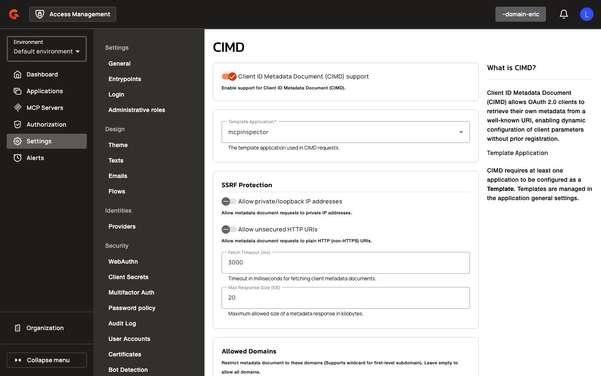

# CIMD Configuration Reference and Restrictions

## Gateway Configuration

### CIMD Settings

Configure CIMD behavior at the domain level in `gravitee.yml` or via the Management API.

| Property | Description | Example |
|:---------|:------------|:--------|
| `oidc.cimdSettings.enabled` | Enable CIMD support | `false` |
| `oidc.cimdSettings.templateId` | Application ID of the template used for CIMD clients (required when enabled) | `"app-123"` |
| `oidc.cimdSettings.allowPrivateIpAddress` | Allow metadata document requests to private IP addresses | `false` |
| `oidc.cimdSettings.allowUnsecuredHttpUri` | Allow metadata document requests to plain HTTP URIs | `false` |
| `oidc.cimdSettings.fetchTimeoutMs` | Timeout in milliseconds for fetching client metadata documents | `3000` |
| `oidc.cimdSettings.maxResponseSizeKb` | Maximum allowed size of a metadata response in kilobytes | `20` |
| `oidc.cimdSettings.allowedDomains` | Restrict metadata document to these domains (supports wildcard `*.example.com`); empty list allows all | `["*.example.com"]` |
| `oidc.cimdSettings.cacheTtlSeconds` | Time-to-live for cached metadata responses in seconds | `3600` |
| `oidc.cimdSettings.cacheMaxEntries` | Maximum number of entries to store in the metadata cache | `500` |
| `oidc.cimdSettings.revokeOnDocumentChange` | Revoke all tokens and consents when CIMD metadata document changes | `false` |

### JWKS Cache

JWKS public keys presented in CIMD metadata are stored in the in-memory cache alongside keys for pre-registered clients. Configure the cache using standard `gravitee.yml` settings for JWKS caching.

## Creating a CIMD-Enabled Domain

To enable CIMD, configure a template application and activate CIMD settings in the domain.

1. Create or designate an application as a template by enabling the **Template** toggle in the application's general settings. This template defines the baseline configuration (identity providers, MFA, token validity, certificates) inherited by all CIMD clients.
2. Navigate to [**Domain Settings** → **OAuth 2.0** → **CIMD**](#cimd-settings).
3. Enable the **Enable CIMD** toggle.
4. Select the template application from the **Template Application** autocomplete field.
5. Configure SSRF protection by setting **Allowed Domains** (supports wildcard `*.example.com` for first-level subdomains), toggling **Allow private/loopback IP addresses** and **Allow unsecured HTTP URIs** as needed.
6. Set **Fetch Timeout (ms)**, **Max Response Size (KB)**, **Cache TTL (seconds)**, and **Cache Max Entries** to control metadata fetching and caching behavior.
7. (Optional) Enable **Revoke on Document Change** to automatically revoke tokens and consents when a client's metadata document changes.
8. Save the configuration to apply the settings.

## Using CIMD Clients

A client initiates authorization by presenting a URL-shaped `client_id` (e.g., `https://example.com/metadata`). The gateway checks its cache for the metadata document keyed by the canonical `client_id`. On a cache miss, the gateway validates the `client_id` host against allowed domains and SSRF rules, fetches the metadata document from the URL, validates the JSON schema and required fields (`client_id`, `redirect_uris`), validates `jwks_uri` trust and resolvability if present, intersects `grant_types`, `response_types`, and `scope` with the template, and caches the metadata for the configured TTL. The gateway synthesizes an ephemeral client from the template and metadata, then proceeds with the standard OAuth flow. On token exchange, the gateway accepts the `client_id` in the request body or Basic auth header (URL-encoded) and issues tokens with `aud=<client_id>`. On refresh grant, the gateway requires the `client_id` in the request (body or Basic auth) and rejects the request if the `client_id` is missing. When automatic revocation is enabled, the gateway stores a hash of the metadata document and revokes all tokens and consents if the hash changes on a subsequent fetch.

## End-User Configuration

Navigate to [**Domain Settings** → **OAuth 2.0** → **CIMD**](#cimd-settings) to configure CIMD settings.

<figure><figcaption></figcaption></figure>

1. Toggle **Enable CIMD** to enable or disable CIMD support.
2. Select a **Template Application** from the autocomplete dropdown (searches applications where `template=true`).
3. Toggle **Allow private/loopback IP addresses** to permit metadata document requests to private IP addresses.

    <figure><figcaption></figcaption></figure>

4. Toggle **Allow unsecured HTTP URIs** to permit metadata document requests to plain HTTP URIs.
5. Enter a value in the **Fetch Timeout (ms)** field to set the timeout for fetching client metadata documents.

    <figure><figcaption></figcaption></figure>

6. Enter a value in the **Max Response Size (KB)** field to set the maximum allowed size of a metadata response.
7. Enter comma-separated domains in the **Allowed Domains** chip list to restrict metadata document hosts (supports wildcard `*.example.com`); leave empty to allow all domains.

    <figure><figcaption></figcaption></figure>

8. Enter a value in the **Cache TTL (seconds)** field to set the time-to-live for cached metadata responses.
9. Enter a value in the **Cache Max Entries** field to set the maximum number of entries to store in the metadata cache.
10. Toggle **Revoke on Document Change** to automatically revoke tokens and consents when a client's metadata document changes.

    <figure><figcaption></figcaption></figure>

| Field | Description | Example |
|:------|:------------|:--------|
| **Enable CIMD** | Enable Client ID Metadata Document support | `false` |
| **Template Application** | Application ID of the template used for CIMD clients (required when enabled) | `app-123` |
| **Allow private/loopback IP addresses** | Allow metadata document requests to private IP addresses | `false` |
| **Allow unsecured HTTP URIs** | Allow metadata document requests to plain HTTP URIs | `false` |
| **Fetch Timeout (ms)** | Timeout in milliseconds for fetching client metadata documents (minimum: 0) | `3000` |
| **Max Response Size (KB)** | Maximum allowed size of a metadata response in kilobytes (minimum: 0) | `20` |
| **Allowed Domains** | Restrict metadata document to these domains (supports wildcard `*.example.com`); empty list allows all | `*.example.com` |
| **Cache TTL (seconds)** | Time-to-live for cached metadata responses in seconds (minimum: 0) | `3600` |
| **Cache Max Entries** | Maximum number of entries to store in the metadata cache (minimum: 0) | `500` |
| **Revoke on Document Change** | Revoke all tokens and consents when CIMD metadata document changes | `false` |

### CIMD Logo Endpoint

**Endpoint:** `GET /{domain}/cimd/logo?clientId={url-encoded-client-id}`

Serves pre-fetched or on-demand client logos for CIMD clients. Returns a cached logo if available. On cache miss, fetches the logo from `logo_uri` if metadata is cached and valid. Returns `404` if no logo is available or metadata has expired. Returns `200` with `Content-Type` and `Cache-Control` headers on success.

## Restrictions

- CIMD clients cannot use secret-based authentication methods (`client_secret_basic`, `client_secret_post`, `client_secret_jwt`)
- CIMD clients cannot specify `client_secret` or `client_secret_expires_at` in metadata
- CIMD clients always require exact `redirect_uri` matching (domain-level `redirectUriStrictMatching` setting is ignored)
- Logo fetch is limited to 256 KB
- Metadata document fetch retries up to 3 times with 100ms delay between attempts
- `jwks_uri` must pass the same SSRF validation as `client_id` (allowed domains, private IP checks)
- When `revokeOnDocumentChange=true`, token revocation is asynchronous and may not complete before the next authorization request
- CIMD clients inherit all settings from the template application except `grant_types`, `response_types`, and `scopeSettings` (which are intersected with metadata)
- The `scope` parameter in metadata is space-delimited; scopes not present in the template are silently dropped
- CIMD metadata cache is in-memory only (not persisted across gateway restarts)
- CIMD client state (metadata hash) is stored in the database but not replicated to other gateway nodes in real-time
- Pre-registered clients take precedence: if an application exists in Access Management with a `client_id` that matches a CIMD URL, the pre-registered configuration applies instead of the remote metadata
- Changes to template application settings or restrictions do not trigger automatic token revocation for CIMD clients (only changes to remote CIMD metadata trigger revocation when enabled)
- Template applications referenced as `templateId` cannot be deleted or un-templated while CIMD is enabled
- `token_endpoint_auth_method` defaults to `none` when omitted in metadata and overrides the template value
- `private_key_jwt` authentication requires `jwks` or `jwks_uri` in metadata
- Fetch timeout, max response size, cache TTL, and cache max entries must be greater than 0
- CIMD settings require a valid `templateId` referencing an application configured as a template

## Related Changes

When CIMD is enabled, the OIDC discovery document (`/.well-known/openid-configuration`) includes `"client_id_metadata_document_supported": true`. The UI adds a new "CIMD" menu item under **Domain Settings** → **OAuth 2.0** with a form for configuring CIMD settings. The template application selector displays "No template applications found — configure one in Client Registration settings" when no templates exist. The **Template** toggle in application general settings is disabled with a tooltip when the application is the active CIMD template. Audit logs for CIMD clients (actor type `APPLICATION` with `metadataDocumentHash` attribute) are not linked to application detail pages. New audit event types `CIMD_METADATA.DEPLOY`, `CIMD_METADATA.UPDATE`, and `CIMD_METADATA.UNDEPLOY` track metadata document lifecycle. The `cimd_client_state` table stores metadata document hashes for revocation tracking. The `ScopeApprovalRepository` adds methods to find and delete approvals by domain and client. The `ClientLookupService` adds a `findById` method for SSO session handling. The property `oidc.cimdSettings.softwareId` is renamed to `oidc.cimdSettings.templateId`.
