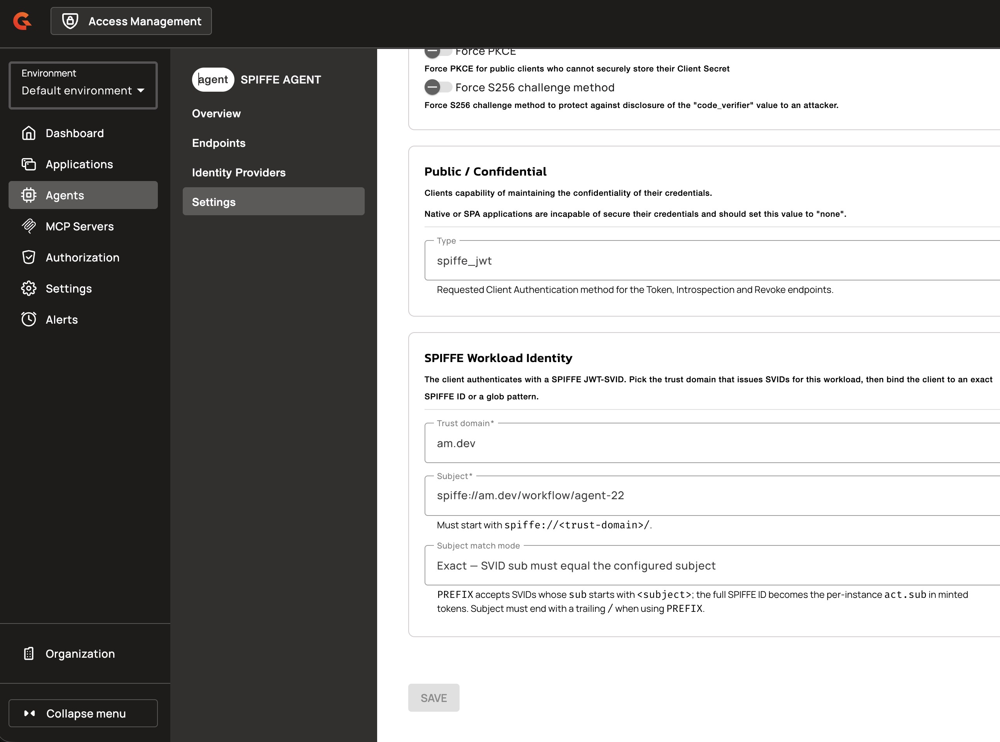
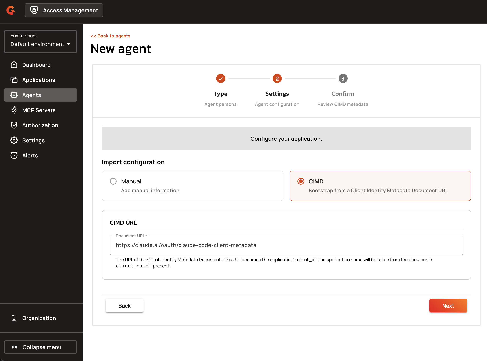
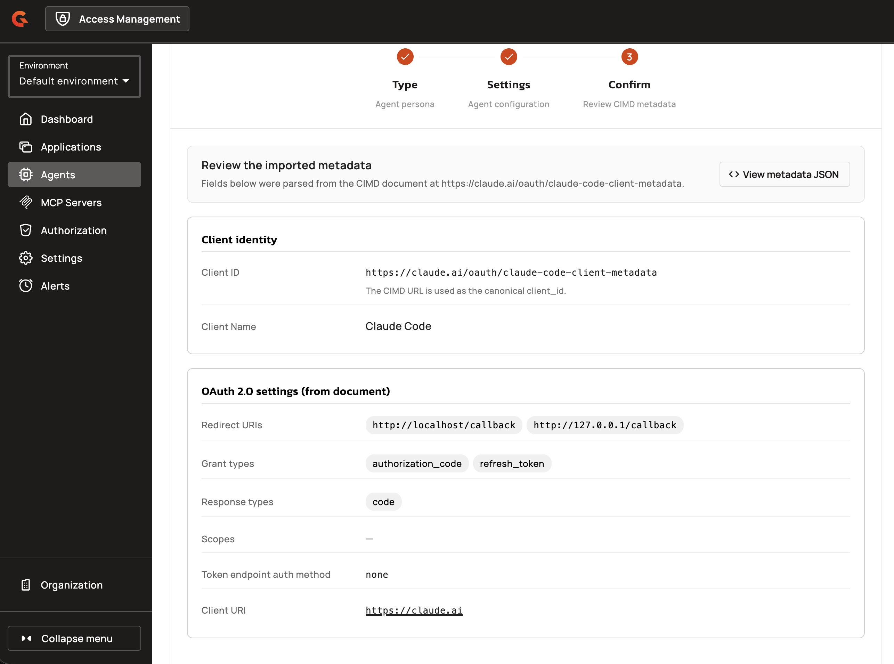

# Create and Manage Agent Applications

## Creating Agent Applications

Agent applications can be created manually or via CIMD. The creation flow depends on whether CIMD is enabled for the domain.

### Manual Creation

1. Navigate to **Agents** in the domain sidebar and click the **+** button.

    <figure><figcaption></figcaption></figure>

2. On the **Type** step, select one of the three agent personas: **User-Embedded**, **Hosted Delegated**, or **Autonomous**.
3. Click **Next** to proceed to the **Settings** step.
4. Enter a **Name** for the agent application.
5. (Optional) Enter a **Description**.
6. Configure **Redirect URIs**:
   - Required for User-Embedded and Hosted Delegated
   - Forbidden for Autonomous
7. Click **Save** to save the application.

### Further Configuration

Once the agent application has been created it would then be possible to extend the functionality by updating the following settings:

1. Open the Agent Application
2. Click on Settings
3. Open OAuth / OIDC tab
4. If using SPIFFE authentication, configure **Workload Identity Settings**:
  a. Set **Token Endpoint Auth Method** to **SPIFFE JWT** if using workload identity.
  b. Select a **Trust Domain** from the dropdown.
  c. Enter the **Subject** (SPIFFE ID, for example: `spiffe://acme/hotel-agent/`).
  d. Choose **Subject Match Mode**: **Exact** or **Prefix**.

    <figure><figcaption></figcaption></figure>

       
       Prefix requires a trailing `/` and is only available for Hosted Delegated and Autonomous. See [Subject Match Modes](spiffe-workload-identity-and-agent-applications-overview.md#subject-match-modes) for details.
       

6. (Optional) Toggle **Use as DCR / CIMD registration template** to mark the application as a registration template.
7. Click **Save** to save the application.

#### Agent Application Settings Reference

| Field | Description | Constraints |
|:------|:------------|:------------|
| **Kind** | Agent persona (carried in the application's `kind` field) | Required for AGENT type; must be USER_EMBEDDED, HOSTED_DELEGATED, or AUTONOMOUS |
| **Redirect URIs** | OAuth callback URLs | Required for USER_EMBEDDED and HOSTED_DELEGATED; forbidden for AUTONOMOUS |
| **Grant Types** | Allowed OAuth flows | USER_EMBEDDED: authorization_code; HOSTED_DELEGATED: authorization_code + client_credentials (+ token_exchange); AUTONOMOUS: client_credentials (+ token_exchange). Implicit, password, and refresh_token grants are forbidden for all agents. |
| **Trust Domain** | SPIFFE trust boundary | Required when Token Endpoint Auth Method is SPIFFE JWT; must reference a registered trust domain |
| **Subject** | SPIFFE ID | Required when Token Endpoint Auth Method is SPIFFE JWT; must start with `spiffe://<trustDomain>/` |
| **Subject Match Mode** | How Subject is matched | EXACT (default) or PREFIX; PREFIX requires trailing `/` and is only allowed for HOSTED_DELEGATED and AUTONOMOUS |

### CIMD Creation

When CIMD is enabled for the domain, the application creation wizard offers a **Manual / CIMD** toggle on step 2.

1. Navigate to **Agents** and click the **+** button.
2. On the **Settings** step, toggle to **CIMD** mode.
3. Enter the **CIMD URL** (the hosted metadata document URL).

    <figure><figcaption></figcaption></figure>

4. Click **Next**. AM fetches and validates the document, then displays a read-only preview showing:
   - Parsed metadata (client_id, client_name, redirect_uris, grant_types, jwks_uri, etc.)
   - Missing fields (if `client_name` is absent, you must provide an application name)
   - Whether the document contains inline JWKS

    <figure><figcaption></figcaption></figure>

5. If validation succeeds, review the preview and click **Create**. The CIMD URL becomes the application's `client_id`.

#### CIMD Validation Behavior

CIMD validation enforces the same security policies as runtime authentication:

* Unsecured HTTP URLs are rejected unless `allowUnsecuredHttpUri` is enabled
* Private IP resolution is blocked unless `allowPrivateIpAddress` is enabled
* Secret-based authentication methods are forbidden
* Documents are rejected if they are unreachable, oversized, or exceed the fetch timeout
* Documents using `client_secret_basic`, `client_secret_post`, or `client_secret_jwt` authentication methods are rejected
* Documents missing required `redirect_uris` are rejected
* Documents using `private_key_jwt` without `jwks` or `jwks_uri` are rejected

#### Portal API Endpoints

**CIMD Validation:**

```
POST /organizations/{organizationId}/environments/{environmentId}/domains/{domain}/cimd/validate
```

Request body:
```json
{
  "url": "string"
}
```

Response (200 OK):
```json
{
  "url": "string",
  "hasInlineJwks": false,
  "missing": {
    "clientId": false,
    "clientName": false
  },
  "metadata": {
    "client_id": "string",
    "client_name": "string",
    "redirect_uris": ["string"],
    "grant_types": ["string"],
    "response_types": ["string"],
    "token_endpoint_auth_method": "string",
    "jwks_uri": "string",
    "scope": "string"
  }
}
```

**CIMD Application Creation:**

```
POST /organizations/{organizationId}/environments/{environmentId}/domains/{domain}/cimd/applications
```

Request body:
```json
{
  "cimdUrl": "string",
  "name": "string",
  "clientName": "string",
  "description": "string",
  "type": "WEB | NATIVE | BROWSER | SERVICE | RESOURCE_SERVER | AGENT",
  "kind": "USER_EMBEDDED | HOSTED_DELEGATED | AUTONOMOUS"
}
```

The `kind` field is optional and only applies when `type` is `AGENT`, where it carries the agent persona.

Response: `201 Created` with `Application` object.

**Application Filtering:**

```
GET /organizations/{organizationId}/environments/{environmentId}/domains/{domain}/applications?type=AGENT
```

The `type` query parameter accepts multiple values:
```
GET /applications?type=WEB&type=SERVICE
```

#### Restrictions

* Authentication method constraints: secret-based methods (`client_secret_basic`, `client_secret_post`, `client_secret_jwt`) are forbidden for CIMD clients
* Grant type constraints: `implicit`, `password`, and `refresh_token` grants are forbidden for all agent applications
* Redirect URI requirements: USER_EMBEDDED and HOSTED_DELEGATED agents require at least one redirect URI; AUTONOMOUS agents cannot have redirect URIs
* PREFIX matching constraints: only available for HOSTED_DELEGATED and AUTONOMOUS agent applications; requires trailing `/` in Subject

#### Related Changes

* **Agents navigation entry**: New top-level "Agents" section in the domain sidebar with dedicated agent list and creation flow
* **Application list filtering**: Applications list excludes agents; backend supports multi-valued `type` query parameter
* **Manual/CIMD toggle**: Application creation wizard step 2 offers Manual/CIMD mode selection when CIMD is enabled for the domain
* **DCR/CIMD template toggle**: Agent applications can be marked as registration templates
