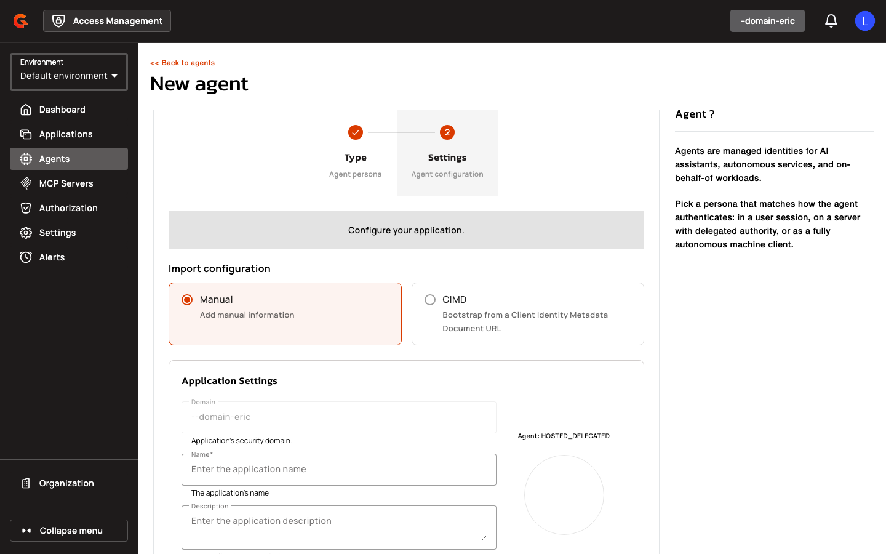

# Creating Agent Applications and Managing Trust Domains

## Creating Agent Applications

Navigate to **Agents** in the management console and click **Add Agent**. The creation wizard guides you through three steps:

<figure><figcaption></figcaption></figure>

1. **Select the agent persona** from the dropdown: User-Embedded, Hosted Delegated, or Autonomous.
2. **Choose the creation method**: Manual (enter OAuth settings directly) or CIMD (provide a metadata document URL). CIMD is only available when enabled on the domain.

    <figure><figcaption></figcaption></figure>

3. **Configure OAuth settings** (Manual mode) or **confirm the parsed metadata** (CIMD mode).

    <figure><figcaption></figcaption></figure>

### Manual Mode

For Manual mode, configure the following settings:

| Setting | Description |
|:--------|:------------|
| **Application Name** | Display name for the agent |
| **Redirect URIs** | OAuth callback URLs (required for User-Embedded and Hosted Delegated) |
| **Grant Types** | Allowed OAuth flows (constrained by agent persona) |
| **Token Endpoint Auth Method** | Select `spiffe_jwt` for SPIFFE authentication or another supported method |

### CIMD Mode

For CIMD mode:

1. Enter the **CIMD Document URL** (e.g., `https://example.com/.well-known/client-metadata`).
2. Click **Validate** to fetch and parse the document. AM displays a read-only preview of the parsed metadata.
3. If the document lacks a `client_name`, enter an **Application Name** manually.
4. Click **Create** to provision the application. The CIMD URL becomes the `client_id`.

### SPIFFE Workload Identity Configuration

When **Token Endpoint Auth Method** is `spiffe_jwt`:

1. Select a **Trust Domain** from the dropdown (populated from registered trust domains).
2. Enter the **Subject** SPIFFE URI (e.g., `spiffe://example.org/hotel-agent`). The subject must start with `spiffe://<trust-domain>/`.
3. Select a **Subject Match Mode**: Exact Match (default) or Prefix Match. Prefix Match requires the subject to end with `/` and is only allowed for Hosted Delegated and Autonomous agents.

| Field | Description |
|:------|:------------|
| **Trust Domain** | Registered trust domain for SVID validation |
| **Subject** | SPIFFE URI identifying the workload |
| **Subject Match Mode** | Exact Match or Prefix Match |

## Managing Trust Domains

Trust domains are managed in the domain settings under **Workload Identity**. To create a trust domain:

1. Navigate to **Settings > Workload Identity** in the domain console.
2. Click **Add Trust Domain**.
3. Enter the trust domain name (e.g., `example.org`).
4. Select **JWKS URL** as the bundle source.
5. Enter the **JWKS URL** (e.g., `https://spire.example.org/keys`).
6. Set the **Refresh Interval** in seconds (default 300).
7. Select **Allowed Algorithms** (e.g., RS256, ES256).
8. Click **Create**.

Trust domains can be updated or deleted via the same console or the Management API. Deleting a trust domain does not affect existing applications but prevents new SPIFFE-authenticated clients from using that trust domain.
