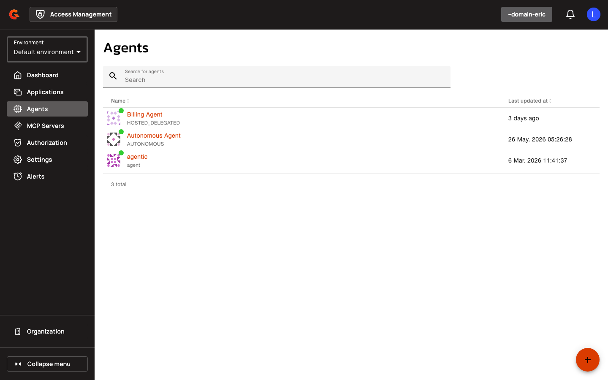
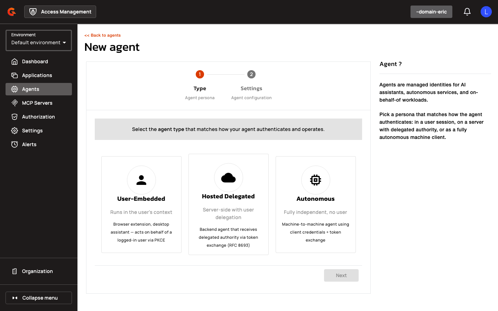
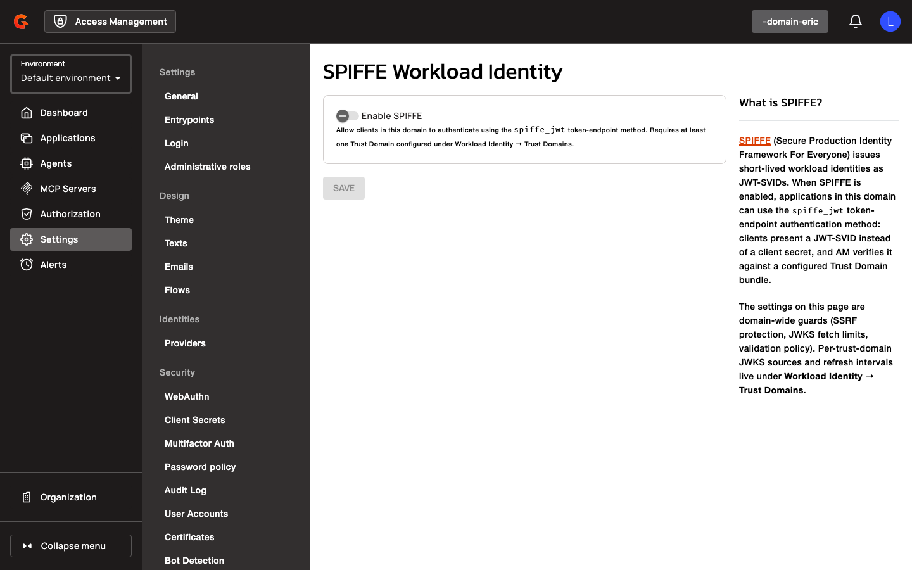
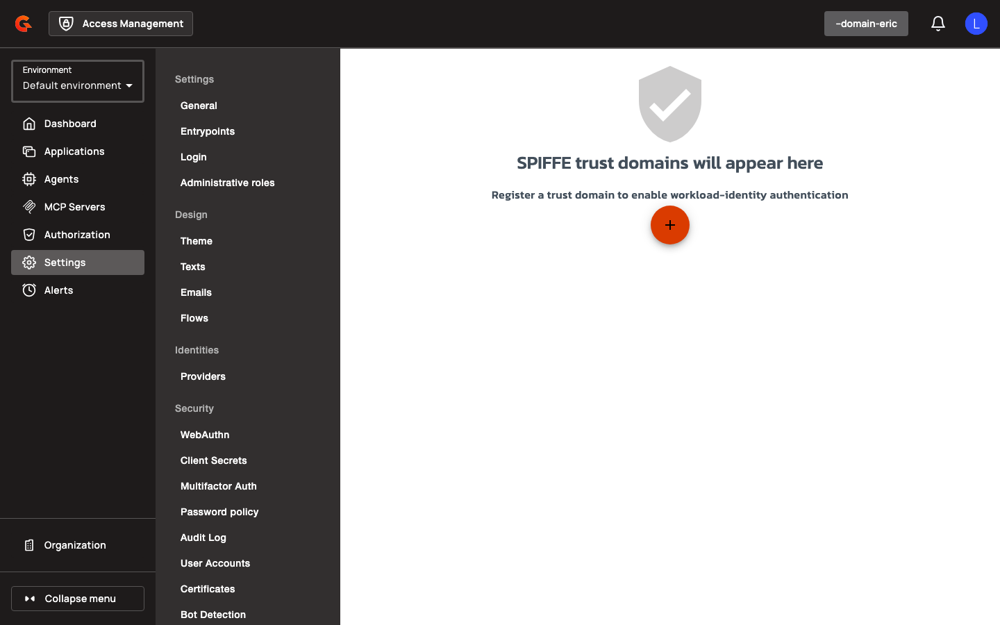

# Creating Agent Applications and Managing Trust Domains

## Creating Agent Applications

Navigate to **Agents** in the domain sidebar and click **Add Agent**. The agent creation wizard presents two modes: Manual and CIMD.

<figure><figcaption></figcaption></figure>

### Manual Agent Creation

1. Navigate to **Agents** in the domain sidebar.
2. Click **Add Agent**.
3. Select **Manual** on the creation mode toggle.

    <figure><figcaption></figcaption></figure>

4. Enter an **Application Name**.
5. Select an **Application Type** from the dropdown (Web, Native, Browser, Service, Resource Server).
6. Select an **Agent Kind** (User Embedded, Hosted Delegated, or Autonomous).
7. Enter at least one **Redirect URI** (required for User Embedded and Hosted Delegated agents).
8. Select **Grant Types** (User Embedded and Hosted Delegated require `authorization_code`; Autonomous requires `client_credentials`).
9. Select a **Token Endpoint Auth Method** from the dropdown. For SPIFFE workload identity, select **SPIFFE JWT**.
10. If **SPIFFE JWT** is selected, configure **Workload Identity Settings**:
    * Select a **Trust Domain** from the dropdown (populated from registered trust domains).
    * Enter a **Subject** (SPIFFE URI, e.g., `spiffe://example.org/agent/instance`).
    * Select a **Subject Match Mode** (Exact or Prefix). Prefix is only allowed for Hosted Delegated and Autonomous agents; the subject must end with `/`.
11. Optionally toggle **Use as DCR / CIMD registration template** to mark the agent as a registration template.
12. Click **Create**.

| Field | Description | Constraints |
|:------|:------------|:------------|
| **Application Name** | Human-readable name for the agent | Required |
| **Application Type** | OAuth application type | One of: Web, Native, Browser, Service, Resource Server |
| **Agent Kind** | Agent persona | One of: User Embedded, Hosted Delegated, Autonomous |
| **Redirect URI** | OAuth redirect endpoint | Required for User Embedded and Hosted Delegated |
| **Grant Types** | OAuth grant types | User Embedded/Hosted Delegated: `authorization_code`; Autonomous: `client_credentials`; all forbid `implicit`, `password`, `refresh_token` |
| **Token Endpoint Auth Method** | Client authentication method | Options include SPIFFE JWT, private_key_jwt, client_secret_basic, etc. |
| **Trust Domain** | SPIFFE trust domain name | Must exist in domain's trust domain registry |
| **Subject** | SPIFFE URI for the agent | Must start with `spiffe://<trustDomain>/`; must end with `/` if Subject Match Mode is Prefix |
| **Subject Match Mode** | SPIFFE subject matching strategy | Exact (default) or Prefix (Hosted Delegated and Autonomous only) |

### CIMD Agent Creation

1. Navigate to **Agents** in the domain sidebar.
2. Click **Add Agent**.
3. Select **CIMD** on the creation mode toggle (visible only when CIMD is enabled on the domain).

    <figure><figcaption></figcaption></figure>

4. Enter a **CIMD URL** (the Client Identity Metadata Document URL).
5. Click **Validate**. Access Management fetches and validates the document server-side.
6. Review the read-only **CIMD Preview** displaying parsed metadata (Client ID, Client Name, Redirect URIs, Grant Types, Response Types, Token Endpoint Auth Method, JWKS URI, Application Type, Subject Type, ID Token Signed Response Algorithm, Scope, Contacts, Logo URI, Client URI, Policy URI, TOS URI, Software ID, Software Version, Software Statement, TLS Client Auth Subject DN, TLS Client Auth SAN DNS, TLS Client Auth SAN URI, TLS Client Auth SAN IP, TLS Client Auth SAN Email, TLS Client Certificate Bound Access Tokens, Backchannel Token Delivery Mode, Backchannel Client Notification Endpoint, Backchannel Authentication Request Signing Algorithm, Backchannel User Code Parameter, Post Logout Redirect URIs, Request URIs, Sector Identifier URI, Inline JWKS indicator).
7. If **Client Name** is missing from the document, enter an **Application Name** in the prompt.
8. Optionally enter a **Description**.
9. Select an **Application Type** from the dropdown.
10. Click **Create**.

The CIMD URL becomes the application's `client_id`. All parsed metadata is persisted, and the document is upserted to pre-warm the gateway cache.

## Managing Trust Domains

Navigate to **Workload Identity** under domain settings to manage SPIFFE trust domains.

<figure><figcaption></figcaption></figure>

### Creating a trust domain

1. Navigate to **Workload Identity** in the domain sidebar.

    <figure><figcaption></figcaption></figure>

2. Click **Add Trust Domain**.

    <figure><figcaption></figcaption></figure>

3. Enter a **Name** for the trust domain.
4. Optionally enter a **Description**.
5. Select a **Bundle Source** (JWKS URL or Static JWKS).
6. If **JWKS URL** is selected, enter the **JWKS URL**.
7. Enter a **Refresh Interval (seconds)** (how often the trust bundle is refreshed).
8. Select **Allowed Algorithms** from the multi-select dropdown (RS256, RS384, RS512, ES256, ES384, ES512, PS256, PS384, PS512).
9. Click **Create**.

| Field | Description | Example |
|:------|:------------|:--------|
| **Name** | Trust domain identifier | `prod.example` |
| **Description** | Human-readable description | `Production SPIFFE trust domain` |
| **Bundle Source** | Source of the trust bundle | JWKS URL or Static JWKS |
| **JWKS URL** | URL to fetch the trust bundle | `https://spire.example.org/.well-known/jwks.json` |
| **Refresh Interval (seconds)** | Cache refresh interval | `3600` |
| **Allowed Algorithms** | Permitted signing algorithms | `["RS256", "ES256"]` |
