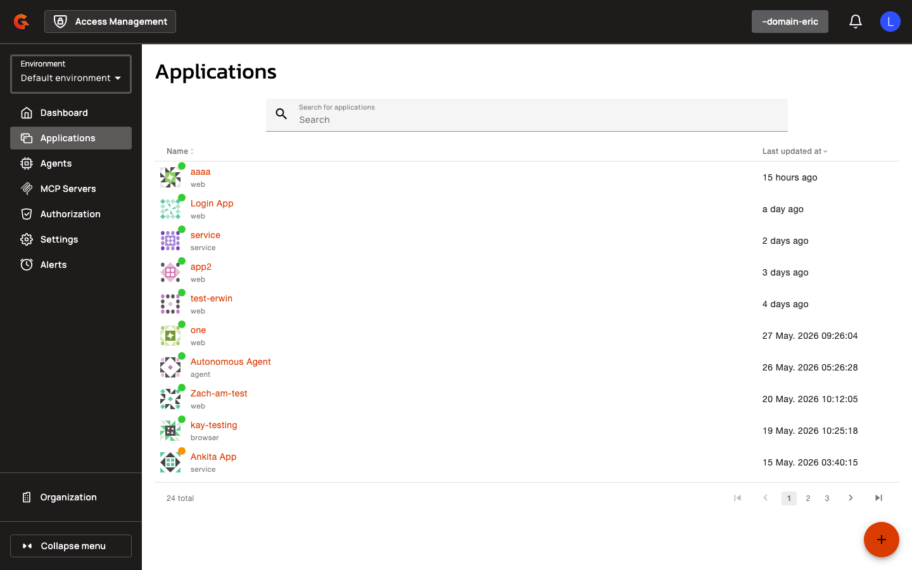
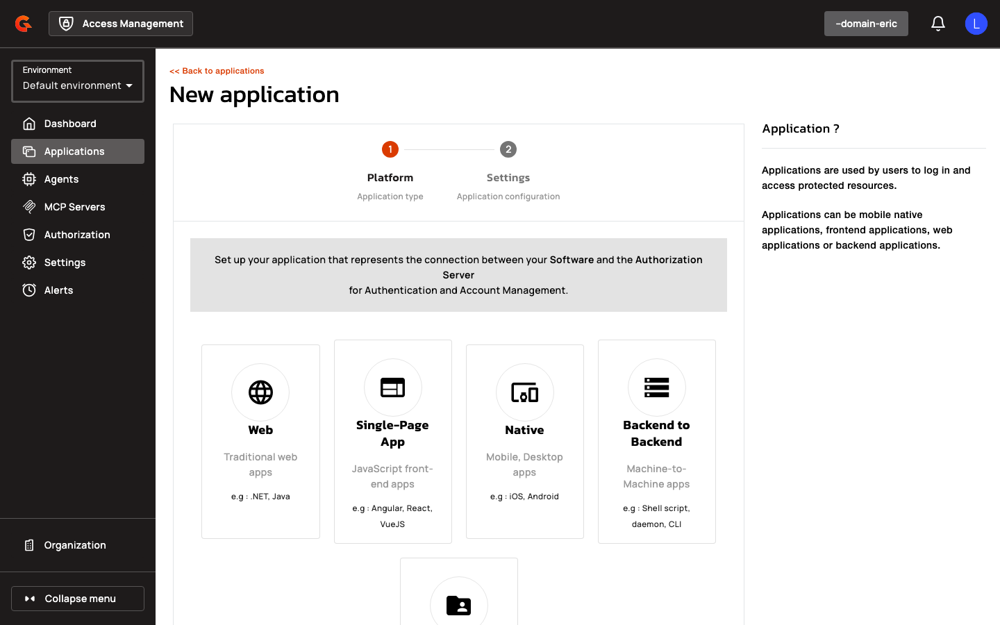
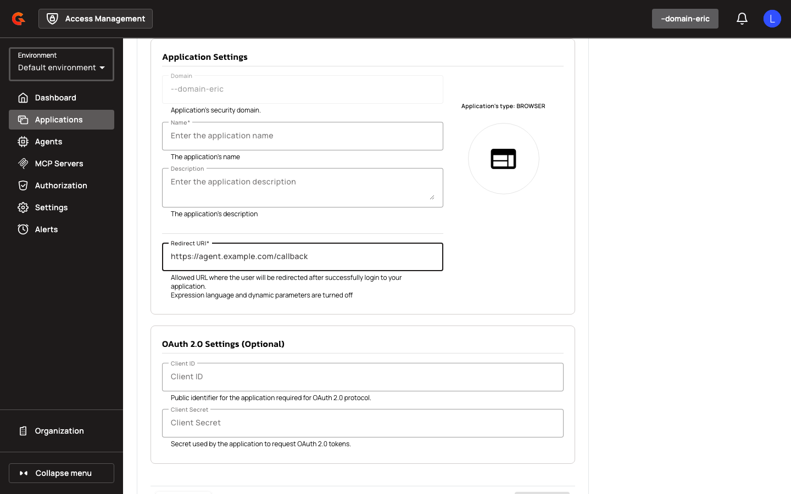
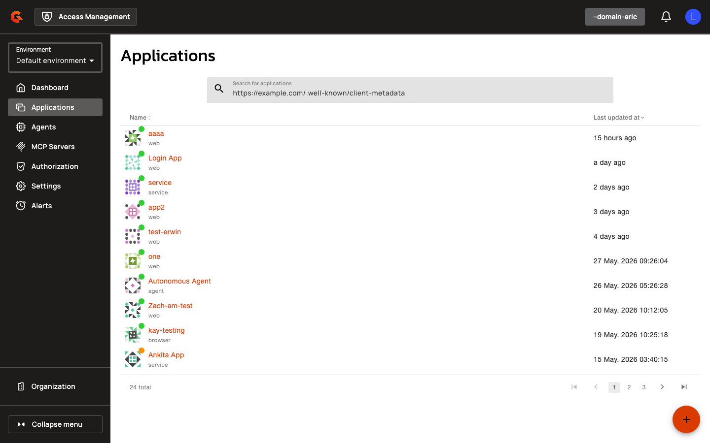

# Creating Agent Applications

Navigate to **Agents** in the management console and select **Add Agent**. Choose an agent persona (User-Embedded, Hosted Delegated, or Autonomous) and configure the application settings.

<figure><figcaption></figcaption></figure>

1. Select an **Agent Sub-Type** from the dropdown (User-Embedded, Hosted Delegated, or Autonomous).

    <figure><figcaption></figcaption></figure>

2. Enter a **Name** for the agent application.
3. For User-Embedded or Hosted Delegated agents, add at least one redirect URI in the **Redirect URIs** field.
4. Select **spiffe_jwt** from the **Token Endpoint Auth Method** dropdown to enable SPIFFE authentication.

    <figure><figcaption></figcaption></figure>

5. Select a **SPIFFE Trust Domain** from the dropdown (populated from registered trust domains).
6. Enter the expected SPIFFE ID in the **SPIFFE Subject** field (must start with `spiffe://{trustDomain}/`).
7. Select a **Subject Match Mode** (Exact Match or Prefix Match). Prefix Match is only available for Hosted Delegated and Autonomous agents; if selected, the SPIFFE Subject must end with `/`.

    <figure><figcaption></figcaption></figure>

**Agent application configuration reference:**

| Field | Description | Constraints |
|:------|:------------|:------------|
| Agent Sub-Type | Agent persona | Required when type is AGENT; must be `USER_EMBEDDED`, `HOSTED_DELEGATED`, or `AUTONOMOUS` |
| Redirect URIs | OAuth redirect endpoints | Required for User-Embedded and Hosted Delegated agents |
| Grant Types | Allowed OAuth flows | User-Embedded/Hosted Delegated: `authorization_code` only; Autonomous: `client_credentials` only; all agents prohibit `implicit`, `password`, `refresh_token` |
| SPIFFE Trust Domain | Registered trust domain name | Required when token endpoint auth method is `spiffe_jwt` |
| SPIFFE Subject | Expected SPIFFE ID | Required when token endpoint auth method is `spiffe_jwt`; must start with `spiffe://{trustDomain}/` |
| Subject Match Mode | SPIFFE ID matching strategy | `EXACT` (default) or `PREFIX`; PREFIX requires trailing `/` and is only allowed for Hosted Delegated or Autonomous agents |

## Managing Trust Domains

For instructions on creating and managing trust domains, see [Managing Trust Domains](../security-domains/managing-trust-domains.md).

## Management API

Access Management provides REST endpoints for filtering and retrieving agent applications.

**List applications with agent filtering:**

```
GET /domains/{domain}/applications?agentSubType={subType}
```

Query parameters:
- `agentSubType`: Filter by agent persona (`USER_EMBEDDED`, `HOSTED_DELEGATED`, or `AUTONOMOUS`)

**Response:**

```json
{
  "data": [
    {
      "id": "app-id",
      "name": "Agent App",
      "type": "AGENT",
      "settings": {
        "oauth": {
          "agentSubType": "AUTONOMOUS",
          "tokenEndpointAuthMethod": "spiffe_jwt",
          "spiffeTrustDomain": "example.org",
          "spiffeSubject": "spiffe://example.org/workload/service",
          "spiffeSubjectMatchMode": "EXACT"
        }
      }
    }
  ]
}
```

### Creating Applications from CIMD

Navigate to **Applications → Add Application** and toggle to **CIMD** mode on step 2 of the wizard.

<figure><figcaption></figcaption></figure>


<figure><figcaption></figcaption></figure>


<figure><figcaption></figcaption></figure>

1. Enter the **CIMD URL** (e.g., `https://example.com/.well-known/client-metadata`).
2. Review the **Metadata Preview** panel showing parsed OAuth/OIDC settings.

    <figure><figcaption></figcaption></figure>

3. If the document lacks a `client_name`, enter an **Application Name**.
4. Optionally override the **Client Name** or add a **Description**.
5. Confirm creation. The CIMD URL becomes the application's `client_id`.

Access Management validates the CIMD document server-side before creation. Validation rejects documents using secret-based token endpoint authentication methods (`client_secret_basic`, `client_secret_post`, `client_secret_jwt`), documents missing required `redirect_uris`, documents with `private_key_jwt` authentication but no `jwks` or `jwks_uri`, and URLs resolving to private IP addresses (unless the domain allows private IPs).

**CIMD validation API:**

```
POST /domains/{domain}/cimd/validate
```

**Request:**

```json
{ "url": "https://example.com/.well-known/client-metadata" }
```

**Response:**

```json
{
  "url": "https://example.com/.well-known/client-metadata",
  "hasInlineJwks": false,
  "missing": { "clientId": false, "clientName": false },
  "metadata": {
    "client_id": "...",
    "client_name": "...",
    "redirect_uris": ["..."],
    "grant_types": ["authorization_code"],
    "token_endpoint_auth_method": "private_key_jwt",
    "jwks_uri": "https://example.com/jwks"
  }
}
```

**CIMD application creation API:**

```
POST /domains/{domain}/cimd/applications
```

**Request:**

```json
{
  "name": "My CIMD App",
  "type": "WEB",
  "cimdUrl": "https://example.com/.well-known/client-metadata",
  "clientName": "Override Client Name",
  "description": "Optional description"
}
```

<figure><figcaption></figcaption></figure>
