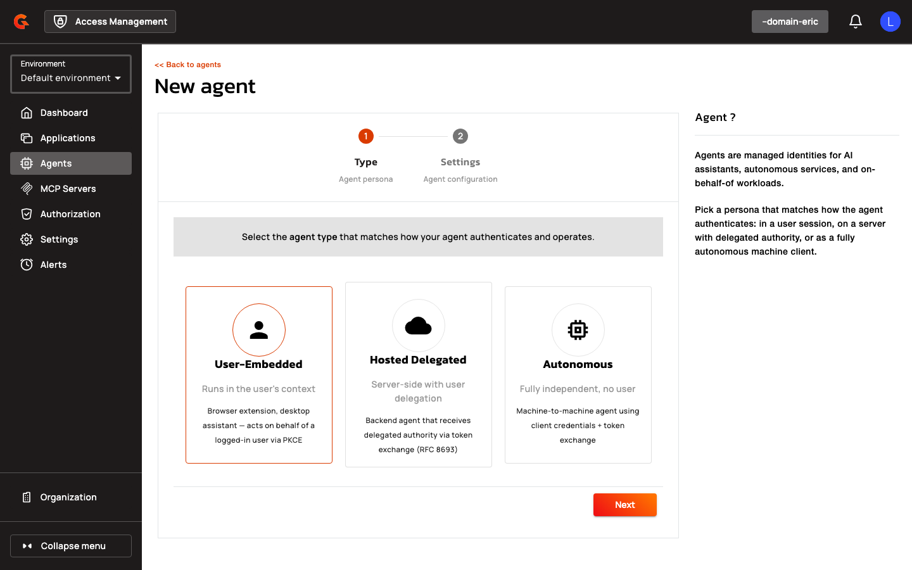

# Creating Agent Applications

Navigate to **Agents** in the management console and click **Add Agent**. Choose between **Manual** configuration or **CIMD** bootstrap.

<figure><figcaption></figcaption></figure>

<figure><figcaption></figcaption></figure>

## Manual Configuration

1. Select an **Application Type** (WEB, NATIVE, BROWSER, SERVICE, RESOURCE_SERVER).

    <figure><figcaption></figcaption></figure>

2. Select an **Agent Kind**: USER_EMBEDDED, HOSTED_DELEGATED, or AUTONOMOUS.
3. Enter a **Name** for the agent application.
4. Configure **Redirect URIs** (required for USER_EMBEDDED and HOSTED_DELEGATED; forbidden for AUTONOMOUS).
5. Select **Grant Types**. Agent applications cannot use `implicit`, `password`, or `refresh_token`. USER_EMBEDDED and HOSTED_DELEGATED agents cannot use `client_credentials`. AUTONOMOUS agents cannot use `authorization_code`.
6. Under **Token Endpoint Auth Method**, select **spiffe_jwt** to enable SPIFFE authentication.
7. Configure **Workload Identity Settings**:
   * Select a **Trust Domain** from the dropdown.
   * Enter a **Subject** (SPIFFE ID, e.g., `spiffe://example.org/hotel-agent`).
   * Select a **Subject Match Mode**: EXACT or PREFIX. PREFIX requires the subject to end with `/` and is only available for HOSTED_DELEGATED and AUTONOMOUS agents.
8. Optionally toggle **Use as DCR / CIMD registration template** to mark the application as a template.

The following table summarizes the configured properties:

| Field | Description |
|:------|:------------|
| **Application Type** | OAuth application type (WEB, NATIVE, BROWSER, SERVICE, RESOURCE_SERVER) |
| **Agent Kind** | Agent persona (USER_EMBEDDED, HOSTED_DELEGATED, AUTONOMOUS) |
| **Name** | Human-readable application name |
| **Redirect URIs** | OAuth redirect endpoints (required for user-bound agents) |
| **Grant Types** | Permitted OAuth flows (constrained by agent kind) |
| **Token Endpoint Auth Method** | Client authentication method (spiffe_jwt for SPIFFE) |
| **Trust Domain** | SPIFFE trust domain reference |
| **Subject** | SPIFFE ID or prefix |
| **Subject Match Mode** | EXACT or PREFIX matching |
| **Template** | Mark as DCR/CIMD registration template |

## CIMD Bootstrap

1. Toggle **CIMD** on step 2 of the application creation wizard.
2. Enter the **CIMD URL** (e.g., `https://agents.example.com/metadata/hotel-agent`).
3. Click **Validate**. AM fetches and validates the document, then displays a read-only preview of the parsed metadata.
4. If the document lacks a `client_name`, enter a **Name** for the application.
5. Review the parsed metadata (redirect URIs, grants, scopes, JWKS, etc.) and click **Create**.

The CIMD URL becomes the application's `client_id`. All parsed metadata is persisted, and the document is cached for gateway use.
