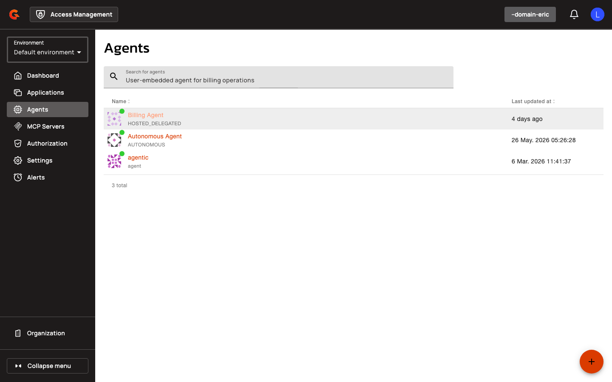

# Creating and Managing Agent Applications

## Creating Agent Applications

Navigate to **Agents** in the left sidebar. Agent applications are OAuth/OIDC clients with one of three personas: User-Embedded, Hosted Delegated, or Autonomous.

<figure><figcaption></figcaption></figure>

1. Click the **+** button in the bottom-right corner to add a new agent.

    <figure><figcaption></figcaption></figure>

2. Select an agent persona: **User-Embedded**, **Hosted Delegated**, or **Autonomous**.
3. Enter an **Application Name**.
4. Provide an optional **Description**.
5. For User-Embedded and Hosted Delegated agents, add at least one **Redirect URI**.
6. Select **Grant Types** appropriate for the persona (e.g., `authorization_code` and `refresh_token` for User-Embedded; `client_credentials` and `refresh_token` for Autonomous).
7. If using SPIFFE authentication, select **SPIFFE JWT** as the **Token Endpoint Auth Method**.
8. In the **Workload Identity Settings** section, select a **Trust Domain** from the dropdown.
9. Enter a **Subject** (e.g., `spiffe://prod.example/agent/billing`). The subject must start with `spiffe://<trust-domain>/`.
10. Select a **Subject Match Mode**: **Exact** or **Prefix**. Prefix mode is available only for Hosted Delegated and Autonomous agents and requires the subject to end with `/`.
11. Click **Create**.

| Field | Description |
|:------|:------------|
| **Agent Persona** | User-Embedded, Hosted Delegated, or Autonomous |
| **Application Name** | Display name for the agent application |
| **Description** | Optional description |
| **Redirect URIs** | Required for User-Embedded and Hosted Delegated agents |
| **Grant Types** | OAuth grant types (restricted by persona) |
| **Token Endpoint Auth Method** | SPIFFE JWT, Private Key JWT, or None (determined by persona) |
| **Trust Domain** | Registered trust domain for SPIFFE authentication |
| **Subject** | SPIFFE ID (must start with `spiffe://<trust-domain>/`) |
| **Subject Match Mode** | Exact (default) or Prefix (Hosted Delegated and Autonomous only) |

<figure><figcaption></figcaption></figure>

<figure><figcaption></figcaption></figure>
