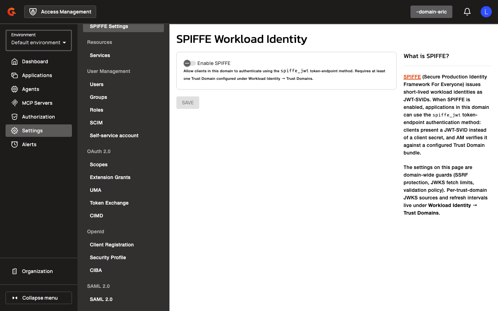

# SPIFFE Workload Identity & Agent Applications Overview

## Key Concepts

### Agent Application Types

Agent applications represent AI agents or automated workloads that interact with APIs on behalf of users or autonomously. Each agent has a **persona** (called **Kind** in the UI) that determines its OAuth flow and identity model:

- **USER_EMBEDDED**: Agents running in user-controlled environments (e.g., browser extensions, mobile apps). Require redirect URIs. Cannot use `client_credentials`. Top-level `sub` is the end user; `act.sub` carries the agent instance ID.
- **HOSTED_DELEGATED**: Agents hosted by the service provider but acting on behalf of users. Require redirect URIs. Cannot use both `authorization_code` and `client_credentials` simultaneously. Top-level `sub` is the end user; `act.sub` carries the agent instance ID.
- **AUTONOMOUS**: Agents acting independently without user context. Use `client_credentials` only. No redirect URIs needed. Top-level `sub` is the agent instance ID.

All agent applications emit a `client_profile` claim (`"ai_agent <kind>"`) and a `sub_profile` claim for the agent subject, propagated through `act` delegation chains.

### Trust Domains

A **Trust Domain** is a SPIFFE trust boundary registered in Access Management. Each trust domain references a JWKS URL (or static JWKS) containing the public keys used to verify JWT-SVIDs issued by that domain's SPIRE server. Trust domains are scoped to an AM domain and managed via the Workload Identity settings area.

| Property | Description |
|:---------|:------------|
| **Name** | Unique identifier for the trust domain (e.g., `am.local`) |
| **Bundle Source** | JWKS_URL (fetch from remote endpoint) or STATIC_JWKS (inline keys) |
| **JWKS URL** | Remote endpoint serving the trust bundle (required for JWKS_URL source) |
| **Refresh Interval Seconds** | How often to refresh the trust bundle from the JWKS URL |
| **Allowed Algorithms** | Permitted signing algorithms (e.g., RS256, ES256) |

Trust bundles are cached per domain and refreshed at the configured interval. On transient fetch errors, the last known good bundle is served.

### SPIFFE Workload Identity Settings

Applications using SPIFFE authentication configure **Workload Identity Settings** to bind a SPIFFE ID to the client:

| Property | Description |
|:---------|:------------|
| **Trust Domain** | Reference to a registered trust domain |
| **Subject** | SPIFFE ID (e.g., `spiffe://example.org/hotel-agent`) |
| **Subject Match Mode** | EXACT (default) or PREFIX |

**EXACT** mode requires the JWT-SVID `sub` to match the configured subject exactly. **PREFIX** mode (available only for HOSTED_DELEGATED and AUTONOMOUS agents) treats the configured subject as a path prefix: the subject must end with `/`, and any SVID whose `sub` starts with that prefix is accepted (e.g., `spiffe://acme/hotel-agent/` matches `spiffe://acme/hotel-agent/instance-a` and `spiffe://acme/hotel-agent/instance-b`). PREFIX mode enables per-instance agent identity: each running instance presents a unique SPIFFE ID attested by SPIRE, and the gateway synthesizes a per-instance client with `agentInstanceId` set to the full SPIFFE ID.

### Client Identity Metadata Document (CIMD)

A **Client Identity Metadata Document** is a JSON document hosted at a URL that describes an OAuth client's metadata (redirect URIs, grants, JWKS, etc.). Administrators can create applications by pointing AM at a CIMD URL instead of entering settings manually. The CIMD URL becomes the application's `client_id`. AM fetches, validates, and caches the document, then persists all parsed metadata on creation.

<figure><figcaption></figcaption></figure>

<figure><figcaption></figcaption></figure>
