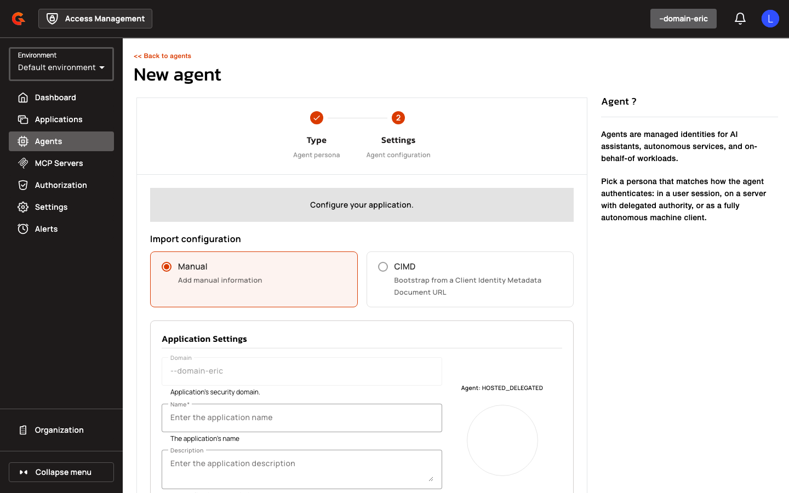

# SPIFFE Workload Identity & Agent Applications - Concepts

## Overview

SPIFFE Workload Identity & Agent Applications introduce AI agents as first-class OAuth/OIDC identities in Access Management. Agents authenticate using SPIFFE JWT-SVIDs issued by SPIRE, enabling per-instance identity attestation with delegation chains. This feature supports three agent personas (User-Embedded, Hosted Delegated, and Autonomous) and includes CIMD-based application bootstrap for hosted metadata documents.

## Key Concepts

### Agent Application Type

Agent applications are standard applications with `type=AGENT` and a persona defined by the `subType` field. Three personas are supported:

| Persona | Description | Use Case |
|:--------|:------------|:---------|
| **User-Embedded** | Agent acts on behalf of an authenticated user; user identity appears in top-level `sub` claim | Personal assistants, browser extensions |
| **Hosted Delegated** | Agent acts on behalf of a user but runs in a hosted environment; supports delegation chains | Multi-tenant SaaS agents |
| **Autonomous** | Agent acts independently without user context; agent identity appears in top-level `sub` | Background processors, scheduled tasks |

User-Embedded and Hosted Delegated agents require at least one redirect URI. Autonomous agents use only `client_credentials` grant. All agent applications emit a `client_profile` claim (`ai_agent <persona>`) and propagate `sub_profile` through delegation chains. Agent applications can be marked as templates for DCR/CIMD registration; the blueprint ID is permitted as `software_id` in DCR requests.

### Trust Domain

A Trust Domain is a new entity scoped to an Access Management security domain, representing a SPIFFE trust boundary. Each trust domain holds a name, JWKS URL (or static JWKS), allowed signature algorithms, and a refresh interval. The gateway fetches and caches trust bundles per domain, honoring the refresh interval and serving the last known good bundle on transient fetch errors.

| Property | Description | Example |
|:---------|:------------|:--------|
| **Name** | Unique identifier for the trust domain | `prod.example` |
| **Bundle Source** | `JWKS_URL` or `STATIC_JWKS` | `JWKS_URL` |
| **JWKS URL** | URL to fetch the trust bundle (JWKS) | `https://spire.example/keys` |
| **Allowed Algorithms** | Signature algorithms accepted for SVIDs | `["RS256", "ES256"]` |
| **Refresh Interval Seconds** | Cache duration for fetched bundles | `3600` |

JWKS URLs resolving to private, loopback, or link-local addresses are rejected unless the domain sets `allowPrivateIpAddress`. Trust domains are managed via a new **Workload Identity** section under domain settings.

### SPIFFE JWT-SVID Authentication

SPIFFE JWT-SVID is a client authentication method using workload identity attested by SPIRE. Clients present a JWT-SVID with `client_assertion_type=urn:ietf:params:oauth:client-assertion-type:jwt-spiffe`. The gateway validates the SVID signature against the trust domain's bundle, verifies the `sub` claim matches the application's configured SPIFFE subject, and authenticates the client. SVID validation enforces `typ=JWT`, allowed signing algorithms only (no `none` or HMAC), a SPIFFE ID in `sub` inside the configured trust domain, the token endpoint in `aud`, and bounded `iat`/`exp`/`nbf` claims with clock-skew tolerance per the SPIFFE JWT-SVID specification.

### SPIFFE Subject Match Mode

Applications using `spiffe_jwt` authentication configure a subject match mode:

| Mode | Behavior | Requirement |
|:-----|:---------|:------------|
| **Exact** | SVID `sub` must equal the configured subject exactly | Default for all applications |
| **Prefix** | SVID `sub` must start with the configured subject | Only allowed for Hosted Delegated or Autonomous agents; subject must end with `/` |

Prefix mode enables per-instance agent identity: a blueprint with subject `spiffe://acme/hotel-agent/` accepts SVIDs like `spiffe://acme/hotel-agent/instance-a` or `.../instance-b`. Prefix matching requires a trailing slash to ensure prefixes only match at path boundaries. The full SPIFFE ID becomes the agent instance ID, propagated to `act.sub` in access tokens.

### Agent JWT-Bearer Assertion

Agent JWT-Bearer is a distinct client-assertion flow for agent applications. The blueprint (registered agent application) is resolved from the `iss` claim; the running instance ID is carried in `sub`. The assertion type is `urn:ietf:params:oauth:client-assertion-type:agent-jwt-bearer`. The gateway verifies the assertion signature using the blueprint's JWKS, validates `aud` (token endpoint), and synthesizes a per-instance client with `agentInstanceId` set to `sub`. For User-Embedded and Hosted Delegated agents, `act.sub` in the issued token is set to the agent instance ID; for Autonomous agents, the top-level `sub` already carries the instance ID.

### CIMD Application Creation

Client ID Metadata Document (CIMD) bootstrap lets administrators create applications by pointing Access Management at a hosted metadata URL. In CIMD mode the admin supplies only the Document URL. Access Management fetches and validates it server-side, then shows a read-only preview of the parsed metadata before creation. The CIMD URL becomes the application's `client_id`. All parsed metadata (redirect URIs, grants, scopes, JWKS, mTLS, CIBA, software metadata) is persisted on creation, and the document is upserted to pre-warm the gateway cache. Documents using secret-based token endpoint auth methods (`client_secret_basic`, `client_secret_post`, `client_secret_jwt`) are rejected. CIMD URLs resolving to private IP addresses (literal or DNS resolution) are rejected unless the domain allows private IPs.

<figure><figcaption></figcaption></figure>

<figure><figcaption></figcaption></figure>

<figure><figcaption></figcaption></figure>

<figure><figcaption></figcaption></figure>

<figure><figcaption></figcaption></figure>

<figure><figcaption></figcaption></figure>
