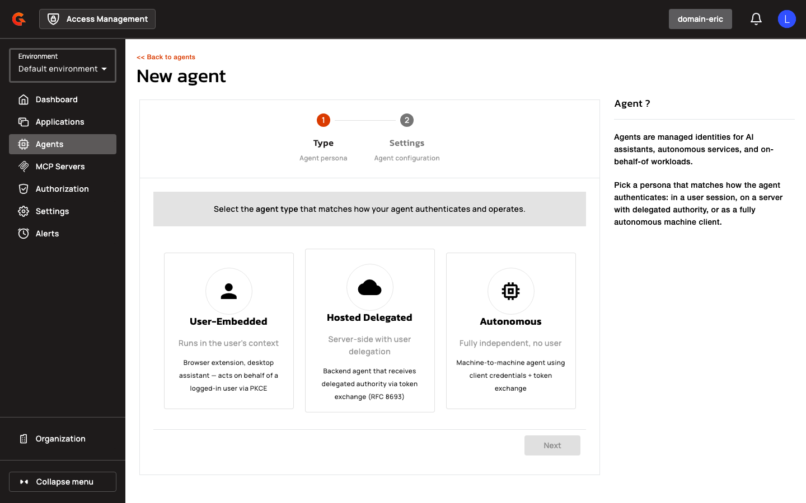
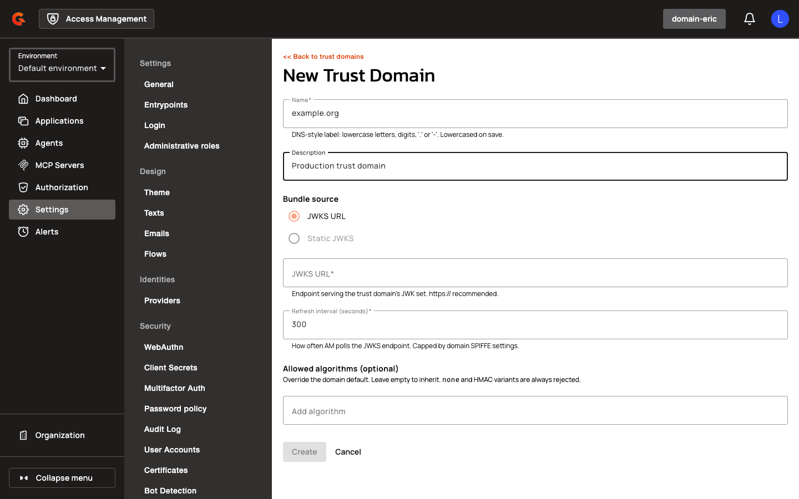

# SPIFFE Workload Identity & Agent Applications

## Prerequisites

- Access Management 4.12.0 or later
- For SPIFFE authentication: a SPIRE server or SPIFFE-compliant workload identity provider with an accessible JWKS endpoint
- For CIMD application creation: CIMD must be enabled at the domain level (`gravitee.oidc.cimdSettings.enabled=true`)
- Database migration required (new `trust_domains` table and `sub_type` column in `applications` table)

## Overview

SPIFFE Workload Identity & Agent Applications introduces AI agents as first-class OAuth/OIDC identities in Gravitee Access Management. Agents authenticate using SPIFFE JWT-SVIDs issued by SPIRE or other SPIFFE-compliant workload identity providers, enabling per-instance identity attestation and delegation chains. Administrators can create agent applications manually or bootstrap them from Client Identity Metadata Documents (CIMD), and configure trust domains to validate workload credentials.

## Key Concepts

### Agent Application Types

Agent applications represent AI agents and autonomous services that interact with APIs on behalf of users or independently. Three agent personas define the delegation model:

| Persona | Description | Typical Use Case |
|:--------|:------------|:-----------------|
| **User-Embedded** | Agent acts on behalf of an authenticated user; user identity is the primary subject | Personal assistant agents running in user context |
| **Hosted Delegated** | Agent acts on behalf of a user but maintains its own identity in the delegation chain | Multi-tenant agent services where user consent is required |
| **Autonomous** | Agent acts independently without user context | Background processing agents, scheduled tasks |

Agent applications enforce persona-specific constraints: **User-Embedded** and **Hosted Delegated** agents require at least one redirect URI. **User-Embedded** agents cannot use the `client_credentials` grant; **Autonomous** agents cannot use the `authorization_code` grant; **Hosted Delegated** agents must include the `urn:ietf:params:oauth:grant-type:token-exchange` grant. All agent applications are prohibited from using `implicit` or `password` grants. Agent applications can be marked as DCR/CIMD registration templates starting in Access Management 4.12.0. The blueprint application's `client_id` is permitted as the `software_id` in dynamic client registration.

### SPIFFE Workload Identity

SPIFFE (Secure Production Identity Framework For Everyone) provides cryptographically verifiable workload identities. A workload presents a JWT-SVID (SPIFFE Verifiable Identity Document) signed by its SPIRE server; Access Management validates the SVID against a registered trust domain and authenticates the client.

**Trust Domain**: A new entity scoped to an Access Management domain, holding a name (e.g., `prod.example`), JWKS URL pointing to the SPIRE server's trust bundle, allowed signing algorithms, and refresh interval. Trust domains are managed via the Workload Identity section in domain settings or the Management API.

**Subject Matching**: Applications configure a SPIFFE subject (e.g., `spiffe://prod.example/agent/billing`) and a matching mode. **Exact** mode requires the JWT-SVID `sub` claim to match the configured subject exactly. **Prefix** mode (available only for Hosted Delegated and Autonomous agents) accepts any SVID whose `sub` starts with the configured subject path, enabling per-instance identity attestation. Prefix subjects must end with `/` to ensure prefixes only match at path boundaries.

**SVID Validation**: Access Management verifies the JWT-SVID's `typ` header is `JWT`, signature algorithm is in the trust domain's allowed list, `sub` is a SPIFFE URI within the configured trust domain, `aud` contains the token endpoint URL, and `iat`/`exp`/`nbf` claims are within bounds (with configurable clock skew tolerance).

### Client Identity Metadata Document (CIMD)

CIMD enables administrators to create applications by referencing a hosted metadata document URL instead of manually entering OAuth/OIDC settings. In CIMD mode the admin supplies only the Document URL. Access Management fetches and validates it server-side, then shows a read-only preview (a "CIMD confirm" step) of the parsed metadata before creation. The CIMD URL becomes the application's `client_id`. Secret-based authentication methods (`client_secret_basic`, `client_secret_post`, `client_secret_jwt`) are rejected for CIMD-created applications.

### Agent Authentication Flow

Agents authenticate using the `urn:ietf:params:oauth:client-assertion-type:agent-jwt-bearer` assertion type. The blueprint application (the registered agent in Access Management) is resolved from the JWT's `iss` claim; the running instance ID is carried in the `sub` claim. For SPIFFE-authenticated agents, the instance ID is the full SPIFFE URI from the JWT-SVID's `sub` claim. Issued access tokens include a `client_profile` claim (e.g., `"ai_agent autonomous"`) and a `sub_profile` claim for agent subjects. For user-bound agents (User-Embedded, Hosted Delegated), the access token's top-level `sub` is the end-user ID, and `act.sub` is the agent instance ID, creating a delegation chain.

### Application Sub-Type Field

The agent persona is stored in a top-level `Application.subType` field (optional string, e.g., `"AUTONOMOUS"`), replacing the earlier nested `settings.agent` (AgentSettings) shape. The public API, persistence layer, and UI all read and write this single field. The UI sends the agent persona as `kind` on creation to match the backend contract.


## Gateway Configuration

### SPIFFE Settings

Configure SPIFFE workload identity validation at the domain level:

| Property | Description | Example |
|:---------|:------------|:--------|
| `gravitee.oidc.spiffeSettings.enabled` | Enables SPIFFE workload identity authentication | `true` |
| `gravitee.oidc.spiffeSettings.allowPrivateIpAddress` | Allows SPIFFE JWKS URLs to resolve to private IP addresses | `false` |
| `gravitee.oidc.spiffeSettings.allowUnsecuredHttpUri` | Allows SPIFFE JWKS URLs to use `http://` (insecure) | `false` |
| `gravitee.oidc.spiffeSettings.cacheMaxEntries` | Maximum number of cached SPIFFE trust bundle entries | `100` |
| `gravitee.oidc.spiffeSettings.cacheTtlSeconds` | TTL for cached SPIFFE trust bundle entries | `3600` |
| `gravitee.oidc.spiffeSettings.clockSkewSeconds` | Allowed clock skew for SPIFFE JWT-SVID validation | `30` |
| `gravitee.oidc.spiffeSettings.defaultAllowedAlgorithms` | Default signing algorithms allowed for SPIFFE JWT-SVIDs | `["RS256", "ES256"]` |
| `gravitee.oidc.spiffeSettings.fetchTimeoutMs` | HTTP timeout for fetching SPIFFE trust bundles | `10000` |
| `gravitee.oidc.spiffeSettings.maxJwtLifetimeSeconds` | Maximum allowed lifetime for SPIFFE JWT-SVIDs | `300` |
| `gravitee.oidc.spiffeSettings.maxResponseSizeKb` | Maximum size of SPIFFE trust bundle HTTP responses | `512` |

### CIMD Settings

Configure CIMD application creation at the domain level:

| Property | Description | Example |
|:---------|:------------|:--------|
| `gravitee.oidc.cimdSettings.enabled` | Enables CIMD (Client Identity Metadata Document) flows | `true` |
| `gravitee.oidc.cimdSettings.allowPrivateIpAddress` | Allows CIMD URLs to resolve to private IP addresses | `false` |
| `gravitee.oidc.cimdSettings.allowUnsecuredHttpUri` | Allows CIMD URLs to use `http://` (insecure) | `false` |
| `gravitee.oidc.cimdSettings.allowedDomains` | Whitelist of domains allowed for CIMD URLs | `["example.com", "trusted.org"]` |

## Creating Agent Applications

### Manual agent creation

1. Navigate to **Agents** in the domain navigation menu.

    <figure><figcaption></figcaption></figure>

2. Click the **+** button in the bottom-right corner to open the agent creation wizard.

    <figure><figcaption></figcaption></figure>

3. Select a **Kind** (agent persona) from the three options: **User-Embedded**, **Hosted Delegated**, or **Autonomous**.
4. Click **Next** to proceed to the Settings step.

    <figure><figcaption></figcaption></figure>

5. Ensure **Manual** mode is selected under **Import configuration**.
6. Enter a **Name** for the agent application (e.g., "Billing Agent").
7. Optionally enter a **Description**.
8. Scroll down to configure **Redirect URIs** (required for User-Embedded and Hosted Delegated agents).
9. Select **Grant Types**. User-Embedded agents cannot use `client_credentials`; Autonomous agents cannot use `authorization_code`; Hosted Delegated agents must include `urn:ietf:params:oauth:grant-type:token-exchange`. All agents are prohibited from using `implicit` or `password` grants.
10. Select **SPIFFE JWT** as the **Token Endpoint Auth Method** to enable workload identity authentication.

    <figure><figcaption></figcaption></figure>

11. In the **Workload Identity Settings** section, select a **Trust Domain** from the dropdown (populated from registered trust domains).
12. Enter a **Subject** starting with `spiffe://<trust-domain>/` (e.g., `spiffe://prod.example/agent/billing`).
13. Select a **Subject Match Mode**: **Exact** (default) or **Prefix**. Prefix mode is available only for Hosted Delegated and Autonomous agents and requires the subject to end with `/`.
14. Click **Create** to register the agent application.

**Reference Table**:

| Field | Description | Constraints |
|:------|:------------|:------------|
| **Kind** | Agent persona defining delegation model | Required when type is Agent; must be User-Embedded, Hosted Delegated, or Autonomous |
| **Redirect URIs** | OAuth redirect endpoints | Required for User-Embedded and Hosted Delegated agents |
| **Grant Types** | Allowed OAuth grant types | User-Embedded: no `client_credentials`; Autonomous: no `authorization_code`; Hosted Delegated: must include `token-exchange`; all agents: no `implicit` or `password` |
| **Trust Domain** | SPIFFE trust domain for workload identity | Must be registered in the domain |
| **Subject** | SPIFFE URI identifying the workload | Must start with `spiffe://<trust-domain>/`; must end with `/` if Subject Match Mode is Prefix |
| **Subject Match Mode** | How the SVID `sub` claim is matched | Exact (default) or Prefix; Prefix only for Hosted Delegated and Autonomous agents |

### CIMD Agent Creation

1. Navigate to **Agents** in the domain navigation menu.
2. Click the **+** button in the bottom-right corner to open the agent creation wizard.
3. Select a **Kind** (agent persona) from the three options.
4. Click **Next** to proceed to the Settings step.

    <figure><figcaption></figcaption></figure>

5. Toggle to **CIMD** mode under **Import configuration**.
6. Enter the **Document URL** (e.g., `https://example.com/.well-known/client-metadata`).
7. Click **Validate**. Access Management fetches the document and displays a preview of parsed metadata: Client ID, Client Name, Redirect URIs, Grant Types, Token Endpoint Auth Method, and JWKS URL (or "Inline JWKS" badge if the document contains embedded keys).
8. Review the preview. Edit the **Name** and **Client Name** fields if needed (pre-filled from the document's `client_name`).
9. Select an application **Type** from the dropdown: Web, Native, Browser, Service, or Resource Server.
10. Optionally enter a **Description**.
11. Click **Create** to register the application. The CIMD URL becomes the application's `client_id`.

## Managing Trust Domains

### Creating a Trust Domain

1. Navigate to **Settings** in the domain navigation menu.
2. Expand the **Security** section in the left sidebar.
3. Click **Workload Identity** (or navigate directly to the SPIFFE trust domains page).

    <figure><figcaption></figcaption></figure>

4. Click the **+** button to open the trust domain creation form.

    <figure><figcaption></figcaption></figure>

5. Enter a **Name** for the trust domain (e.g., `example.org`).
6. Optionally enter a **Description** (e.g., "Production trust domain").
7. Under **Bundle Source**, select **JWKS URL**.
8. Enter the **JWKS URL** pointing to the SPIRE server's trust bundle endpoint (e.g., `http://spire-oidc:8443/keys`).
9. Specify a **Refresh Interval** in seconds (e.g., `300`).
10. Select **Allowed Algorithms** from the multi-select dropdown (e.g., `RS256`, `ES256`, `PS256`).
11. Click **Create**.

**Alternative: Static JWKS**

<figure><figcaption></figcaption></figure>

If you select **Static JWKS** as the bundle source, paste the trust bundle JSON directly into the **Static JWKS** textarea instead of providing a JWKS URL.

### Updating a Trust Domain

1. Navigate to **Workload Identity** under domain settings.
2. In the trust domain list, click **Edit** for the target trust domain.
3. Modify the **JWKS URL**, **Refresh Interval**, **Allowed Algorithms**, or **Description** as needed. The **Static JWKS** field is write-only and cannot be updated via the edit form.
4. Click **Save**.

### Deleting a Trust Domain

1. Navigate to **Workload Identity** under domain settings.
2. In the trust domain list, click **Delete** for the target trust domain.
3. Confirm the deletion. Applications referencing the deleted trust domain will fail SPIFFE authentication until reconfigured.

### Management API

**POST** `/organizations/{organizationId}/environments/{environmentId}/domains/{domain}/trust-domains`

Creates a SPIFFE trust domain. Requires `APPLICATION[CREATE]` permission. Request body:

```json
{
  "name": "prod.example",
  "bundleSource": "JWKS_URL",
  "jwksUrl": "http://spire-oidc:8443/keys",
  "refreshIntervalSeconds": 300,
  "allowedAlgorithms": ["RS256", "ES256"],
  "description": "Production SPIRE trust domain"
}
```

**GET** `/organizations/{organizationId}/environments/{environmentId}/domains/{domain}/trust-domains`

Lists all trust domains for a security domain.

**GET** `/organizations/{organizationId}/environments/{environmentId}/domains/{domain}/trust-domains/{trustDomainId}`

Retrieves a single trust domain. The `staticJwks` field is excluded from the response.

**PUT** `/organizations/{organizationId}/environments/{environmentId}/domains/{domain}/trust-domains/{trustDomainId}`

Updates a trust domain. The `staticJwks` field cannot be updated via PUT.

**DELETE** `/organizations/{organizationId}/environments/{environmentId}/domains/{domain}/trust-domains/{trustDomainId}`

Deletes a trust domain.

### CIMD Validation API

**POST** `/organizations/{organizationId}/environments/{environmentId}/domains/{domain}/cimd/validate`

Validates a CIMD URL and returns a parsed metadata preview. Requires `APPLICATION[CREATE]` permission and a CIMD-enabled domain. Request body:

```json
{
  "url": "https://example.com/.well-known/client-metadata"
}
```

Response:

```json
{
  "url": "https://example.com/.well-known/client-metadata",
  "hasInlineJwks": false,
  "missing": {
    "clientId": false,
    "clientName": false
  },
  "metadata": {
    "client_id": "example-client",
    "client_name": "Example Application",
    "redirect_uris": ["https://example.com/callback"],
    "grant_types": ["authorization_code"],
    "token_endpoint_auth_method": "private_key_jwt",
    "jwks_uri": "https://example.com/.well-known/jwks.json"
  }
}
```

**POST** `/organizations/{organizationId}/environments/{environmentId}/domains/{domain}/cimd/applications`

Creates an application from a CIMD document URL. Requires `APPLICATION[CREATE]` permission and a CIMD-enabled domain. Request body:

```json
{
  "cimdUrl": "https://example.com/.well-known/client-metadata",
  "name": "Example App",
  "type": "WEB",
  "clientName": "Example Client",
  "description": "Application created from CIMD"
}
```

### Application Filtering API

**GET** `/organizations/{organizationId}/environments/{environmentId}/domains/{domain}/applications?type=WEB&type=NATIVE`

The `type` query parameter accepts multiple values. Each value must be one of: `WEB`, `NATIVE`, `BROWSER`, `SERVICE`, `RESOURCE_SERVER`, `AGENT`. The Applications list in the console excludes agents by sending `?type=WEB&type=NATIVE&type=BROWSER&type=SERVICE&type=RESOURCE_SERVER`. The Agents list sends `?type=AGENT`. The backend `/applications` listing accepts a multi-valued `type` filter so the UI can request "AGENT only" or "everything except AGENT" in one call.

## Domain-Level Settings

### CIMD Settings

For CIMD configuration properties and detailed instructions, see [Client Identity Metadata Document (CIMD)](#client-identity-metadata-document-cimd).

### SPIFFE Settings

For SPIFFE configuration properties, see [Gateway Configuration → SPIFFE Settings](#spiffe-settings).

## Restrictions

- SPIFFE JWT-SVID validation requires the trust domain's JWKS to be accessible at the time of authentication. If the JWKS URL is unreachable, authentication fails with no fallback.
- Prefix subject matching mode is restricted to Hosted Delegated and Autonomous agent applications. User-Embedded agents must use Exact mode.
- CIMD URLs must be resolvable and reachable from the Access Management gateway. Private IP addresses and unsecured HTTP are blocked by default (configurable via `allowPrivateIpAddress` and `allowUnsecuredHttpUri`).
- Agent applications cannot use `implicit` or `password` grant types. User-Embedded agents cannot use `client_credentials`. Autonomous agents cannot use `authorization_code`. Hosted Delegated agents must include `urn:ietf:params:oauth:grant-type:token-exchange`.
- Trust domain `staticJwks` field is write-only. It is not returned in GET responses and cannot be updated via PUT (only via POST during creation).
- SPIFFE JWT-SVID `aud` claim must contain the exact token endpoint URL. Wildcard or issuer-level audience values are rejected.
- CIMD-created applications cannot use secret-based token endpoint authentication methods (`client_secret_basic`, `client_secret_post`, `client_secret_jwt`).
- Presenting a SPIFFE URI in the `sub` claim with `client_assertion_type=urn:ietf:params:oauth:client-assertion-type:jwt-bearer` is rejected with the error: "SPIFFE JWT-SVID must be sent with client_assertion_type=urn:ietf:params:OAuth:client-assertion-type:jwt-spiffe".
- For SPIFFE-authenticated applications, the `client_id` form parameter is authoritative; if absent, the SPIFFE URI in the JWT-SVID's `sub` claim is used as the client ID.
- Agent applications can be marked as DCR/CIMD registration templates starting in Access Management 4.12.0.

## Related Changes

Database migration is required. A new `trust_domains` table stores SPIFFE trust domain registrations with fields for name, bundle source, JWKS URL, refresh interval, allowed algorithms, and static JWKS. A new `sub_type` column is added to the `applications` table to store the agent persona (User-Embedded, Hosted Delegated, Autonomous). The Applications list in the management console now scopes itself to exclude agents and displays them in a separate top-level Agents navigation entry. The `type` query parameter on the `/applications` endpoint accepts multiple values to support filtering. The agent creation wizard includes a Manual/CIMD toggle (when CIMD is enabled), a Kind selector for agent personas, and a Workload Identity Settings section for SPIFFE configuration. Trust domain management is accessible via a new Workload Identity section under domain settings. CIMD validation and application creation endpoints are added to the Management API. Access tokens for user-bound agents (User-Embedded, Hosted Delegated) include an `act.sub` claim set to the agent instance ID, creating a delegation chain. The `AGENT_AUTHENTICATED` audit event type is removed; agent authentication is logged via standard `TOKEN_CREATED` audit events with `agentApplication` metadata.
