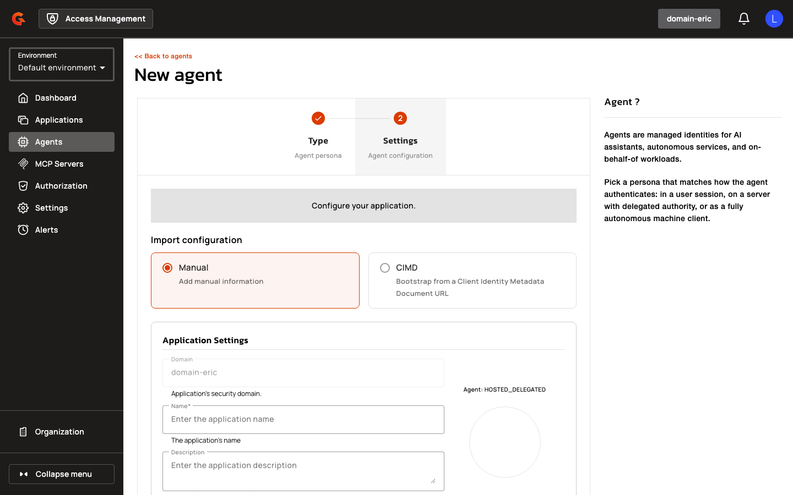

# SPIFFE Workload Identity & Agent Applications

## Prerequisites

- Access Management 4.12.0 or later
- For CIMD: CIMD enabled on the domain (`cimdSettings.enabled=true`)
- `APPLICATION[CREATE]` permission for CIMD validation and application creation endpoints

## Overview

Agent Applications introduces AI agents as first-class OAuth/OIDC identities in Gravitee Access Management. Administrators can create agent applications via Client Identity Metadata Documents (CIMD) or manual configuration.

## Key Concepts

### Client Identity Metadata Document (CIMD)

Client Identity Metadata Document (CIMD) is an OAuth 2.0 extension that allows clients to present a URL as their `client_id` and retrieve configuration dynamically from that URL, eliminating the need for pre-registration. The Authorization Server fetches a metadata document from the client_id URL and synthesizes the client's configuration by merging it with a designated template application. CIMD is the preferred authentication mechanism for AI agents and Model Context Protocol (MCP) clients, enabling agent-driven workflows to authenticate without manual registration.

## Gateway Configuration

### CIMD Domain Settings

Configure CIMD at the domain level via `gravitee.yml` or the Management API.

| Property | Description | Example |
|:---------|:------------|:--------|
| `cimdSettings.enabled` | Enable CIMD for the domain | `true` |
| `cimdSettings.allowPrivateIpAddress` | Allow CIMD URLs resolving to private IP addresses | `false` |
| `cimdSettings.allowUnsecuredHttpUri` | Allow unsecured HTTP URIs for CIMD URLs (development only) | `false` |
| `cimdSettings.allowedDomains` | Allowed domains for CIMD URLs | `["agents.example.com"]` |
| `cimdSettings.cacheMaxEntries` | Maximum number of cached CIMD documents | `100` |
| `cimdSettings.cacheTtlSeconds` | Cache TTL in seconds | `3600` |
| `cimdSettings.fetchTimeoutMs` | Fetch timeout for CIMD URLs in milliseconds | `5000` |
| `cimdSettings.maxResponseSizeKb` | Maximum CIMD response size in kilobytes | `512` |

<figure><figcaption></figcaption></figure>

<figure><figcaption></figcaption></figure>

<figure><figcaption></figcaption></figure>

## Creating Agent Applications

1. Navigate to **Agents** in the left sidebar.
2. Click the **+** button to add a new agent.

    <figure><figcaption></figcaption></figure>

3. Select an **Agent Persona**: **User-Embedded**, **Hosted Delegated**, or **Autonomous**.
4. Click **Next**.
5. Choose between **Manual** configuration or **CIMD** (Client Identity Metadata Document) creation.

### Manual Configuration

1. Select **Manual** and ensure it is highlighted.
2. Enter an **Application Name** (e.g., `Billing Agent`).
3. (Optional) Enter a **Description**.
4. For **USER_EMBEDDED** or **HOSTED_DELEGATED**: Scroll down and add at least one **Redirect URI**.

<figure><figcaption></figcaption></figure>

5. Configure **Grant Types**: Select `authorization_code` for **USER_EMBEDDED** or **HOSTED_DELEGATED**; select `client_credentials` for **AUTONOMOUS**. Do not select `implicit`, `password`, or `refresh_token`.

<figure><figcaption></figcaption></figure>

6. (Optional) Configure **Token Endpoint Auth Method**: Select **spiffe_jwt** to enable SPIFFE workload identity authentication.
7. If **spiffe_jwt** is selected:

<figure><figcaption></figcaption></figure>

   - Select a **Trust Domain** from the dropdown.
   - Enter a **Subject** (SPIFFE ID) in the format `spiffe://<trust-domain>/<workload-path>`.
   - Select a **Subject Match Mode**: **EXACT** or **PREFIX**. For **PREFIX**, the subject must end with `/`.
8. (Optional) Toggle **Use as DCR / CIMD registration template** to mark the application as a template for dynamic client registration.

<figure><figcaption></figcaption></figure>

9. Click **Create**.

| Field | Description | Required |
|:------|:------------|:---------|
| **Agent Persona** | Agent type: USER_EMBEDDED, HOSTED_DELEGATED, or AUTONOMOUS | Yes |
| **Application Name** | Human-readable name for the agent application | Yes |
| **Description** | Optional description | No |
| **Redirect URI** | OAuth redirect URI (required for USER_EMBEDDED and HOSTED_DELEGATED) | Conditional |
| **Grant Types** | OAuth grant types (exclude implicit, password, refresh_token) | Yes |
| **Token Endpoint Auth Method** | Client authentication method (e.g., spiffe_jwt) | Yes |
| **Trust Domain** | SPIFFE trust domain for workload identity | Conditional |
| **Subject** | SPIFFE ID for the workload | Conditional |
| **Subject Match Mode** | EXACT or PREFIX matching | Conditional |
| **Use as DCR / CIMD registration template** | Mark as template for dynamic registration | No |

### CIMD Configuration

1. Select **CIMD** and ensure it is highlighted.
2. Enter the **CIMD URL** (e.g., `https://agents.example.com/.well-known/client-metadata`).
3. Click **Validate**. Access Management fetches and validates the document server-side.
4. Review the **CIMD Preview** showing parsed metadata (redirect URIs, grants, scopes, JWKS, etc.).
5. If the document lacks a `client_name`, enter an **Application Name**.
6. Click **Create**.

The CIMD URL becomes the application's `client_id`. All parsed metadata is persisted, and the document is cached for gateway use.

### Application Filtering API

**GET** `/organizations/{organizationId}/environments/{environmentId}/domains/{domain}/applications`

List applications with optional type filtering. The endpoint accepts a multi-valued `type` filter so the UI can request "AGENT only" or "everything except AGENT" in one call. Query parameters:

- `type`: Array of application types (e.g., `type=AGENT`, `type=WEB&type=SERVICE`)
- `page`: Page number (default 0)
- `size`: Page size (default 50)
- `q`: Search query
- `expand`: Array of fields to expand
- `status`: `enabled` or `disabled`
- `owner.email`: Filter by owner email

Example: `GET /applications?type=AGENT` returns only agent applications. `GET /applications?type=WEB&type=SERVICE` returns applications where `type IN (WEB, SERVICE)`.

## Restrictions

- Agent applications cannot use `implicit`, `password`, or `refresh_token` grants.
- **USER_EMBEDDED** agents cannot use `client_credentials` grant.
- **AUTONOMOUS** agents cannot use `authorization_code` grant.
- **HOSTED_DELEGATED** agents cannot use both `client_credentials` and `authorization_code` grants simultaneously.
- **USER_EMBEDDED** and **HOSTED_DELEGATED** agents require at least one redirect URI.
- **AUTONOMOUS** agents do not require redirect URIs.
- CIMD URLs must use `https://` unless **Allow Unsecured HTTP URI** is enabled (development only).
- CIMD URLs resolving to private, loopback, or link-local IP addresses are rejected unless **Allow Private IP Address** is enabled.
- CIMD URLs must match an allowed domain if **Allowed Domains** is configured.
- CIMD clients cannot use `client_secret_basic`, `client_secret_post`, or `client_secret_jwt` token endpoint authentication methods.
- CIMD documents that are unreachable, oversized, or slow (timeout) are rejected.
- CIMD documents missing required `redirect_uris` are rejected.
- CIMD documents using `private_key_jwt` without `jwks` or `jwks_uri` are rejected.
- JWKS URLs resolving to private, loopback, or link-local IP addresses are rejected unless **Allow Private IP Address** is enabled.

<figure><figcaption></figcaption></figure>

<figure><figcaption></figcaption></figure>

<figure><figcaption></figcaption></figure>

<figure><figcaption></figcaption></figure>

<figure><figcaption></figcaption></figure>

<figure><figcaption></figcaption></figure>
