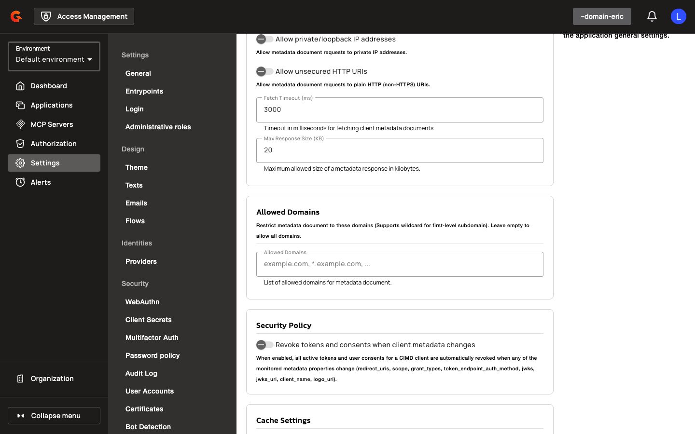
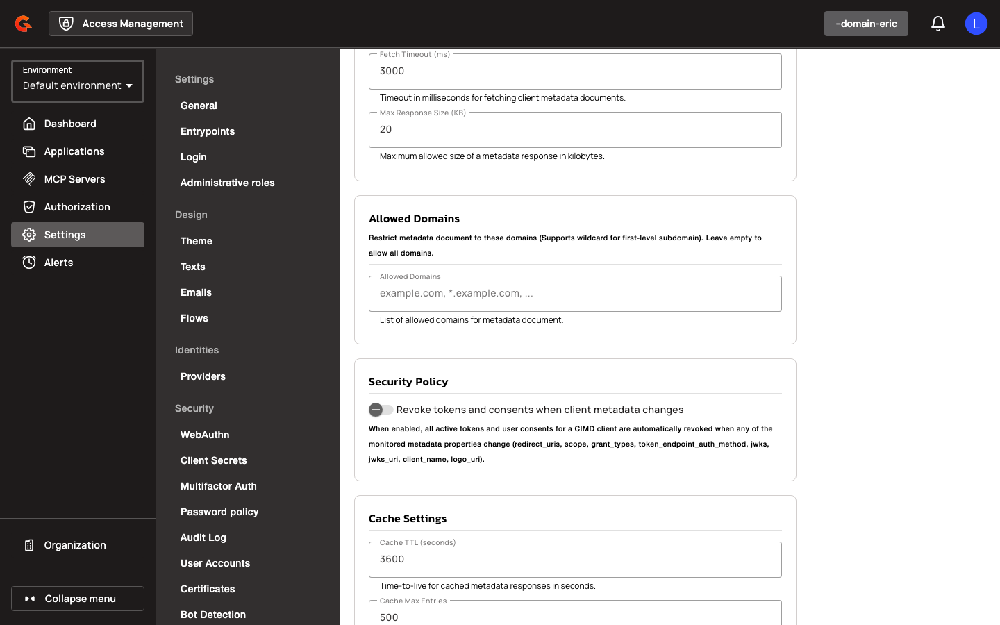
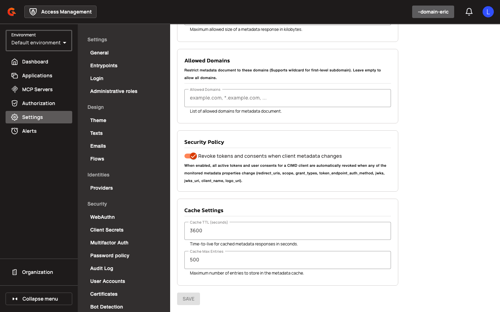

# Enable and Configure CIMD in the Console

## Creating a CIMD-Enabled Domain

To enable CIMD for a domain, navigate to the CIMD settings page and toggle **Enable CIMD** to on. Select a **Template Application** from the autocomplete list (filtered to applications marked as templates). Configure SSRF protection by toggling **Allow Private/Loopback IP Addresses** and **Allow Unsecured HTTP URIs** as needed. Set **Fetch Timeout (ms)** to control how long the gateway waits for metadata responses (default 3000 ms). Define **Max Response Size (KB)** to limit metadata document size (default 20 KB). Optionally, add domains to the **Allowed Domains** chip list to restrict metadata fetching to trusted hosts (supports `*.example.com` for first-level subdomains). Configure **Cache TTL (seconds)** to control how long metadata is cached (default 3600 seconds) and **Cache Max Entries** to limit cache size (default 500 entries). Enable **Revoke Tokens and Consents When Client Metadata Changes** to automatically revoke all tokens and consents when the metadata document hash changes. Save the settings to activate CIMD for the domain.

## Authenticating CIMD Clients

When a client presents a `client_id` matching `^https?://`, the Authorization Server treats it as a CIMD client. The gateway fetches the metadata document from the canonical `client_id` URL, applying SSRF protection and validating the response against the template application. The metadata must include a `client_id` field matching the request URL (canonical form) and a non-empty `redirect_uris` array. The `token_endpoint_auth_method` defaults to `none` if omitted; secret-based methods (`client_secret_basic`, `client_secret_post`, `client_secret_jwt`) are forbidden. If `token_endpoint_auth_method` is `private_key_jwt`, the metadata must include either `jwks` or `jwks_uri`. The `grant_types` field defaults to `["authorization_code"]` and is intersected with the template's authorized grant types. The `response_types` field defaults to `["code"]` and is intersected with the template's response types. The `scope` field, if present, is intersected with the template's scope settings; if omitted, the template's scopes apply verbatim. The gateway synthesizes an ephemeral client object, caches the metadata for the configured TTL, and proceeds with the authorization flow. If the metadata includes a `logo_uri`, the gateway fetches the logo asynchronously and caches it separately. Tokens are issued with the `aud` claim set to the canonical `client_id`, and the metadata document hash is stored in audit actor attributes.

## End-User Configuration

1. Navigate to **Settings → OAuth 2.0 → CIMD** in the domain console.

    <figure><figcaption></figcaption></figure>

2. Toggle **Enable CIMD** to enable or disable CIMD support.
3. Select a **Template Application** from the autocomplete dropdown (filtered to applications marked as templates).
4. Toggle **Allow Private/Loopback IP Addresses** to allow metadata requests to private, loopback, link-local, and any-local IP addresses.

    <figure><figcaption></figcaption></figure>

5. Toggle **Allow Unsecured HTTP URIs** to allow metadata requests to plain HTTP (non-HTTPS) URIs.
6. Enter a value in the **Fetch Timeout (ms)** field to set the timeout for metadata fetch requests (must be greater than 0).

    <figure><figcaption></figcaption></figure>

7. Enter a value in the **Max Response Size (KB)** field to set the maximum allowed size of metadata responses (must be greater than 0).
8. Add domains to the **Allowed Domains** chip list to restrict metadata fetching to specific domains (supports `*.example.com` for first-level subdomains; leave empty to allow all domains).

    <figure><figcaption></figcaption></figure>

9. Enter a value in the **Cache TTL (seconds)** field to set the time-to-live for cached metadata (must be greater than 0).
10. Enter a value in the **Cache Max Entries** field to set the maximum number of entries in the metadata cache (must be greater than 0).
11. Toggle **Revoke Tokens and Consents When Client Metadata Changes** to enable automatic revocation of tokens and consents when the metadata document hash changes.

    <figure><figcaption></figcaption></figure>

| Field | Description |
|:------|:------------|
| **Enable CIMD** | Enable or disable CIMD support for the domain. |
| **Template Application** | Application ID of the template used for CIMD clients. Required when CIMD is enabled. |
| **Allow Private/Loopback IP Addresses** | Allow metadata document requests to private, loopback, link-local, and any-local IP addresses. |
| **Allow Unsecured HTTP URIs** | Allow metadata document requests to plain HTTP (non-HTTPS) URIs. |
| **Fetch Timeout (ms)** | Timeout in milliseconds for fetching client metadata documents. Must be greater than 0. |
| **Max Response Size (KB)** | Maximum allowed size of a metadata response in kilobytes. Must be greater than 0. |
| **Allowed Domains** | Restrict metadata document fetching to these domains. Supports wildcard for first-level subdomain (e.g., `*.example.com`). Empty list allows all domains. |
| **Cache TTL (seconds)** | Time-to-live for cached metadata responses in seconds. Must be greater than 0. |
| **Cache Max Entries** | Maximum number of entries to store in the metadata cache. Must be greater than 0. |
| **Revoke Tokens and Consents When Client Metadata Changes** | Revoke all tokens and consents when the CIMD metadata document changes. |
