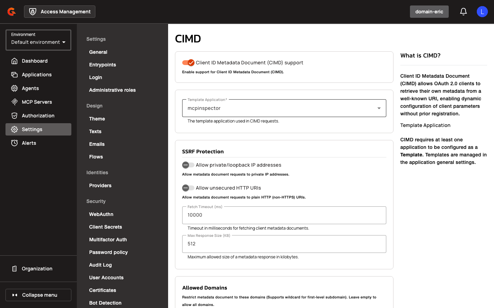

# Client ID Metadata Document (CIMD)

## Overview

Client ID Metadata Document (CIMD) is an OAuth 2.0 extension that allows clients to present a URL as their `client_id` and retrieve configuration dynamically from that URL, eliminating the need for pre-registration. The Authorization Server fetches a metadata document from the client_id URL and synthesizes the client's configuration by merging it with a designated template application. CIMD is the preferred authentication mechanism for AI agents and Model Context Protocol (MCP) clients, enabling agent-driven workflows to authenticate without manual registration.

When CIMD is enabled, the OIDC discovery document (`/.well-known/openid-configuration`) advertises `client_id_metadata_document_supported: true`.

## Key Concepts

### CIMD Client Identification

A client is treated as a CIMD client when its `client_id` matches the pattern `^https?://` (a URL). During OAuth authentication, the gateway fetches a JSON metadata document from the client_id URL, validates it against SSRF protection rules, and synthesizes a client configuration by merging the metadata with a template application.

Pre-registered applications take precedence: if an application exists in Access Management with a client_id that is also a valid CIMD URL, the pre-registered configuration applies instead of the remote metadata.

### Template Application

The template application defines default settings and restrictions for all CIMD clients in a domain. Valid OAuth settings present in CIMD metadata override template values, with the following exceptions:

- `token_endpoint_auth_method`: Defaults to `"none"` when omitted in metadata
- `grant_types`: Intersected with template values (metadata defaults to `["authorization_code"]`)
- `response_types`: Intersected with template values (metadata defaults to `["code"]`)
- `scope`: Intersected with template scopes when present in metadata; otherwise uses template scopes verbatim


Applications are individually elected to be templates in their **Settings** > **General tab**.


Non-OAuth application configurations (identity providers, metadata, token validity, certificates, MFA) can only be defined in the [template application](../../applications/). The template application cannot be deleted or un-templated while CIMD is enabled.

### Metadata Caching and Change Detection

CIMD metadata documents are cached in-memory with a configurable TTL (default 24 hours) and maximum entry count (default 1000). When automatic token revocation is enabled, the gateway stores a SHA-256 hash of each metadata document and compares it on subsequent fetches. If the hash changes, all tokens and scope approvals for that client are revoked. This policy detects changes in remote CIMD metadata only; changes to the template application do not trigger revocation.

Stored hashes persist indefinitely while the policy is enabled and are deleted when it is disabled.


When clients declare a `jwks_uri`, public keys are resolved using the [JWKS resolver and cache](../../../getting-started/configuration/configure-am-gateway/#jwks-resolver-and-cache), separate from the CIMD cache.


### SSRF Protection

All metadata and logo fetches are subject to Server-Side Request Forgery (SSRF) protection. The gateway validates that URLs do not resolve to private, loopback, link-local, or any-local IP addresses (unless explicitly allowed), enforces HTTPS (unless HTTP is explicitly allowed), restricts requests to allowed domains (when configured), and enforces fetch timeout and maximum response size limits. JWKS URIs declared in metadata are validated with the same SSRF rules.

## Creating a CIMD-Enabled Domain

1. Navigate to **Settings → OAuth 2.0 → CIMD** in the domain console.

    <figure><figcaption></figcaption></figure>

2. Toggle **Enable CIMD** to enable Client ID Metadata Document support.
3. Select a **Template Application** from the autocomplete dropdown.
4. Add domains to the **Allowed Domains** chip list to restrict metadata fetching to specific domains (supports `*.example.com` wildcard for first-level subdomains; empty list allows all domains).

    <figure><figcaption></figcaption></figure>

5. Click **SAVE**.

### CIMD Settings Reference

| Field | Description | Default |
|:------|:------------|:--------|
| **Enable CIMD** | Enable/disable Client ID Metadata Document support | Disabled |
| **Template Application** | Template application for CIMD clients | None (required) |
| **Allow Private/Loopback IP Addresses** | SSRF protection: allow metadata requests to private IPs | Disabled |
| **Allow Unsecured HTTP URIs** | SSRF protection: allow metadata requests to HTTP URIs | Disabled |
| **Fetch Timeout (ms)** | Timeout for metadata fetch | 5000 |
| **Max Response Size (KB)** | Maximum metadata response size | 10 |
| **Allowed Domains** | Restrict metadata to these domains (supports `*.example.com`) | Empty (allow all) |
| **Cache TTL (seconds)** | Metadata cache time-to-live | 86400 |
| **Cache Max Entries** | Maximum cache entries | 1000 |
| **Revoke Tokens and Consents When Client Metadata Changes** | Revoke tokens when metadata hash changes | Disabled |

### SPIFFE Settings

Configure SPIFFE workload identity validation at the domain level:

1. Navigate to **Settings → OAuth 2.0 → SPIFFE Settings** in the domain console.
2. Toggle **Enable SPIFFE** to allow clients to authenticate using the `spiffe_jwt` token-endpoint method.
3. Configure SSRF Protection, JWKS fetch limits, and validation policy:
   - Toggle **Allow private/loopback IP addresses** to permit SPIFFE JWKS URLs resolving to private IPs.
   - Toggle **Allow unsecured HTTP URIs** to permit `http://` SPIFFE JWKS URLs.
   - Set **Fetch Timeout (ms)**.
   - Set **Max Response Size (KB)**.
   - Set **Clock Skew (seconds)** for SPIFFE JWT-SVID validation.
   - Set **Max JWT Lifetime (seconds)**.
   - Configure **Default Allowed Algorithms** for SPIFFE JWT-SVIDs.
4. Configure **Cache Settings**:
   - Set **Cache TTL (seconds)**.
   - Set **Cache Max Entries**.
5. Click **SAVE**.
