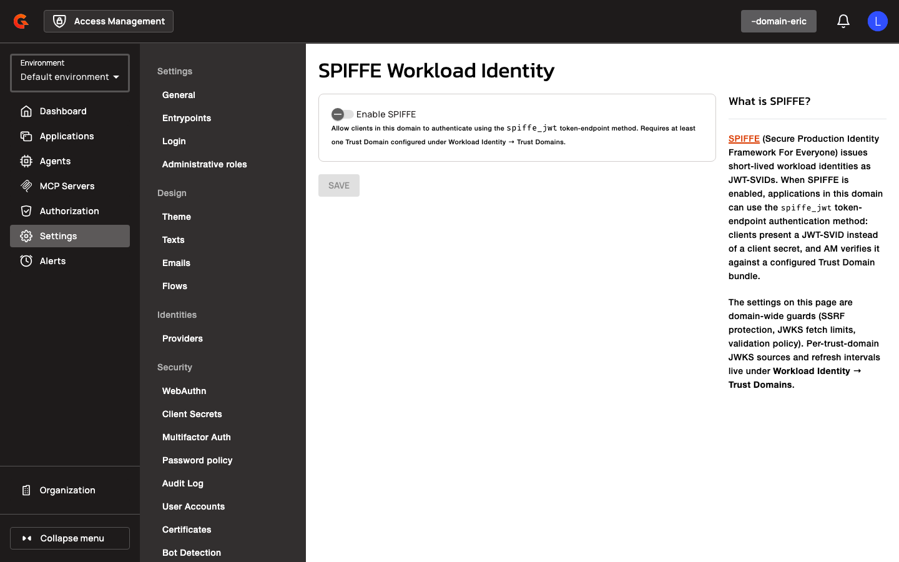
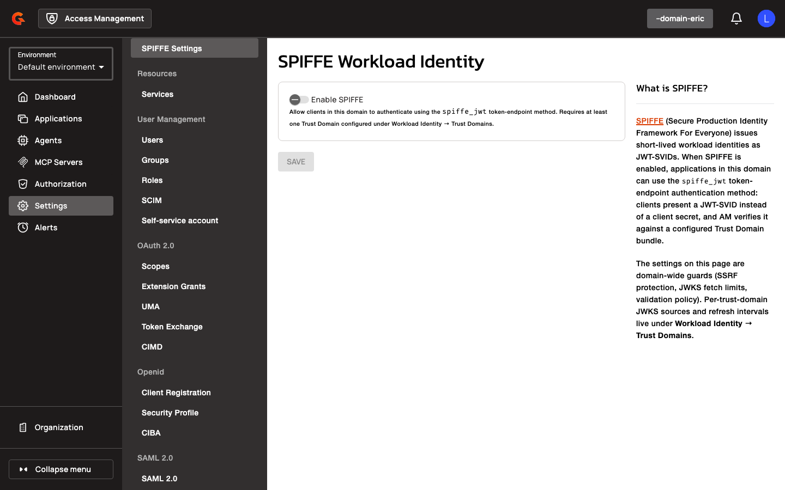
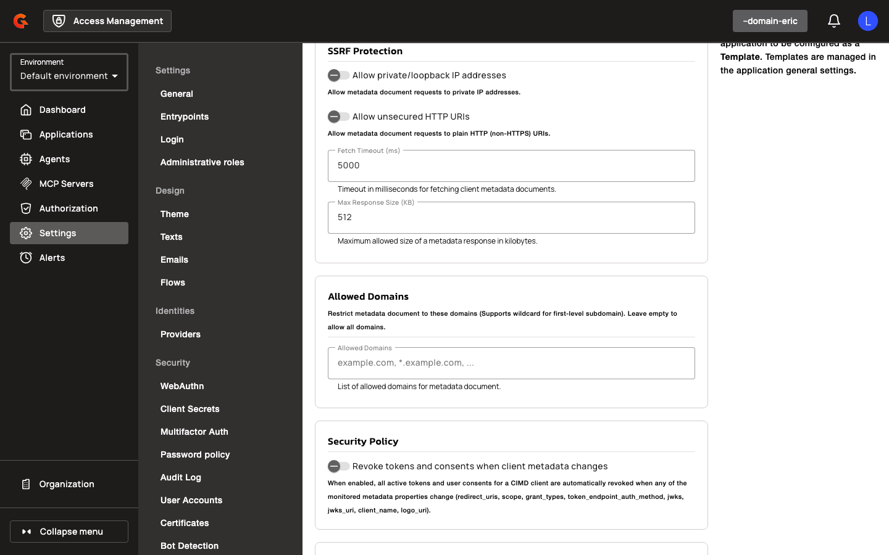
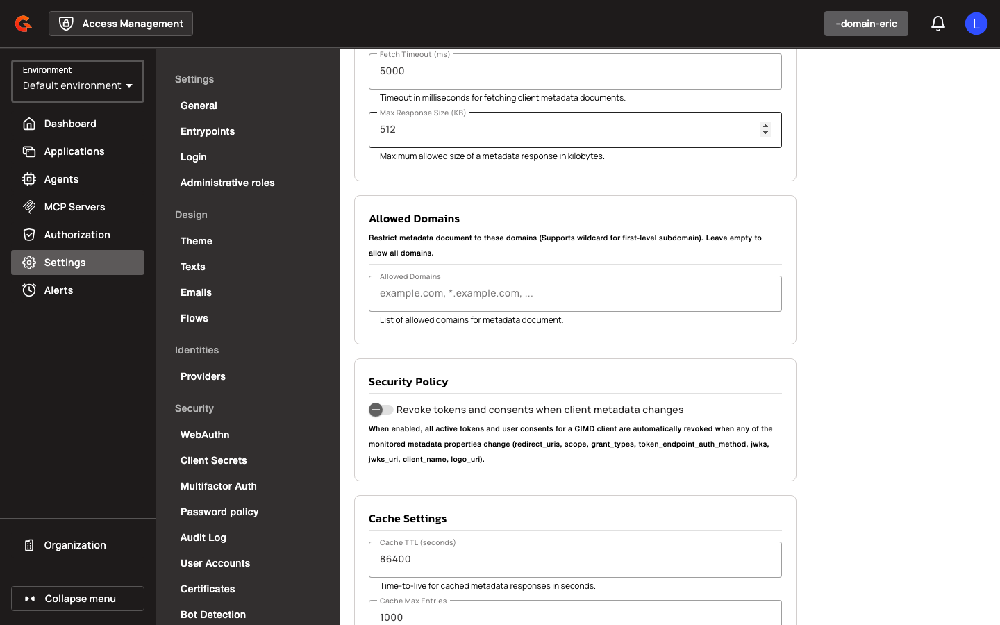

# Configuring SPIFFE Settings in the AM Console

### SPIFFE Settings

Navigate to **Settings** > **SPIFFE Settings** under the OAuth 2.0 section to configure domain-wide SPIFFE workload identity settings.

<figure><figcaption></figcaption></figure>

1. Toggle **Enable SPIFFE** to allow clients in this domain to authenticate using the `spiffe_jwt` token-endpoint method. Requires at least one Trust Domain configured under Workload Identity → Trust Domains.

<figure><figcaption></figcaption></figure>

2. Configure **JWKS fetch limits**:
   - **Fetch Timeout (ms)**: Timeout for fetching JWKS endpoints (e.g., `5000`).
   - **Max Response Size (KB)**: Maximum allowed size of a JWKS response (e.g., `512`).
3. Configure **JWKS cache settings**:
   - **Cache Max Entries**: Maximum number of JWKS cache entries (e.g., `100`).
   - **Cache TTL (seconds)**: Time-to-live for cached JWKS entries (e.g., `3600`).

<figure><figcaption></figcaption></figure>

4. Configure **JWT validation policy**:
   - **Clock Skew (seconds)**: Allowed clock skew for JWT validation (e.g., `30`).
   - **Max JWT Lifetime (seconds)**: Maximum JWT lifetime (e.g., `300`).
   - **Default Allowed Algorithms**: Default signing algorithms for trust domains (e.g., `RS256`, `ES256`).
5. Configure **SSRF protection**:
   - **Allow private/loopback IP addresses**: Permits JWKS URLs resolving to private IP addresses.
   - **Allow unsecured HTTP URIs**: Permits HTTP (non-TLS) JWKS URLs.

## Managing Applications via CIMD

### CIMD Settings

Before creating applications from CIMD, ensure CIMD is enabled at the domain level. Navigate to **Settings** > **CIMD** under the OAuth 2.0 section.

<figure><figcaption></figcaption></figure>

1. Toggle **Client ID Metadata Document (CIMD) support** to enable CIMD flows.
2. Select a **Template Application** from the dropdown. This application serves as the blueprint for CIMD requests.

<figure><figcaption></figcaption></figure>

3. Configure **SSRF Protection** settings:
   - **Allow private/loopback IP addresses**: Permits CIMD URLs resolving to private IP addresses.
   - **Allow unsecured HTTP URIs**: Permits HTTP (non-TLS) CIMD URLs.

<figure><figcaption></figcaption></figure>

4. Set **Fetch Timeout (ms)** for fetching client metadata documents (e.g., `5000`).
5. Set **Max Response Size (KB)** for the maximum allowed size of a metadata response (e.g., `512`).
6. Configure **Allowed Domains** to restrict metadata document URLs to specific domains (supports wildcard for first-level subdomain). Leave empty to allow all domains.
7. Configure **Security Policy** to revoke tokens and consents when client metadata changes.
8. Configure **Cache Settings** to control how long metadata responses are cached.

### CIMD Application Creation API

**Endpoint:** `POST /domains/{domain}/cimd/applications`

Creates an application from a CIMD URL. Requires `APPLICATION[CREATE]` permission and a CIMD-enabled domain.

**Request:**
```json
{
  "cimdUrl": "https://example.com/.well-known/client-metadata",
  "name": "Example Application",
  "clientName": "Example Client",
  "description": "Application created from CIMD",
  "type": "WEB"
}
```
