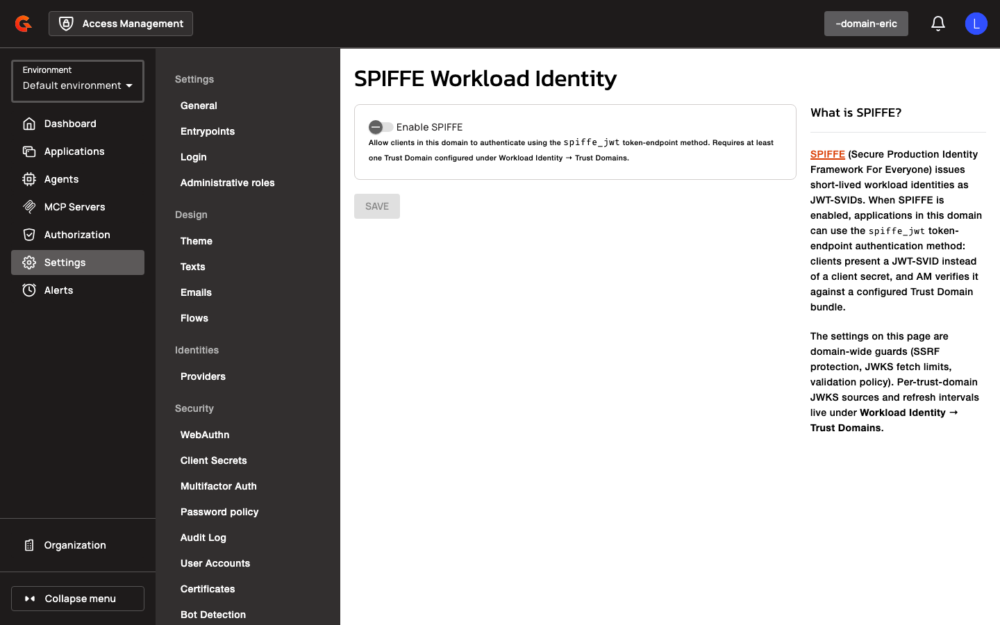

# SPIFFE Workload Identity Prerequisites and Gateway Configuration

## Prerequisites

Before configuring SPIFFE authentication and CIMD, ensure the following requirements are met:

- Access Management 4.12.0 or later
- For SPIFFE authentication: a SPIRE deployment with OIDC Discovery Provider configured
- For CIMD: CIMD enabled on the target domain (`cimd.enabled=true`)
- For Prefix Match: Hosted Delegated or Autonomous agent application type
- Database migration applied (adds `sub_type` column to `applications` table and creates `trust_domains` table)

## Gateway Configuration

### Trust Domain Configuration

Trust domains are managed via the Management API or the domain settings console. Each trust domain requires the following properties:

| Property | Description | Example |
|:---------|:------------|:--------|
| `name` | Trust domain identifier | `example.org` |
| `bundleSource` | Bundle retrieval method | `JWKS_URL` |
| `jwksUrl` | URL serving the trust bundle | `https://spire.example.org/keys` |
| `refreshIntervalSeconds` | Bundle refresh interval | `300` |
| `allowedAlgorithms` | Permitted signature algorithms | `["RS256", "ES256"]` |

Trust bundles are cached per trust domain and refreshed according to the configured interval. On transient fetch errors, the gateway serves the last known good bundle.

JWKS URLs are validated at configuration time and fetch time. URLs resolving to private, loopback, or link-local IP addresses are rejected unless `allowPrivateIpAddress` is enabled on the domain.

### CIMD Configuration

CIMD is configured at the domain level:

<figure><figcaption></figcaption></figure>

<figure><figcaption></figcaption></figure>

<figure><figcaption></figcaption></figure>

| Property | Description | Example |
|:---------|:------------|:--------|
| `cimd.enabled` | Enable CIMD application creation | `true` |
| `cimd.allowedDomains` | Restrict CIMD URLs to specific domains (optional) | `["example.com", "trusted.org"]` |
| `cimd.allowPrivateIpAddress` | Allow CIMD URLs resolving to private IPs | `false` |
| `cimd.allowUnsecuredHttpUri` | Allow HTTP CIMD URLs (not recommended) | `false` |
| `cimd.fetchTimeoutMs` | Maximum time to fetch CIMD document | `5000` |
| `cimd.maxResponseSizeKb` | Maximum CIMD document size | `100` |

CIMD document fetches are bounded by `fetchTimeoutMs`. Documents exceeding `maxResponseSizeKb` are rejected. When `allowPrivateIpAddress=false`, CIMD URLs resolving to private or reserved IP addresses (loopback, site-local, link-local, any-local) are rejected.

### SPIFFE Validation Configuration

SPIFFE JWT-SVID validation is configured at the domain level:

<figure><figcaption></figcaption></figure>

| Property | Description | Example |
|:---------|:------------|:--------|
| `spiffe.maxJwtLifetimeSeconds` | Maximum allowed SVID lifetime (`exp - iat`) | `300` |
| `spiffe.clockSkewSeconds` | Clock skew tolerance for `exp`/`nbf` validation | `30` |

JWT-SVIDs are validated against `maxJwtLifetimeSeconds`. SVIDs with `exp - iat` exceeding this value are rejected.
