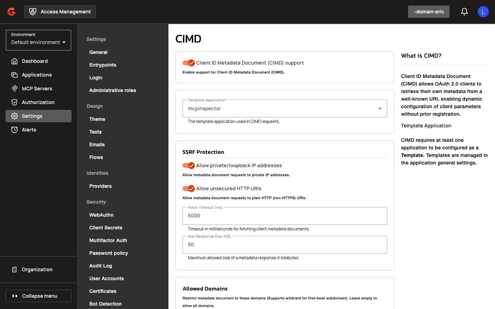
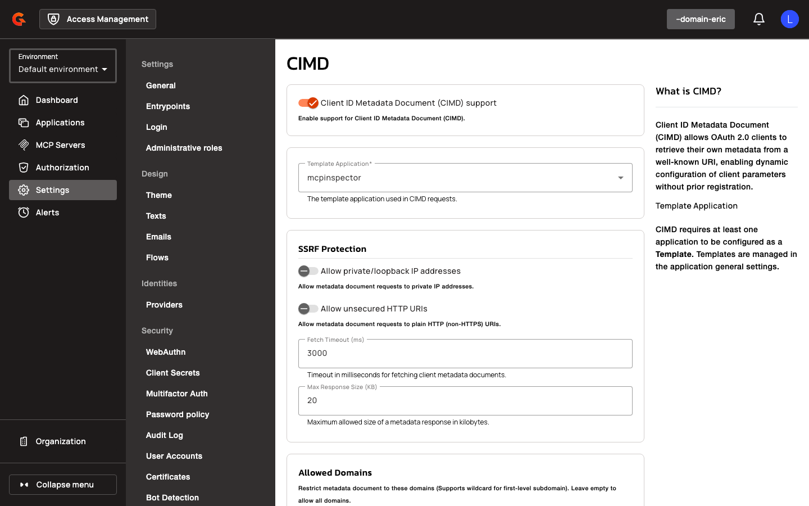
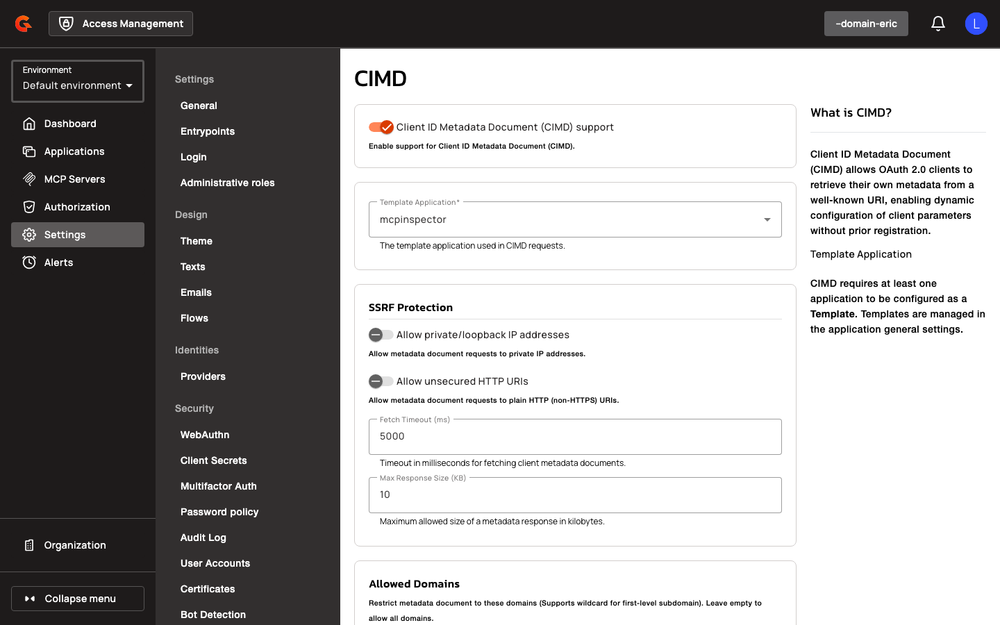

# Enable and Configure CIMD in the Console

## Creating a CIMD-Enabled Domain

To enable CIMD for a domain:

<figure><figcaption></figcaption></figure>

<figure><figcaption></figcaption></figure>

<figure><figcaption></figcaption></figure>

1. Create a template application that defines the baseline configuration for CIMD clients. This includes identity providers, certificates, token validity, allowed grant types, response types, and scopes.
2. Mark the application as a template in its general settings.
3. Navigate to the domain's OIDC settings.
4. Enable the **Enable CIMD** toggle.
5. Select the template application using the **Template Application** autocomplete selector. The selector filters to applications marked as templates.
6. Configure SSRF protection settings:
   * Toggle **Allow private/loopback IP addresses** to permit metadata document requests to private IP addresses.
   * Toggle **Allow unsecured HTTP URIs** to permit metadata document requests to plain HTTP (non-HTTPS) URIs.
   * Set **Fetch Timeout (ms)** to control the timeout for fetching metadata documents.
   * Set **Max Response Size (KB)** to limit the maximum allowed size of a metadata response.
   * Add allowed domains to the **Allowed Domains** chip list. Supports wildcard syntax (e.g., `*.example.com`).
7. Configure cache settings:
   * Set **Cache TTL (seconds)** to define the time-to-live for cached metadata responses.
   * Set **Cache Max Entries** to limit the maximum number of entries stored in the metadata cache.
8. (Optional) Enable **Revoke on Document Change** to automatically revoke tokens and consents when a CIMD client's metadata document changes.
9. Save the configuration.

The template application's general settings display a **CIMD Template** badge when the application is referenced as the CIMD template. Deletion and un-templating are prevented with the error message: "Application is referenced as a CIMD template and cannot be modified."


## Authenticating CIMD Clients

For information on authenticating CIMD clients, see [Client-Initiated Metadata Discovery (CIMD)](auth-protocols/openid-connect.md#client-id-metadata-document-cimd).
