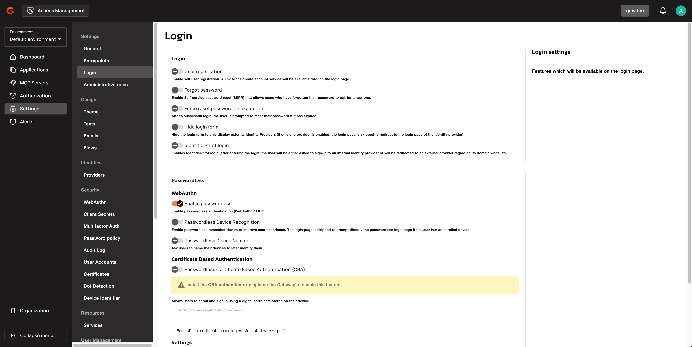
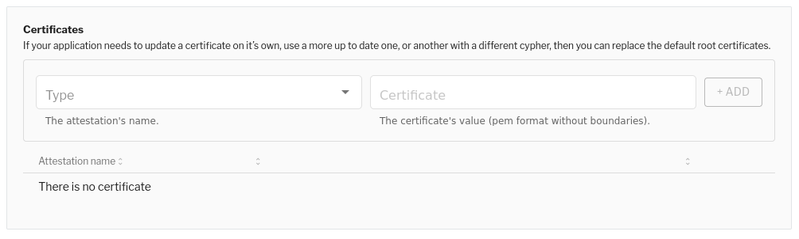
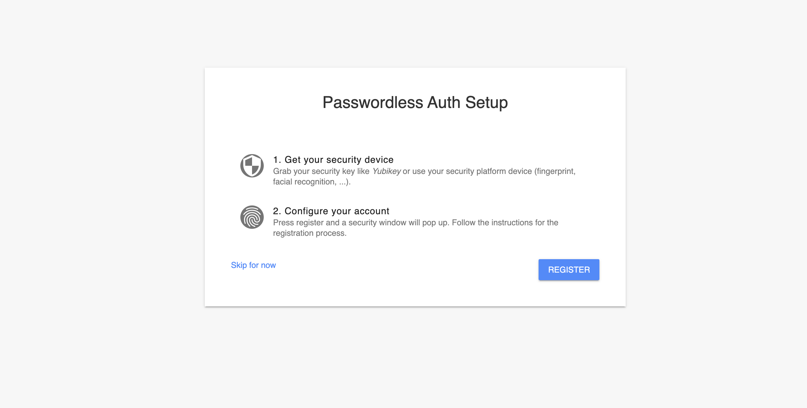
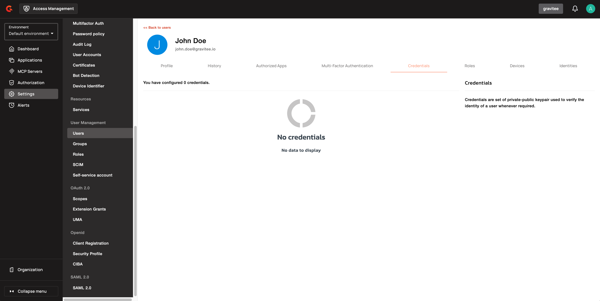
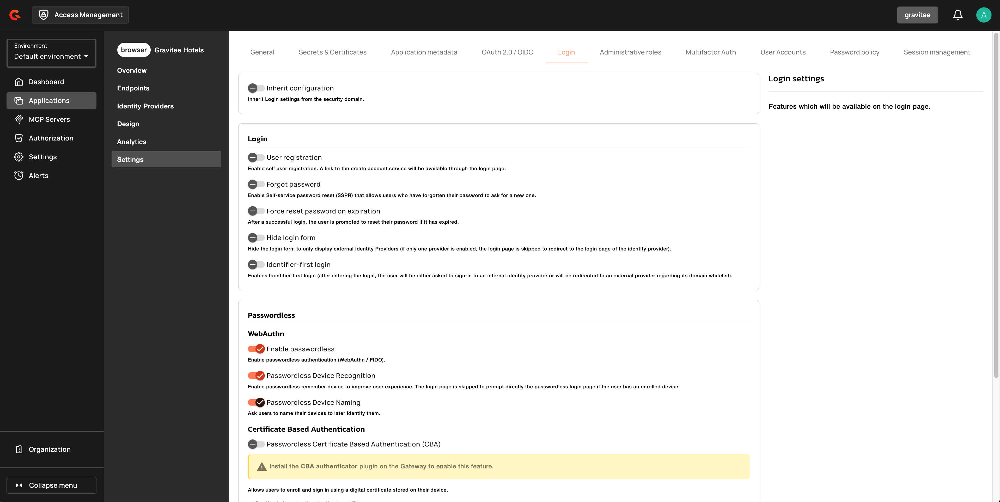
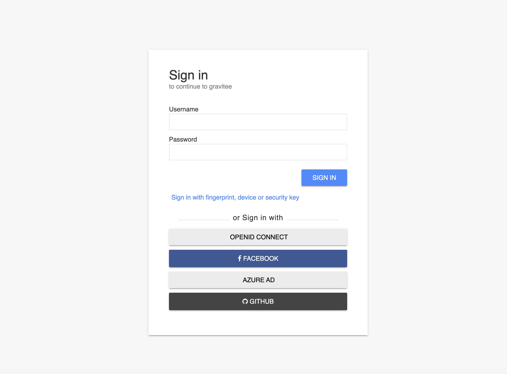
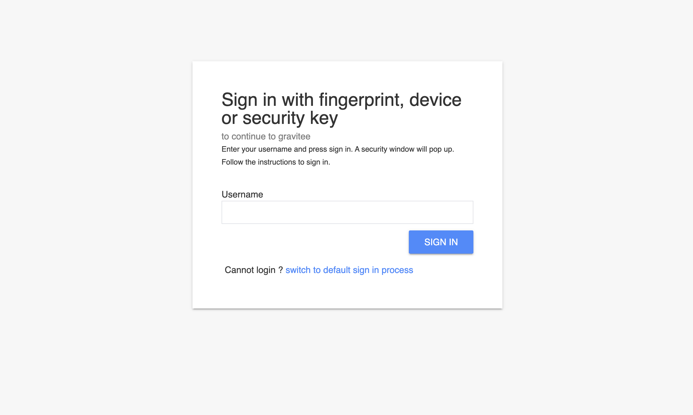

---
metaLinks:
  alternates:
    - >-
      https://app.gitbook.com/s/H4VhZJXn1S232OEmh8Wv/guides/login/passwordless-w3c-webauthn
---

# Passwordless (W3C Webauthn)

## Overview

AM supports [W3C Web Authentication (WebAuthn)](https://www.w3.org/TR/webauthn/), allowing users to authenticate their account without a password.

WebAuthn is supported in the Chrome, Firefox, and Edge browsers to different degrees, but support for credential creation and assertion using a U2F Token, such as those provided by Yubico and Feitian, is supported by all of them. For more information, see [WebAuthn.io](https://webauthn.io/).

If you are experiencing certificate issues with WebAuthn, remember to upload the latest version of the root certificate provided by your device supplier to AM.


This is the first AM version with WebAuthn support and Relying Party (RP) conformance tests are fairly new at the moment. This support’s specification and user interfaces may change.


## Enable passwordless authentication for an application

1. Log in to AM Console.
2. In the **Settings** menu, click **Login** and toggle on the **Enable passwordless** option.

<figure><figcaption></figcaption></figure>

## Manage root certificates

WebAuthn relies on certificates to authenticate the device. These certificates can expire, so if you are experiencing certificate issues, check you have the latest version of the root certificate provided by your device supplier and if not, upload it to AM. Certificates can be uploaded to the WebAuthn settings page.

1. Log in to AM Console.
2. Select your **Security Domain**.
3. Click **Settings**, then click **WebAuthn** in the **Security** section.
4.  In the **Certificates** section, select the certificate details.

    <figure><figcaption><p>Root certificate</p></figcaption></figure>

## Authenticate with WebAuthn

### Registration

Before users can use `Passwordless` authentication for your application, they first need to register their security devices (known as [Authenticators](https://www.w3.org/TR/webauthn/#usecase-new-device-registration)).

The first time users log in with their username/password, they will see the following screen:

<figure><figcaption><p>Passworldless setup UI</p></figcaption></figure>

After the users complete the registration process, their authenticators are immediately registered and they are redirected to your application.

<figure><figcaption></figcaption></figure>

#### **Remember device**

To improve user experience, AM can determine if a passwordless device is already enrolled (or not) for a user, and decide to prompt directly the passwordless login page the next time a user wants to sign in.

<figure><figcaption></figcaption></figure>

### Login


Ensure your users have [registered their security devices.](passwordless-w3c-webauthn.md#registration)


If your application has `Passwordless` authentication enabled, a new link `Sign in with fingerprint, device or security key` will be displayed on the login page.

<figure><figcaption><p>Passwordless login option</p></figcaption></figure>

By clicking on the link, users are redirected to the "Passwordless Login Page", where they need to enter their username and click `Sign in`. A security window will pop up, where they follow instructions to sign in.

<figure><figcaption><p>Passworldess login page</p></figcaption></figure>


The look and feel of the Passwordless forms can be overridden. See [custom pages](../branding/#custom-pages) for more information.


## Managing WebAuthn

### Authenticators

WebAuthn authenticators are listed in the **Users > User > Credentials** section of AM Console. You can review and remove the credentials at any time.

### Global settings

Administrators of your security domain can manage the WebAuthn settings in **Settings > WebAuthn**.

They can update the following options:

| Name                              | Description                                                                                                                                                                                                                                                                                                                                                                                                                                                                                                                                                                                                                                                                                                                                                                                                                                                                                                                                                                                                                                                                                                                                                                                                                                                                                                                                                              |
| --------------------------------- | ------------------------------------------------------------------------------------------------------------------------------------------------------------------------------------------------------------------------------------------------------------------------------------------------------------------------------------------------------------------------------------------------------------------------------------------------------------------------------------------------------------------------------------------------------------------------------------------------------------------------------------------------------------------------------------------------------------------------------------------------------------------------------------------------------------------------------------------------------------------------------------------------------------------------------------------------------------------------------------------------------------------------------------------------------------------------------------------------------------------------------------------------------------------------------------------------------------------------------------------------------------------------------------------------------------------------------------------------------------------------ |
| Origin                            | This value needs to match `window.location.origin` evaluated by the User Agent during registration and authentication.                                                                                                                                                                                                                                                                                                                                                                                                                                                                                                                                                                                                                                                                                                                                                                                                                                                                                                                                                                                                                                                                                                                                                                                                                                                   |
| Relying party name                | Relying Party name for display purposes.                                                                                                                                                                                                                                                                                                                                                                                                                                                                                                                                                                                                                                                                                                                                                                                                                                                                                                                                                                                                                                                                                                                                                                                                                                                                                                                                 |
| Require resident key              | The Relying Party’s requirements in terms of resident credentials. If the parameter is set to true, the authenticator MUST create a client-side-resident public key credential source when creating a public key credential.                                                                                                                                                                                                                                                                                                                                                                                                                                                                                                                                                                                                                                                                                                                                                                                                                                                                                                                                                                                                                                                                                                                                             |
| User verification                 | The Relying Party’s requirements in terms of user verification. User verification ensures that the persons authenticating to a service are in fact who they say they are for the purposes of that service.                                                                                                                                                                                                                                                                                                                                                                                                                                                                                                                                                                                                                                                                                                                                                                                                                                                                                                                                                                                                                                                                                                                                                               |
| Authenticator Attachment          | <p>Mechanism used by clients to communicate with authenticators;</p><p>- <code>unspecified</code> value means that the web browser will display all possibilities (both native devices and cross platform devices such as security key),</p><p>- <code>platform</code> value means only platform native devices will be displayed (ex: TouchID on MacOSX)</p><p>- <code>cross-platform</code> value means only devices able to work on all platforms will be displayed (ex: security keys such as Yubikey).</p>                                                                                                                                                                                                                                                                                                                                                                                                                                                                                                                                                                                                                                                                                                                                                                                                                                                          |
| Attestation Conveyance Preference | <p>WebAuthn Relying Parties may use AttestationConveyancePreference to specify their preference regarding attestation conveyance during credential generation.</p><p>- <code>none</code> This value indicates that the Relying Party is not interested in authenticator attestation. For example, in order to potentially avoid having to obtain user consent to relay identifying information to the Relying Party, or to save a roundtrip to an Attestation CA.</p><p>This is the default value.</p><p>- <code>indirect</code> This value indicates that the Relying Party prefers an attestation conveyance yielding verifiable attestation statements, but allows the client to decide how to obtain such attestation statements. The client MAY replace the authenticator-generated attestation statements with attestation statements generated by an Anonymization CA, in order to protect the user’s privacy, or to assist Relying Parties with attestation verification in a heterogeneous ecosystem.</p><p>Note: There is no guarantee that the Relying Party will obtain a verifiable attestation statement in this case. For example, in the case that the authenticator employs self attestation.</p><p>- <code>direct</code> This value indicates that the Relying Party wants to receive the attestation statement as generated by the authenticator.</p> |

## WebAuthn error monitoring


**Available from:** AM 4.12.


AM now captures client-side WebAuthn errors that occur in the browser and sends them to the backend for logging and analysis. Previously, only server-level authentication outcomes (success/failure) were logged, leaving browser-side failures invisible — such as a user cancelling the biometric prompt, a device that does not support WebAuthn, or a misconfigured origin.

### Error classification

Each captured error is automatically mapped to a business-readable category:

| Category | Description |
| -------- | ----------- |
| `USER_CANCEL_OR_TIMEOUT` | User aborted the authentication or the operation timed out. |
| `AUTHENTICATOR_FAILURE` | Device or biometric hardware failure. |
| `AUTHENTICATOR_UNAVAILABLE` | Authenticator could not be read. |
| `NOT_SUPPORTED` | Browser or device is not compatible with WebAuthn. |
| `SECURITY_ISSUE` | Invalid origin or RP configuration. |
| `INVALID_REQUEST` | Bad input or malformed request. |
| `ALREADY_REGISTERED` | The credential is already registered on this device. |
| `CONSTRAINT_NOT_MET` | The authenticator does not meet the required constraints. |
| `ABORTED` | The operation was explicitly aborted. |
| `UNKNOWN` | Uncategorized error. |

### Error payload

Each error event includes the following context — no sensitive data (biometric data or credential IDs) is ever captured:

* Error name, category, and message
* Timestamp
* User agent (browser and device)
* Authentication context (RP ID)
* Correlation ID (session or request)

### How to use it

Error events are stored as structured JSON and forwarded through your configured reporters, making them searchable in your logging infrastructure (for example, Elasticsearch or a SIEM). Use them to:

* Troubleshoot individual passwordless authentication failures
* Detect abnormal patterns (for example, a spike in `SECURITY_ISSUE` errors indicating a misconfigured origin)
* Identify UX friction points such as frequent user cancellations
* Track WebAuthn adoption over time

This feature can be enabled in the gravitee.yaml of the AM Gateway (disabled by default)

```yaml
handlers:
  webauthn:
    clientErrorReporting:
      enabled: true
```


**HTML Template:** To take benefit of this option, the HTML templates has to use the following JavaScript file:
- assets/js/webauthn-telemetry-v4.js
- assets/js/webauthn-login-v4.js
- assets/js/webauthn-register-v4.js

Default templates can be found on [github](https://github.com/gravitee-io/gravitee-access-management/tree/4.12.x/gravitee-am-gateway/gravitee-am-gateway-handler/gravitee-am-gateway-handler-core/src/main/resources/webroot/views) for reference.


## Watch this space

This is a brand new implementation of passwordless support in AM. We have lots of ideas to improve the user experience, including:

* Giving users the option to use their own webauthn device instead of defining a password during registration.
* Automatically detecting webauthn devices and removing the step where users must provide their username before they can use their webauthn device.
* Letting users manage their own device credentials (add, revoke).

We’d love to hear your feedback!
