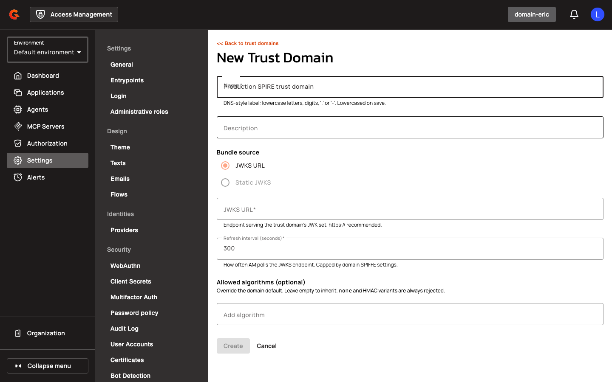
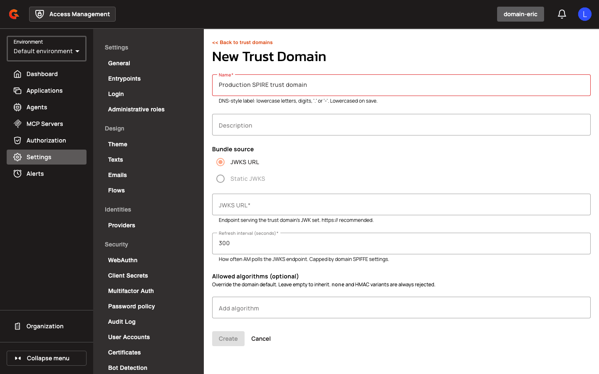
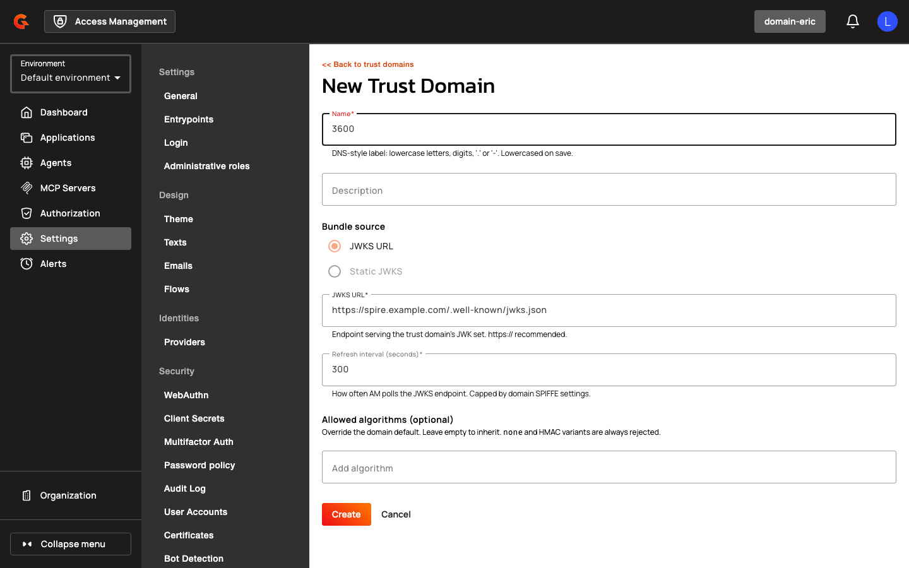

# Manage SPIFFE Trust Domains

## Managing Trust Domains

Trust domains are managed via the **Workload Identity** section under domain settings.

### Creating a Trust Domain

1. Navigate to **Settings > Security > Workload Identity** in the domain sidebar.
2. Click the **+** button to add a new trust domain.

    <figure><figcaption></figcaption></figure>

3. Enter a **Name** (human-readable identifier).

    <figure><figcaption></figcaption></figure>

4. Optionally enter a **Description**.

    <figure><figcaption></figcaption></figure>

5. Select **Bundle Source**:
   - **JWKS URL**: Fetch the trust bundle from a SPIRE OIDC discovery endpoint
   - **STATIC JWKS**: Paste inline JWKS JSON

       <figure><figcaption></figcaption></figure>

6. If using JWKS URL:
   - Enter the **JWKS URL** (e.g., `https://spire.example.com/.well-known/jwks.json`)
   - Set **Refresh Interval Seconds** (how often AM refetches the bundle)
7. Configure **Allowed Algorithms** (e.g., RS256, ES256).
8. Click **Create** to save the trust domain.

    <figure><figcaption></figcaption></figure>

**Trust Domain Settings Reference:**

| Field | Description | Example |
|:------|:------------|:--------|
| **Name** | Human-readable identifier | `prod-trust-domain` |
| **Description** | Optional notes | `Production SPIRE trust domain` |
| **Bundle Source** | How AM obtains the JWKS | JWKS_URL or STATIC_JWKS |
| **JWKS URL** | HTTP(S) endpoint serving the trust bundle | `https://spire.example.com/.well-known/jwks.json` |
| **Refresh Interval Seconds** | How often AM refetches the bundle | `3600` |
| **Allowed Algorithms** | Signing algorithms accepted for JWT-SVIDs | `["RS256", "ES256"]` |

### Management API

Trust domains can also be managed via REST API:

**List Trust Domains:**
```
GET /organizations/{organizationId}/environments/{environmentId}/domains/{domain}/trust-domains
```

**Create Trust Domain:**
```
POST /organizations/{organizationId}/environments/{environmentId}/domains/{domain}/trust-domains
Content-Type: application/json

{
  "name": "prod-trust-domain",
  "description": "Production SPIRE trust domain",
  "bundleSource": "JWKS_URL",
  "jwksUrl": "https://spire.example.com/.well-known/jwks.json",
  "refreshIntervalSeconds": 3600,
  "allowedAlgorithms": ["RS256", "ES256"]
}
```

**Update Trust Domain:**
```
PUT /organizations/{organizationId}/environments/{environmentId}/domains/{domain}/trust-domains/{trustDomainId}
```

**Delete Trust Domain:**
```
DELETE /organizations/{organizationId}/environments/{environmentId}/domains/{domain}/trust-domains/{trustDomainId}
```

### Portal API

**Validate CIMD Document:**
```
POST /organizations/{organizationId}/environments/{environmentId}/domains/{domain}/cimd/validate
Content-Type: application/json

{
  "url": "https://agents.example.com/metadata/hotel-agent"
}
```

Response:
```json
{
  "url": "https://agents.example.com/metadata/hotel-agent",
  "hasInlineJwks": false,
  "missing": {
    "clientId": false,
    "clientName": false
  },
  "metadata": {
    "client_id": "https://agents.example.com/metadata/hotel-agent",
    "client_name": "Hotel Booking Agent",
    "redirect_uris": ["https://app.example.com/callback"],
    "grant_types": ["authorization_code", "client_credentials"],
    "response_types": ["code"],
    "token_endpoint_auth_method": "spiffe_jwt",
    "jwks_uri": "https://agents.example.com/jwks/hotel-agent",
    "scope": "openid profile email"
  }
}
```

**Create Application from CIMD:**
```
POST /organizations/{organizationId}/environments/{environmentId}/domains/{domain}/cimd/applications
Content-Type: application/json

{
  "cimdUrl": "https://agents.example.com/metadata/hotel-agent",
  "name": "Hotel Booking Agent",
  "clientName": "Hotel Booking Agent",
  "description": "AI agent for hotel reservations",
  "type": "SERVICE"
}
```

**Filter Applications by Type:**
```
GET /organizations/{organizationId}/environments/{environmentId}/domains/{domain}/applications?type=AGENT
GET /organizations/{organizationId}/environments/{environmentId}/domains/{domain}/applications?type=WEB&type=SERVICE
```

The `type` query parameter accepts multiple values. The `/applications` listing endpoint accepts a multi-valued `type` filter so the UI can request "AGENT only" or "everything except AGENT" in one call.

## Restrictions

- JWKS URLs that resolve to private, loopback, or link-local IP addresses are rejected unless `allowPrivateIpAddress` is enabled for SPIFFE or CIMD settings.
- Unsecured HTTP URLs are rejected unless `allowUnsecuredHttpUri` is enabled for SPIFFE or CIMD settings.
- Trust bundle refresh intervals are configured per trust domain. Cached keys are not automatically invalidated when a trust domain is updated; the cache TTL must expire naturally.
- The SPIRE local-stack overlay (`docker-compose.spire.yml`) is for development only. Production deployments must use a production-grade SPIRE deployment with TLS-secured OIDC discovery.

## Related Changes

- The **Agents** section appears as a new top-level navigation entry in the management console, separate from the **Applications** list.
- The Applications list now excludes agent applications by default.
