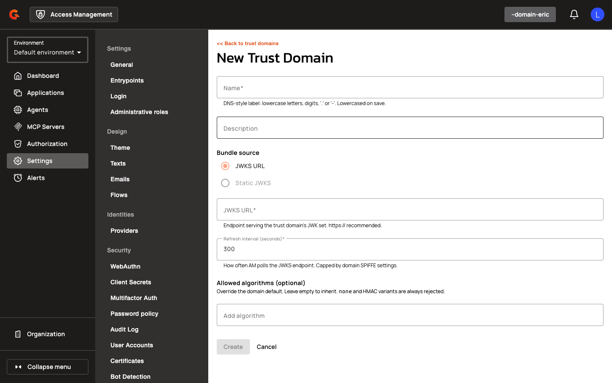
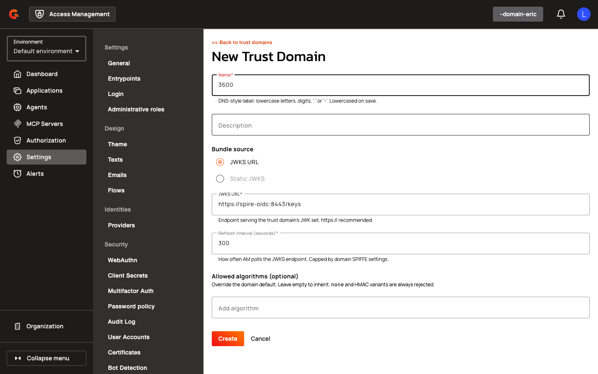

# Managing Trust Domains

Navigate to **Settings > Workload Identity** in the domain console to view the list of trust domains.

<figure><figcaption></figcaption></figure>

Trust bundles are cached per domain and refreshed at the configured interval. On transient fetch errors, AM serves the last known good bundle.

## Creating a Trust Domain

1. Click **Add Trust Domain**.

    <figure><figcaption></figcaption></figure>

2. Enter a **Name** (e.g., `am.local`).
3. (Optional) Enter a **Description**.
4. Select a **Bundle Source**: JWKS_URL or STATIC_JWKS.
5. If JWKS_URL, enter the **JWKS URL** (e.g., `https://spire-oidc:8443/keys`).
6. Enter a **Refresh Interval Seconds** (how often to refresh the trust bundle).
7. Select **Allowed Algorithms** (e.g., RS256, ES256).

    <figure><figcaption></figcaption></figure>

8. Click **Create**.

## Updating a Trust Domain

1. Navigate to **Settings > Workload Identity** and select a trust domain.
2. Update the **Description**, **Bundle Source**, **JWKS URL**, **Refresh Interval Seconds**, or **Allowed Algorithms**.
3. Click **Save**.

## Deleting a Trust Domain

1. Navigate to **Settings > Workload Identity** and select a trust domain.
2. Click **Delete** and confirm.


Trust domains referenced by active applications can't be deleted.

