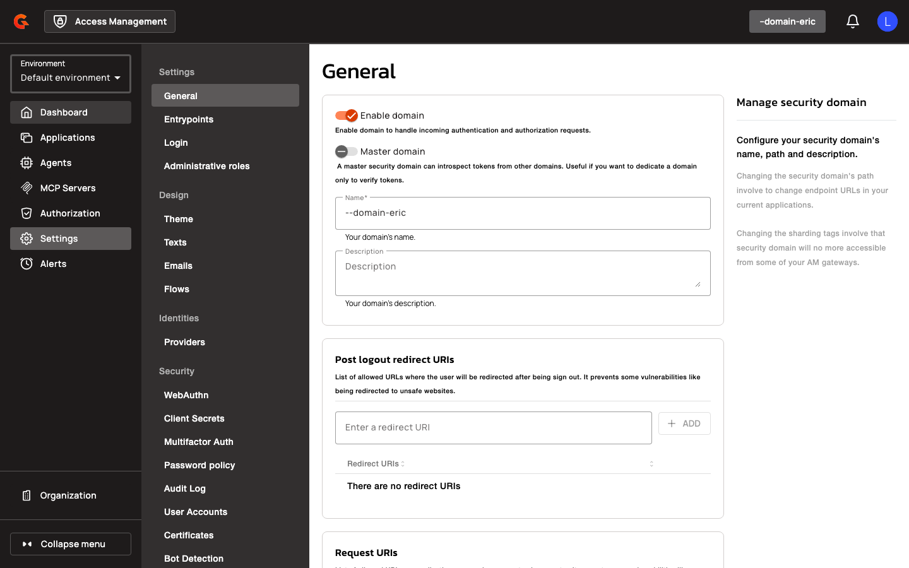

# Managing Trust Domains

Navigate to **Domain Settings → Workload Identity** to create and manage trust domains.

<figure><figcaption></figcaption></figure>

1. Enter a **Name** for the trust domain (e.g., `am.local`).
2. Enter an optional **Description**.
3. Select a **Bundle Source** (JWKS URL or Static JWKS).
4. If using JWKS URL, enter the **JWKS URL** (e.g., `http://spire-oidc:8443/keys`).
5. Enter a **Refresh Interval (seconds)** (default: `300`).
6. Select one or more **Allowed Algorithms** from the multi-select dropdown (e.g., `RS256`, `ES256`).

## Management API Endpoints

Trust domains can be managed programmatically using the following endpoints:

```
GET    /domains/{domain}/trust-domains
POST   /domains/{domain}/trust-domains
GET    /domains/{domain}/trust-domains/{trustDomainId}
PUT    /domains/{domain}/trust-domains/{trustDomainId}
DELETE /domains/{domain}/trust-domains/{trustDomainId}
```
