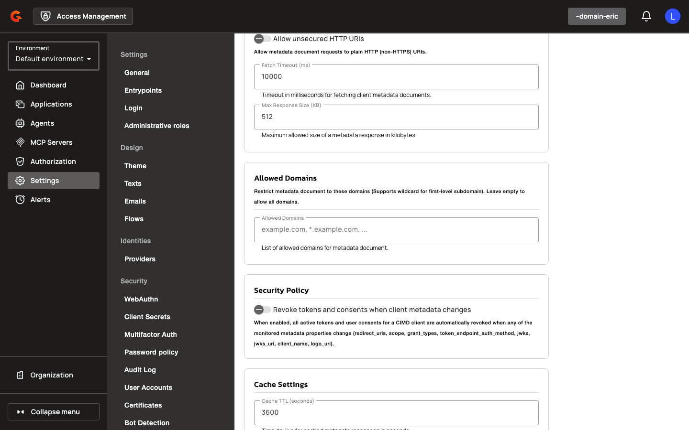
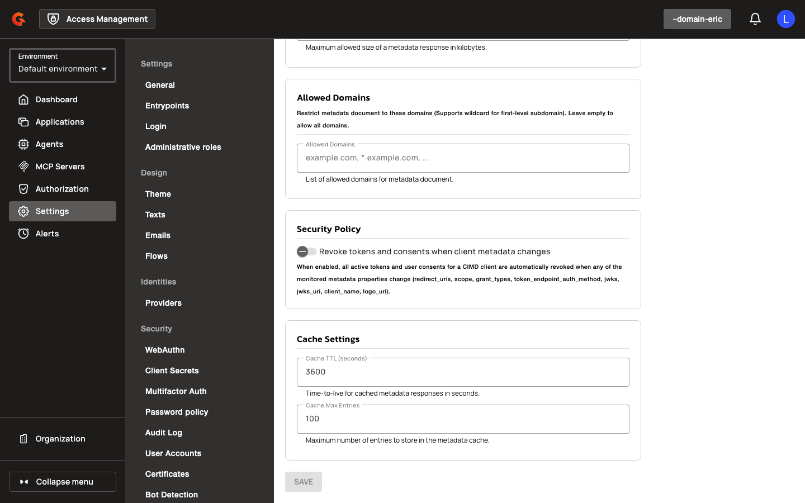

# SPIFFE Workload Identity & Agent Applications - Configuration

## Prerequisites

Before configuring SPIFFE workload identity and CIMD settings, ensure the following:

* Access Management 4.12.0 or later
* For SPIFFE authentication: a SPIRE server and agent deployment issuing JWT-SVIDs
* For CIMD: [domain-level CIMD enablement](#cimd-settings) and an allowed-domains list
* `APPLICATION[CREATE]` permission for creating agent applications
* `DOMAIN[UPDATE]` permission for managing trust domains
* Database migration completed (adds `sub_type` column to `applications` table and creates `trust_domains` table)

## Gateway Configuration

### Trust Domain JWKS Fetcher

The trust domain JWKS fetcher controls how Access Management retrieves and validates JWKS bundles from SPIFFE trust domains. Configure the following property at the gateway level:

| Property | Description | Example |
|:---------|:------------|:--------|
| `allowPrivateIpAddress` | Allow JWKS URLs resolving to private, loopback, or link-local addresses | `false` |

<figure><figcaption></figcaption></figure>

### CIMD Settings

CIMD settings control how Access Management fetches and validates Client ID Metadata Documents. Configure the following properties at the domain level:

<figure><figcaption></figcaption></figure>

<figure><figcaption></figcaption></figure>

<figure><figcaption></figcaption></figure>

| Property | Description | Example |
|:---------|:------------|:--------|
| `allowUnsecuredHttpUri` | Allow HTTP (non-HTTPS) CIMD URLs | `false` |
| `allowedDomains` | List of allowed domain names for CIMD URLs (supports wildcards) | `["example.com", "*.agents.example"]` |
| `allowPrivateIpAddress` | Allow CIMD URLs resolving to private IP addresses | `false` |
