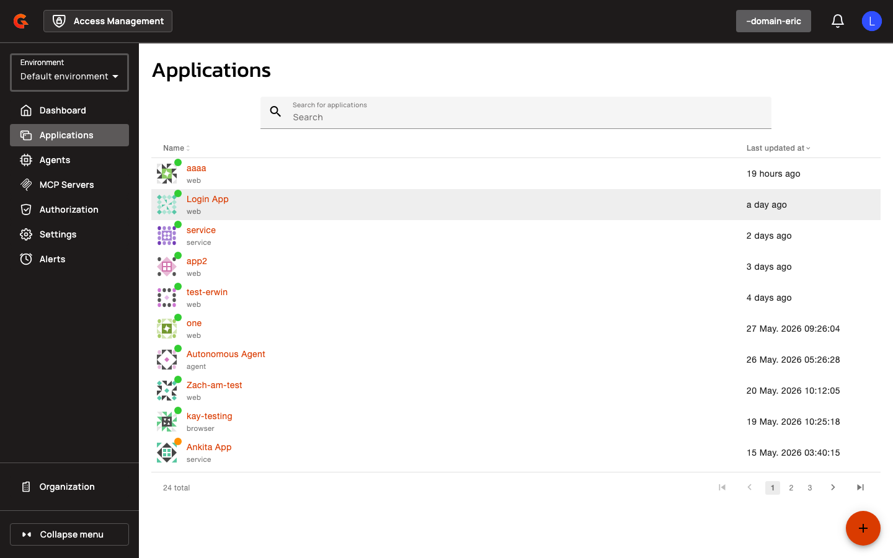

# Trust Domains, CIMD, and Application Filtering API Reference


### Application Filtering API

**GET** `/organizations/{organizationId}/environments/{environmentId}/domains/{domain}/applications`

<figure><figcaption></figcaption></figure>

Lists applications with optional type filtering.

#### Query parameters

* **type**: Array of application types. Supports multi-value filtering (e.g., `?type=WEB&type=SERVICE`). Valid values:
  * `WEB`
  * `NATIVE`
  * `BROWSER`
  * `SERVICE`
  * `RESOURCE_SERVER`
  * `AGENT`
* **page**: Page number (default: `0`)
* **size**: Page size (default: `50`)
* **q**: Search query (filters by name)
* **expand**: Array of fields to expand
* **status**: Filter by enabled/disabled status
* **owner.email**: Filter by owner email

#### Examples

Return only agent applications:

```
GET /applications?type=AGENT
```


Return applications where `type IN (WEB, SERVICE)`:

```
GET /applications?type=WEB&type=SERVICE
```

### Trust Domain Management API

**GET** `/organizations/{organizationId}/environments/{environmentId}/domains/{domain}/trust-domains`

Lists all trust domains configured for the specified domain.

#### Query parameters

* **page**: Page number (default: `0`)
* **size**: Page size (default: `50`)

**POST** `/organizations/{organizationId}/environments/{environmentId}/domains/{domain}/trust-domains`

Creates a new trust domain.

#### Request body

```json
{
  "name": "string",
  "description": "string",
  "issuer": "string",
  "jwksUri": "string",
  "audience": "string"
}
```

**GET** `/organizations/{organizationId}/environments/{environmentId}/domains/{domain}/trust-domains/{trustDomainId}`

Retrieves a specific trust domain by ID.

**PUT** `/organizations/{organizationId}/environments/{environmentId}/domains/{domain}/trust-domains/{trustDomainId}`

Updates an existing trust domain.

#### Request body

```json
{
  "name": "string",
  "description": "string",
  "issuer": "string",
  "jwksUri": "string",
  "audience": "string"
}
```

**DELETE** `/organizations/{organizationId}/environments/{environmentId}/domains/{domain}/trust-domains/{trustDomainId}`

Deletes a trust domain.

### CIMD API

**GET** `/organizations/{organizationId}/environments/{environmentId}/domains/{domain}/cimd/agents`

Lists all CIMD agents configured for the specified domain.

#### Query parameters

* **page**: Page number (default: `0`)
* **size**: Page size (default: `50`)

**POST** `/organizations/{organizationId}/environments/{environmentId}/domains/{domain}/cimd/agents`

Creates a new CIMD agent.

#### Request body

```json
{
  "name": "string",
  "description": "string",
  "type": "string",
  "configuration": {}
}
```

**GET** `/organizations/{organizationId}/environments/{environmentId}/domains/{domain}/cimd/agents/{agentId}`

Retrieves a specific CIMD agent by ID.

**PUT** `/organizations/{organizationId}/environments/{environmentId}/domains/{domain}/cimd/agents/{agentId}`

Updates an existing CIMD agent.

#### Request body

```json
{
  "name": "string",
  "description": "string",
  "type": "string",
  "configuration": {}
}
```

**DELETE** `/organizations/{organizationId}/environments/{environmentId}/domains/{domain}/cimd/agents/{agentId}`

Deletes a CIMD agent.
