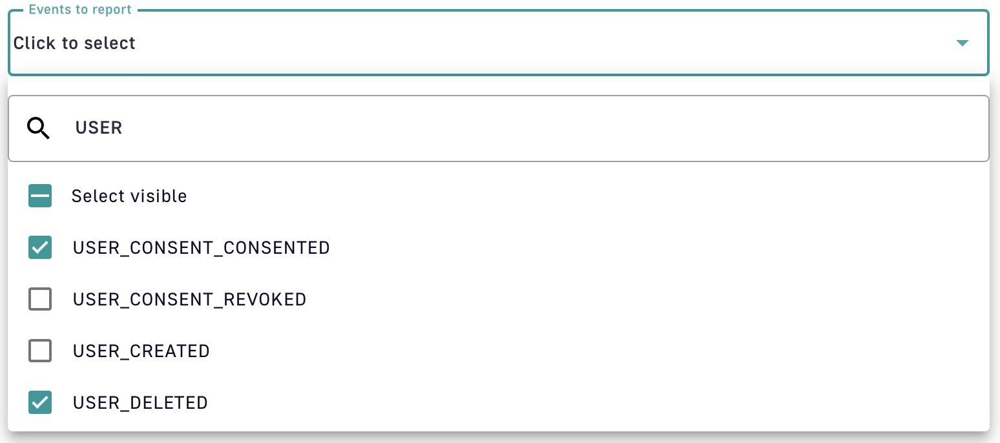
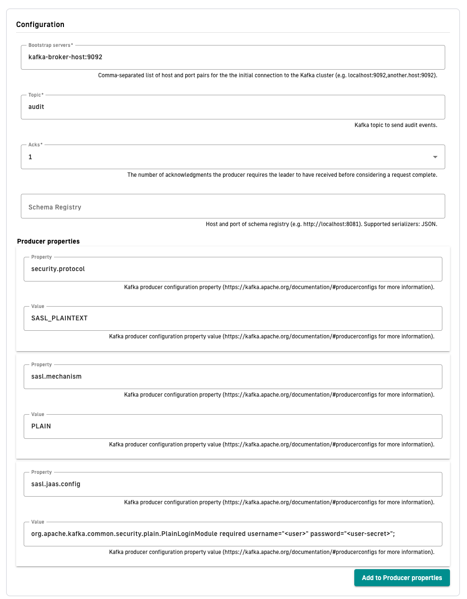
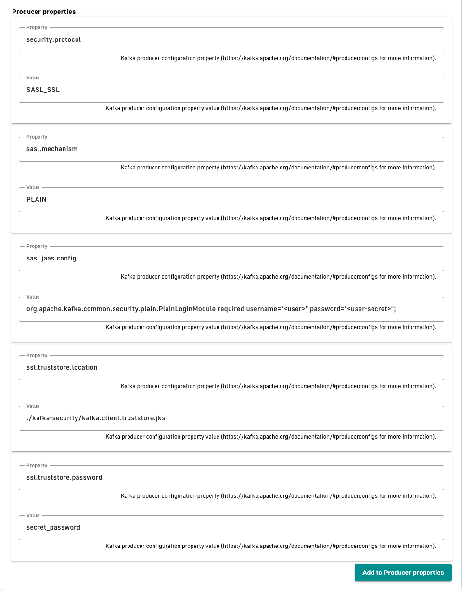
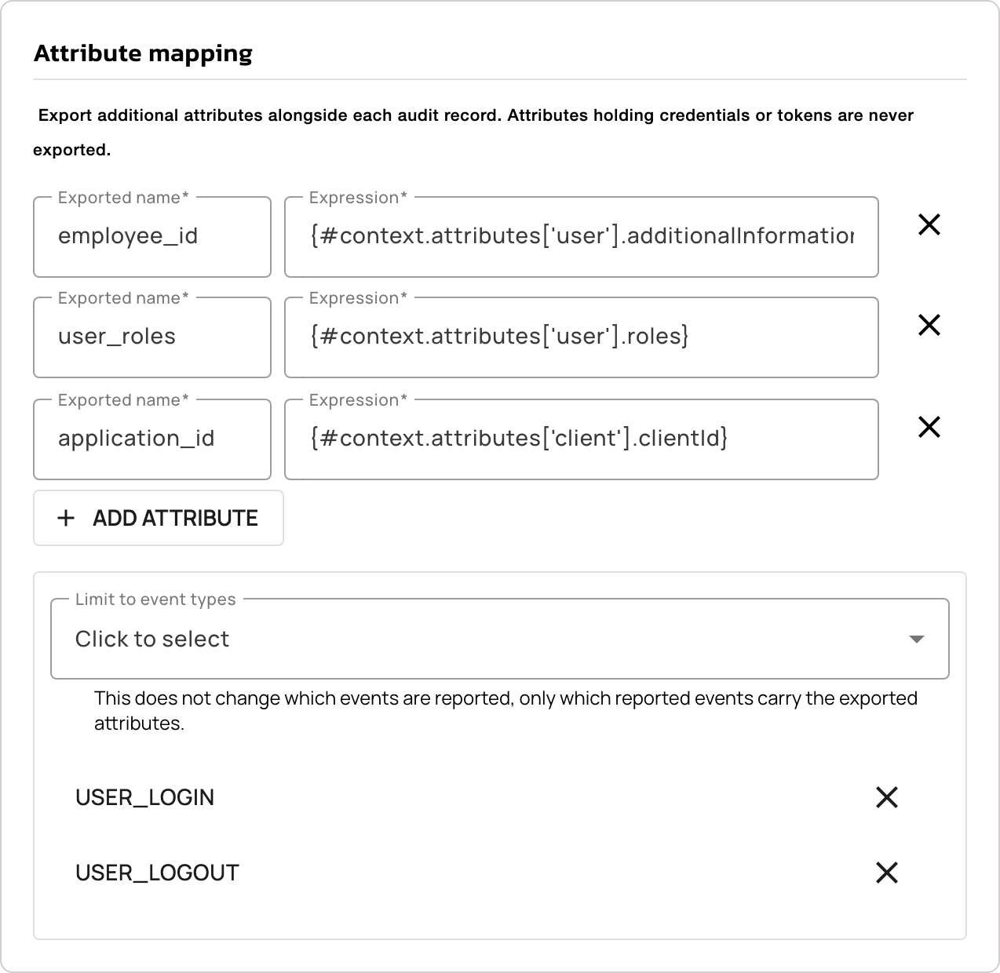

---
metaLinks:
  alternates:
    - >-
      https://app.gitbook.com/s/H4VhZJXn1S232OEmh8Wv/getting-started/configuration/configure-reporters
description: Reporters send Access Management 4.13 Gateway and API events to MongoDB, a file, or Kafka. Follow the steps to configure the reporter you need.
---

# Reporters

## Overview

Reporters are used by AM Gateway and API instances to report many types of events:

* Administration metrics: administrative tasks (CRUD on resources)
* Authentication / Authorization metrics: (sign-in activity, sign-up activity)

A default reporter is created using a MongoDB or JDBC implementation according to the backend configured in the `gravitee.yml` file.

From AM version 3.6, you can create additional reporters.

## MongoDB reporter

When you create a domain, the MongoDB reporter is created automatically based on the repository's configuration. This configuration cannot be edited, but you can specify the `readPreference` for the audit entries in the Management API's `gravitee.yaml`.

### Configuration

When MongoDB is used as a backend, the `readPreference` option can be specified in the `reporters` section of the `gravitee.yaml` file:

```yaml
reporters:
  mongodb: # Configuration of read preference for querying audit records from mongodb, defaults to primary if not provided
    readPreference: secondary # primary, secondary, primaryPreferred, secondaryPreferred, nearest
    readPreferenceMaxStaleness: 120000 # Milliseconds value, min 90000. Lets users specify a maximum replication lag, or "staleness", for reads from secondaries.
```

## File reporter

This implementation is a file-based reporter for writing events to a dedicated file. You can use it for ingesting events into a third party system.

### Configuration

File reporters are configurable in the `gravitee.yml` file `reporter` section with the following properties:

<table><thead><tr><th width="121">property</th><th width="83">type</th><th width="97">required</th><th>description</th></tr></thead><tbody><tr><td>directory</td><td>string</td><td>N</td><td>Path to the file creation directory. The directory must exist (default: <code>${gravitee.home}/audit-logs/</code>)</td></tr><tr><td>output</td><td>string</td><td>N</td><td>Format used to export events. Possible values: JSON, MESSAGE_PACK, ELASTICSEARCH, CSV (default: JSON)</td></tr><tr><td>retainDays</td><td>integer</td><td>N</td><td>Number of days a file is retained on disk. (default: -1 for indefinitely)</td></tr></tbody></table>

```yaml
reporters:
  file:
    #directory:  # directory where the files are created (this directory must exist): default value = ${gravitee.home}/audit-logs/
    #output: JSON # JSON, ELASTICSEARCH, MESSAGE_PACK, CSV
    #retainDays: -1 # -1 for indefinitely
```

Audit logs will be created in a directory tree that represents the resource hierarchy from the organization to the domain. For example, audit logs for domain `my-domain` in environment `dev` and organization `my-company` will be created in the following directory tree: `${reporters.file.directory}/my-company/dev/my-domain/audit-2021_02_11.json`

For details on how to create a file reporter for a domain, see the [Audit trail](../../guides/audit-trail.md) documentation.

## Kafka reporter

This reporter sends all audit logs to Kafka Broker using JSON serialization.

### **Minimal configuration**

The following table shows the properties that Kafka reporter requires:

| Property          | Description                                                                                                            |
| ----------------- | ---------------------------------------------------------------------------------------------------------------------- |
| Name              | The reporter human readable name used to identify the plugin in the UI                                                 |
| Bootstrap servers | Comma-separated list of host and port pairs for the the initial connection to the Kafka cluster                        |
| Topic             | Kafka topic to send audit events.                                                                                      |
| Acks              | The number of acknowledgments the producer requires the leader to have received before considering a request complete. |

### **Additional properties**

To add additional properties to the producer, add property config name and value to the Producers properties section. For more information about supported properties, go to [Kafka](https://kafka.apache.org/documentation/#producerconfigs).

### Events Filtering

To control audit traffic and reduce event noise, you can use the Kafka reporter to selectively propagate specific event types with the "events to report" list. You can configure this option at both the domain and organization levels.


Use the search box to quickly locate and select specific event types.


<figure><figcaption></figcaption></figure>

### **Schema Registry**

Kafka reporter supports Schema registry. This configuration is optional. When the schema registry URL is not provided, then messages is sent to Kafka Broker in JSON format. When the schema registry URL is provided, then the schema of the message will be stored in Schema Registry and ID and version of the schema is attached at the beginning of the JSON message.

Currently, only JSON schema is supported.

### **Partition key**

Kafka reporter sends all messages to separate partitions based on domain id or organization id. This means that all audit log messages from one domain is sent to the same partition key.

### Secured Kafka connection

#### SASL/PLAIN

1. To create secured connection between Kafka Reporter and Kafka Broker, configure your Kafka broker.
2. As described in the following Kafka documentation, add to your broker configuration JAAS configuration:

* [https://kafka.apache.org/documentation/#security\_sasl\_jaasconfig](https://kafka.apache.org/documentation/#security_sasl_jaasconfig)
* [https://kafka.apache.org/documentation/#security\_sasl\_brokerconfig](https://kafka.apache.org/documentation/#security_sasl_brokerconfig)

3. When you configure your broker correctly, add additional **Producer properties** to your Kafka Reporter:

`security.protocol = SASL_PLAINTEXT`

`sasl.mechanism = PLAIN`

`sasl.jaas.config = org.apache.kafka.common.security.plain.PlainLoginModule required username="<user>" password="<user-secret>";`

<figure><figcaption><p>Kafka plaintext security config</p></figcaption></figure>

**TLS/SSL encryption**

If the Kafka broker is using SSL/TLS encryption, you must add additional steps to secure this connection.

1. Place trusted truststore certificate along with AM Management installation.
2. Specify location and password of this trust store and change `security.protocol` in **Producer properties:**

\
`security.protocol = SASL_SSL`

`sasl.mechanism = PLAIN`

`sasl.jaas.config = org.apache.kafka.common.security.plain.PlainLoginModule required username="<user>" password="<user-secret>";`

`ssl.truststore.location = "/path/to/kafka.client.truststore.jks`

`ssl.truststore.password = "secret_password"`

<figure><figcaption><p>Kafka TLS/SSL security config</p></figcaption></figure>

## Attribute mapping

Attribute mapping exports extra fields alongside the audit records a reporter writes. Each mapping pairs an expression, evaluated against the audit context at the moment the event is reported, with the name that value takes in the exported payload. Attribute mapping changes only what a reporter exports, and it doesn't change which events AM generates.


**Available for:** File, Kafka, and TCP reporters.


A reporter with no attribute mappings exports the payload it exported before, so the reporters you already run aren't affected.

### Add an attribute mapping

To export an extra field on the audit records a reporter writes:

1. Log in to AM Console.
2. Open **Settings**.
3. Click **Audit Log**.
4. Click the settings icon on the **Audit log** page.
5. Click the settings icon on the row of the reporter you want to change.
6. Scroll to the **Attribute mapping** section.

    <figure><figcaption><p>The Attribute mapping section on a reporter</p></figcaption></figure>

7. Click **ADD ATTRIBUTE**.
8. Enter the name the value takes in the exported payload in **Exported name**.
9. Enter the expression AM evaluates in **Expression**.
10. Click **SAVE**.

### Expression context

An expression reads from the audit context of the event being reported. The context carries the following attributes:

<table>
    <thead>
        <tr>
            <th width="120">Attribute</th>
            <th width="330">What it holds</th>
            <th>Example expression</th>
        </tr>
    </thead>
    <tbody>
        <tr>
            <td><code>user</code></td>
            <td>The profile of the user the event concerns, including <code>id</code>, <code>username</code>, <code>email</code>, <code>firstName</code>, <code>lastName</code>, <code>roles</code>, <code>groups</code>, <code>claims</code>, <code>additionalInformation</code>, and <code>identities</code></td>
            <td><code>{#context.attributes['user'].id}</code></td>
        </tr>
        <tr>
            <td><code>client</code></td>
            <td>The application the event was raised for, including <code>clientId</code>, <code>clientName</code>, <code>name</code>, and <code>metadata</code></td>
            <td><code>{#context.attributes['client'].clientId}</code></td>
        </tr>
        <tr>
            <td><code>request</code></td>
            <td><code>ip</code> and <code>userAgent</code> of the request behind the event</td>
            <td><code>{#context.attributes['request']['ip']}</code></td>
        </tr>
        <tr>
            <td><code>audit</code></td>
            <td><code>id</code>, <code>type</code>, <code>transactionId</code>, and <code>status</code> of the audit record itself</td>
            <td><code>{#context.attributes['audit']['type']}</code></td>
        </tr>
    </tbody>
</table>

AM populates `user` and `client` from the event itself, so an event raised without a user leaves `user` unset. An expression that reads an attribute the event doesn't carry exports nothing for that field, and AM still reports the record.

### Exported names and limits

AM applies the following rules when you save a reporter:

* A reporter carries at most 20 attribute mappings.
* An exported name uses letters, digits, and underscores only, up to 64 characters.
* Each exported name appears once per reporter.
* An expression is at most 512 characters.

AM rejects a reporter that breaks one of these rules and reports which rule it broke.

### Exported values

A plain value such as `production` is exported as it's written. Lists and maps are exported too, and a map carries every key it holds, so mapping a single attribute keeps the payload smaller than mapping a whole map.

How the value reaches the payload depends on the reporter:

* The Kafka reporter exports every value as a string, and serializes a value that isn't already a string as JSON.
* The File and TCP reporters keep the value's own type.

On a File reporter, the `JSON` and `MESSAGE_PACK` output formats carry the exported attributes. The `ELASTICSEARCH` and `CSV` output formats don't.

AM doesn't export a value nested more than 10 levels deep, or holding more than 100 elements in total. When part of a value can't be exported, AM omits the whole field and still reports the record.

### Limit the mappings to certain event types

By default, a reporter exports its mapped attributes on every audit record it writes. To narrow that, select the event types you want in the **Limit to event types** list. This doesn't change which events AM reports, only which reported records carry the exported attributes. Selecting event types without adding at least one mapping is rejected.

### Attributes that are never exported

AM never exports an attribute whose name holds a credential or a token, whatever the mappings ask for. The built-in list covers names such as passwords, client secrets, shared secrets, private keys, API keys, access, refresh, and ID tokens, assertions, and one-time codes including OTP, MFA, recovery, and verification codes. Any name ending in `password`, `passwd`, `secret`, `token`, `credential`, `credentials`, `privatekey`, or `apikey` is denied as well.

AM compares names without case, underscores, hyphens, or dots, so `client_secret`, `clientSecret`, and `CLIENT-SECRET` are one name. The filter applies to the user profile's claims and additional information, to each linked identity's additional information, and to the application's metadata, including the values nested inside them.

To deny more names, list them in the `gravitee.yml` file of the AM Gateway and the Management API:

```yaml
reporters:
  audits:
    attribute_mappings:
      denied_attributes:
      - legacy_session_key
```

The names you add extend the built-in list rather than replacing it.

## Audit data retention


**Available for:** MongoDB Reporter and JDBC Reporter only.



**Deleted audit data can't be recovered.** Ensure your retention period meets your organization's compliance and operational requirements before enabling this feature.


Access Management lets you automatically purge old audit logs based on a configurable retention period.

The audit retention feature deletes audit records older than a specified number of days. The purge process:

* Runs as a scheduled task (default: daily at 11 PM)
* Works across all audit supported reporters for all domains

### Configuration

Audit retention is configured in the `gravitee.yml` file under the Management API configuration.

**Enable audit retention**

Add the following configuration to your Management API `gravitee.yml`:

```yaml
services:
  purge:
    enabled: true
    cron: 0 0 23 * * *
    audits:
      retention:
        days: 90
```

#### Configuration options

| Property                               | Description                         | Notes                                |
| -------------------------------------- | ----------------------------------- | ------------------------------------ |
| `services.purge.enabled`               | Enable or disable the purge service | Affects both event and audit purging |
| `services.purge.cron`                  | Cron expression for purge schedule  | Spring cron syntax                   |
| `services.purge.audits.retention.days` | Number of days to retain audit data | Value must be greater than `0`       |

#### Disable audit retention

To disable audit purging while keeping other purge tasks active:

```yaml
services:
  purge:
    enabled: true
    audits:
      retention:
        days: 0
```

To disable all purge operations:

```yaml
services:
  purge:
    enabled: false
```

#### MongoDB index for audit retention

When purge is `enabled` and `retention.days > 0`, the service ensures an index optimized for purge queries is created on startup:

* **Index:** `(timestamp ASC, _id ASC)`

This index is used to efficiently scan and delete old documents in a stable order.


In Access Management with MongoDB, index creation happens on startup only if index management is enabled: `ensureIndexOnStart=true` (default is `true`). In environments where index creation is managed externally, make sure this index exists before enabling purge.


#### Startup impact

When purge is enabled for the first time (enabling it on an existing large dataset), the first purge execution may take noticeable time because it starts removing historical audit records.

* Deletion is performed **in batches**, which helps control database load.
* The system remains **operational** during the purge process.
* You may observe increased I/O and CPU usage on MongoDB during the initial cleanup, depending on the amount of historical data.

#### Helm chart configuration

When deploying with Helm, configure audit retention in your `values.yaml`:

```yaml
api:
  services:
    purge:
      enabled: true
      cron: "0 0 23 * * *"
      audits:
        retention:
          days: 90
```

## Verification

To verify attribute mapping is working as expected, follow these steps:

1. Sign in to the security domain with a user whose profile holds the attribute you mapped.
2. Open the destination the reporter writes to.
3. Find the audit record the sign-in produced.
4. Confirm the record carries a `customAttributes` object holding your exported name and its value:

```json
"customAttributes": {
  "employee_id": "E-4471"
}
```

A record written before you saved the mapping doesn't carry the field, and a record whose event didn't resolve any mapped attribute omits `customAttributes` entirely.
