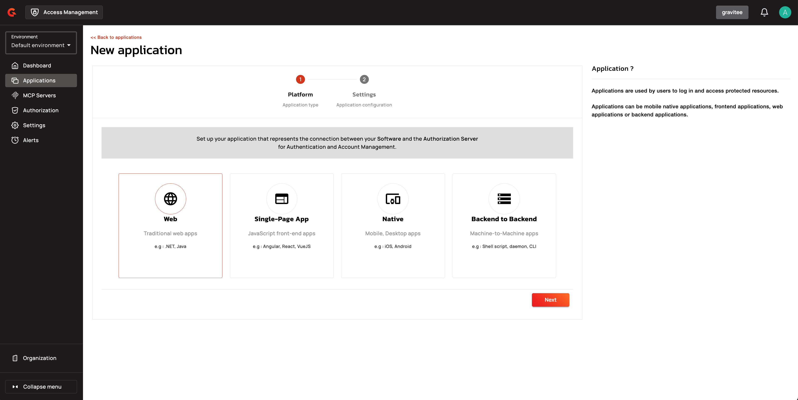
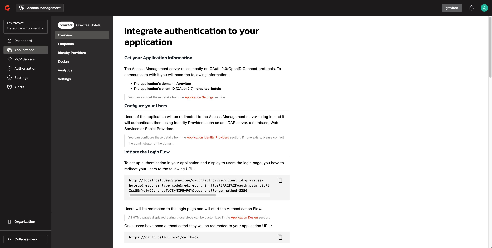
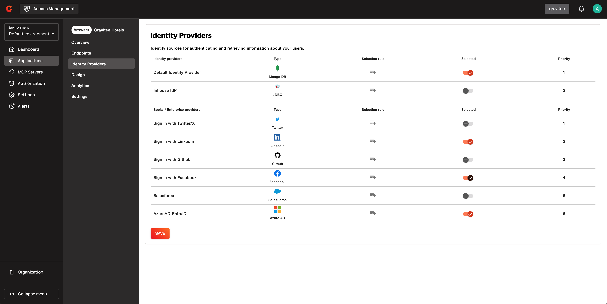
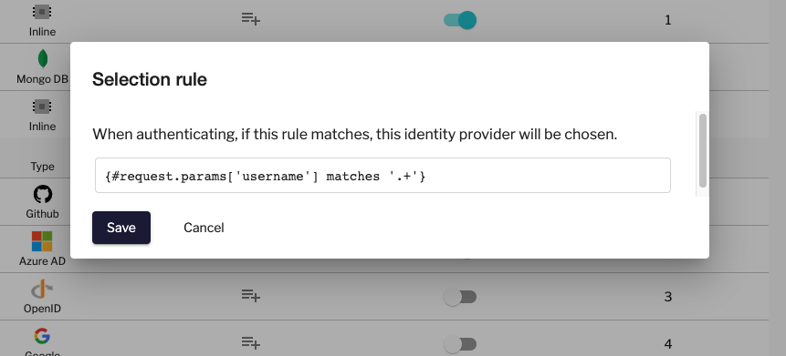

# Applications

## Overview

_Applications_ act on behalf of the user to request tokens, hold user identity information, and retrieve protected resources from remote services and APIs.

Application definitions apply at the _security domain_ level.

## Create an application

### AM Console

To create an application in AM Console, complete the following steps:

1. Log in to AM Console.
2. If you want to create your application in a different security domain, select the domain from the user menu at the top right.
3. Click **Applications**.
4. Click the plus icon .
5. Select the application type, and then click **Next**.

<figure><figcaption><p>Select the Application type</p></figcaption></figure>

6. Specify the application details, and then click **Create**.

<figure><figcaption><p>Application settings</p></figcaption></figure>

### AM API


```sh
curl -H "Authorization: Bearer :accessToken" \
     -H "Content-Type:application/json;charset=UTF-8" \
     -X POST \
     -d '{"name":"My App", "type": "SERVICE"}' \
     http://GRAVITEEIO-AM-MGT-API-HOST/management/organizations/DEFAULT/environments/DEFAULT/domains/:domainId/applications
```


## List applications

### Query parameters

The Application list endpoint supports the following query parameters for filtering, field expansion, and pagination:

| Parameter | Type | Default | Description |
|:----------|:-----|:--------|:------------|
| `status` | string | — | Filter by status. Values: `enabled`, `disabled` |
| `owner.email` | string | — | Filter by owner email address. Requires `ORGANIZATION_USER[READ]` permission. |
| `expand` | array[string] | — | Fields to expand. Supported: `clientId` |
| `q` | string | — | Search query (supports wildcard `*`) |
| `type` | array[string] | — | Filter by type. Values: `WEB`, `NATIVE`, `BROWSER`, `SERVICE`, `RESOURCE_SERVER`, `AGENT` |
| `limit` | integer | 50 | Maximum results per page |
| `sort` | string | `updatedAt` | Sort field. Supported: `updatedAt`, `name` |
| `dir` | string | `DESC` | Sort direction. Values: `ASC`, `DESC` |
| `page` | integer | 0 | Page number (zero-indexed) |

For complete API specifications and cursor pagination details, see [Application Filtering, Cursor Pagination, and Expand Parameters](../../reference/application-filtering-cursor-pagination-and-expand-parameters.md).

### Cursor-based pagination

For large result sets, use the cursor-based search endpoint:


```sh
curl -H "Authorization: Bearer :accessToken" \
     http://GRAVITEEIO-AM-MGT-API-HOST/management/organizations/DEFAULT/environments/DEFAULT/domains/:domainId/applications/search/_cursor?limit=50
```


The response includes a `nextCursor` path for retrieving the next page:

```json
{
  "data": [
    {
      "id": "app-id",
      "name": "My App",
      "type": "SERVICE",
      "enabled": true,
      "template": false,
      "updatedAt": "2024-01-15T10:30:00Z"
    }
  ],
  "nextCursor": "/management/organizations/DEFAULT/environments/DEFAULT/domains/:domainId/applications/search/_cursor?cursor=YXBwLWlkIyMyMDI0LTAxLTE1VDEwOjMwOjAwWg==&page=1",
  "hasNext": true,
  "totalCount": 150,
  "page": 0
}
```

To retrieve the next page, use the `nextCursor` path:


```sh
curl -H "Authorization: Bearer :accessToken" \
     http://GRAVITEEIO-AM-MGT-API-HOST/management/organizations/DEFAULT/environments/DEFAULT/domains/:domainId/applications/search/_cursor?cursor=YXBwLWlkIyMyMDI0LTAxLTE1VDEwOjMwOjAwWg==&page=1
```


### Field expansion

To retrieve OAuth client IDs in the response, include `expand=clientId`:


```sh
curl -H "Authorization: Bearer :accessToken" \
     http://GRAVITEEIO-AM-MGT-API-HOST/management/organizations/DEFAULT/environments/DEFAULT/domains/:domainId/applications/search?expand=clientId
```


The response includes the `clientId` field:

```json
{
  "data": [
    {
      "id": "app-id",
      "name": "My App",
      "type": "SERVICE",
      "enabled": true,
      "template": false,
      "updatedAt": "2024-01-15T10:30:00Z",
      "clientId": "oauth-client-id"
    }
  ]
}
```

### Configure the application

After you create the new application, you're redirected to the application's **Overview** page, which contains documentation and code samples to help you start configuring the application.

<figure><figcaption><p>Application overview</p></figcaption></figure>

### Test the application

The quickest way to test your newly created application is to request an OAuth2 access token, as described in [set up your first application](../../getting-started/tutorial-getting-started-with-am/set-up-your-first-application.md). If you retrieve an access token, your application is all set.

## Application identity providers

Access Management allows your application to use different identity providers (IdPs). If you haven't configured your providers yet, visit the [Identity Provider guide.](../identity-providers/README.md)

The application identity providers are separated into two sections:

* The regular Identity Providers, also called **internal**, that operate inside Access Management without redirecting to another provider
* The Social/Enterprise Identity Providers that require an external service to perform authentication, usually through SSO

<figure><figcaption><p>Application Identity Provider selection options</p></figcaption></figure>

You can enable or disable them to include them in your authentication flow.

### Priority

Identity provider priority enables processing authentication in a certain order. It gives more control over the authentication flow by deciding which provider should evaluate credentials first.

To change the priority of the providers, complete the following steps:

1. Ensure your provider is **selected**.
2. Drag and drop the providers.
3. Save your settings.

### Selection rules

Identity provider selection rules also give you more control over the authentication through Gravitee's Expression Language.

When coupled with [flows](../flows/README.md), you can decide which provider authenticates your end users.

<figure><figcaption><p>Selection rule</p></figcaption></figure>

To apply a selection rule, complete the following steps:

1. Click the **Selection rule** icon.
2. Enter your expression language rule.
3. Validate and save your settings.

When applying rules on **regular** Identity Providers:

* If the rule is empty, the provider **is** taken into account. This is to be retro-compatible when migrating from a previous version.
* Otherwise, Access Management authenticates with the first identity provider where the rule matches.

If you're not using [identifier-first login](../login/identifier-first-login-flow.md), the rule isn't effective on Social/Enterprise providers.

However, if you're using identifier-first login:

* If the rule is empty, the provider **IS NOT** taken into account. This is to be retro-compatible when migrating from a previous version.
* Otherwise, Access Management authenticates with the first identity provider where the rule matches.

## Dynamic Client Registration (DCR)

Another way to create applications in Access Management is to use the OpenID Connect Dynamic Client Registration endpoint. This specification enables Relying Parties, clients, to register applications in the OpenID Provider (OP).

### Enable Dynamic Client Registration with AM Console

By default, this feature is disabled. To enable it through the domain settings, complete the following steps:

1. Log in to AM Console.
2. Click **Settings**, and then in the **OPENID** section, click **Client Registration**.
3. Click the toggle button to **Enable Dynamic Client Registration**.


There is another parameter called **Enable\Disable Open Dynamic Client Registration**. This parameter allows any unauthenticated requests to register new clients through the registration endpoint. It is part of the OpenID specification, but for security reasons, it is disabled by default.


<figure><figcaption><p>Enable DCR</p></figcaption></figure>

### Enable Dynamic Client Registration with AM API

```sh
curl -X PATCH \
  -H 'Authorization: Bearer :accessToken' \
  -H 'Content-Type: application/json' \
  -d '{ "oidc": {
        "clientRegistrationSettings": { \
            "isDynamicClientRegistrationEnabled": true,
            "isOpenDynamicClientRegistrationEnabled": false
      }}}' \
  http://GRAVITEEIO-AM-MGT-API-HOST/management/domains/:domainId
```

### Register a new client

#### Obtain an access token

Unless you enabled open dynamic registration, you need to obtain an access token through the `client_credentials` flow, with a `dcr_admin` scope.


The `dcr_admin` scope grants CRUD access to any clients in your domain. You must only allow this scope for trusted RPs, clients.



```sh
#Request a token
curl -X POST \
  'http://GRAVITEEIO-AM-GATEWAY-HOST/:domain/oauth/token?grant_type=client_credentials&scope=dcr_admin&client_id=:clientId&client_secret=:clientSecret'
```


#### Register new RP (client)

After you obtain the access token, you can call AM Gateway through the registration endpoint. You can specify many client properties, such as `client_name`, but only the `redirect_uris` property is mandatory. See the [OpenID Connect Dynamic Client Registration](https://openid.net/specs/openid-connect-registration-1_0.html) specification for more details.

The endpoint used to register an application is available in the OpenID discovery endpoint, for example, `http(s)://your-am-gateway-host/your-domain/oidc/.well-known/openid-configuration`, under the `registration_endpoint` property.

The response contains some additional fields, including the `client_id` and `client_secret` information.

You also find the `registration_access_endpoint` and the `registration_client_uri` in the response. These are used to read, update, or delete the client id and client secret.


According to the [specification](https://tools.ietf.org/html/rfc6749#section-10.6), an Authorization Server MUST require public clients and SHOULD require confidential clients to register their redirection URIs. Confidential clients are clients that can keep their credentials secret. For example, web applications using a web server to save their credentials (`authorization_code`) and server applications treating credentials saved on a server as safe (`client_credentials`). Unlike confidential clients, public clients are clients who cannot keep their credentials secret. For example, Single Page Applications (`implicit`) and Native mobile application (`authorization_code`). **Because mobile and web applications use the same grant, we force `redirect_uri` only for implicit grants.**


**Register Web application example**

The following example creates a web application. `access_token` is kept on a backend server.

```sh
curl -X POST \
  -H 'Authorization: Bearer :accessToken' \
  -H 'Content-Type: application/json' \
  -d '{ \
        "redirect_uris": ["https://myDomain/callback"], \
        "client_name": "my web application", \
        "grant_types": [ "authorization_code","refresh_token"], \
        "scope":"openid" \
      }' \
  http://GRAVITEEIO-AM-GATEWAY-HOST/::domain/oidc/register
```


`response_types` metadata is not required here because the default value, code, corresponds to the `authorization_code` grant type.


**Register Single Page Application (SPA) example**

Because a SPA does not use a backend, we recommend you use the following implicit flow:

```sh
curl -X POST \
  -H 'Authorization: Bearer :accessToken' \
  -H 'Content-Type: application/json' \
  -d '{ \
        "redirect_uris": ["https://myDomain/callback"], \
        "client_name": "my single page application", \
        "grant_types": [ "implicit" ], \
        "response_types": [ "token" ], \
        "scope":"openid" \
      }' \
  http://GRAVITEEIO-AM-GATEWAY-HOST/::domain/oidc/register
```


`response_types` metadata must be set to token to override the default value.


**Register Server to Server application example**

Sometimes you may have a bot or software that needs to be authenticated as an application and not as a user. For this, you need to use a `client_credentials` flow:

```sh
curl -X POST \
  -H 'Authorization: Bearer :accessToken' \
  -H 'Content-Type: application/json' \
  -d '{ \
        "redirect_uris": [], \
        "application_type": "server", \
        "client_name": "my server application", \
        "grant_types": [ "client_credentials" ], \
        "response_types": [ ] \
      }' \
  http://GRAVITEEIO-AM-GATEWAY-HOST/::domain/oidc/register
```


`response_types` metadata must be set as an empty array to override the default value. `redirect_uris` is not needed, but this metadata is required in the [specification](https://openid.net/specs/openid-connect-registration-1_0.html), so it must be set as an empty array. **We strongly discourage you from using this flow in addition to a real user authentication flow. The recommended approach is to create multiple clients instead.**


**Register mobile application example**

For a mobile app, the `authorization_code` grant is recommended, in addition to [Proof Key for Code Exchange](https://tools.ietf.org/html/rfc7636):

```sh
curl -X POST \
  -H 'Authorization: Bearer :accessToken' \
  -H 'Content-Type: application/json' \
  -d '{ \
        "redirect_uris": ["com.mycompany.app://callback"], \
        "application_type": "native", \
        "client_name": "my mobile application", \
        "grant_types": [ "authorization_code","refresh_token" ], \
        "response_types": [ "code" ] \
      }' \
  http://GRAVITEEIO-AM-GATEWAY-HOST/::domain/oidc/register
```

**Register agent application example**

To register an agent application programmatically, send a POST request to the DCR endpoint with `application_type` set to `"agent"`. The system strips forbidden grant types (`implicit`, `password`, `refresh_token`) from the request. If no valid grant types remain after stripping, the system defaults to `["authorization_code"]`. The `redirect_uris` field is required. If `token_endpoint_auth_method` is omitted, the system defaults to `client_secret_basic`. The DCR flow validates agent constraints and strips forbidden response types (`token`, `id_token`, `id_token token`) during registration. If response types become empty and `authorization_code` is granted, the system adds `"code"`.

```sh
curl -X POST \
  -H 'Authorization: Bearer :accessToken' \
  -H 'Content-Type: application/json' \
  -d '{ \
        "application_type": "agent", \
        "grant_types": [ "authorization_code","client_credentials" ], \
        "redirect_uris": ["https://example.com/callback"] \
      }' \
  http://GRAVITEEIO-AM-GATEWAY-HOST/::domain/oidc/register
```

#### Read, update, or delete client information

The `register` endpoint also allows you to GET, UPDATE, PATCH, or DELETE actions on a `client_id` that has been registered through the `registration` endpoint. To do this, you need the access token generated during the client registration process, provided in the response in the `registration_access_token` field.


The UPDATE http verb acts as a full overwrite, whereas the PATCH http verb acts as a partial update.


This access token contains a `dcr` scope which cannot be obtained, even if you enable the `client_credentials` flow. In addition, rather than using the OpenID registration endpoint together with the `client_id`, the DCR specifications recommend you use the `registration_client_uri` given in the register response instead.

A new registration access token is generated each time the client is updated through the Dynamic Client Registration URI endpoint, which revokes the previous value.

```sh
curl -X PATCH \
  -H 'Authorization: Bearer :accessToken' \
  -H 'Content-Type: application/json' \
  -d '{ "client_name": "myNewApplicationName"}' \
  http://GRAVITEEIO-AM-GATEWAY-HOST/::domain/oidc/register/:client_id
```

#### Renew client secret

To renew the `client_secret`, you need to concatenate `client_id` and `/renew_secret` to the registration endpoint and use the POST HTTP verb.


The `renew_secret` endpoint can also be retrieved through the OpenID discovery endpoint `registration_renew_secret_endpoint` property. You then need to replace the `client_id` with your own. The `renew_secret` endpoint does not need a body.


When you update a client, a new registration access token is generated each time you renew the client secret.

```sh
curl -X POST \
  -H 'Authorization: Bearer :accessToken' \
  http://GRAVITEEIO-AM-GATEWAY-HOST/::domain/oidc/register/:client_id/renew_secret
```

#### Scope Management

You can whitelist which scopes can be requested, define some default scopes to apply, and force a specific set of scopes.

**Allowed scopes (scope list restriction)**

By default, no scope restrictions are applied when you register a new application. However, it is possible to define a list of allowed scopes through the **Allowed scopes** tab. To achieve this, you need to first enable the feature, and then select the allowed scopes.

You can also enable this feature using AM API:

```sh
curl -X PATCH \
  -H 'Authorization: Bearer :accessToken' \
  -H 'Content-Type: application/json' \
  -d '{ "oidc": {
        "clientRegistrationSettings": { \
            "isAllowedScopesEnabled": true,
            "allowedScopes": ['your','scope','list','...']
      }}}' \
  http://GRAVITEEIO-AM-MGT-API-HOST/management/domains/:domainId
```

**Default scopes**

The [specification](https://tools.ietf.org/html/rfc7591#section-2) states that if scopes are omitted while registering an application, the authorization server may set a default list of scopes. To enable this feature, you simply select which scopes you want to be automatically set.

You can also enable this feature using AM API:

```sh
curl -X PATCH \
  -H 'Authorization: Bearer :accessToken' \
  -H 'Content-Type: application/json' \
  -d '{ "oidc": {
        "clientRegistrationSettings": { \
            "defaultScopes": ['your','scope','list','...']
      }}}' \
  http://GRAVITEEIO-AM-MGT-API-HOST/management/domains/:domainId
```

**Force the same set of scopes for all client registrations**

If you want to force all clients to have the same set of scopes, you can enable the allowed scopes feature with an empty list, and then select some default scopes.


Enabling the allowed scopes feature with an empty list removes all requested scopes from the client registration request. Because there is no longer a requested scope in the request, the default scopes are applied.


You can also enable this feature using AM API:

```sh
curl -X PATCH \
  -H 'Authorization: Bearer :accessToken' \
  -H 'Content-Type: application/json' \
  -d '{ "oidc": {
        "clientRegistrationSettings": { \
            "isAllowedScopesEnabled": true,
            "allowedScopes": [],
            "defaultScopes": ['your','scope','list','...']
      }}}' \
  http://GRAVITEEIO-AM-MGT-API-HOST/management/domains/:domainId
```

### Register new client using templates

You can create a client and define it as a template. Registering a new application with a template allows you to specify which identity providers to use, and apply template forms, such as login, password management, and error forms, or emails, such as registration confirmation and password reset emails.

Template mode is enabled for an Application in its **Settings** > **General** tab.


After a client is set up as a template, it can no longer be used for authentication purposes.



Existing applications default to preselect mode (`optInScopeSelection=false`) to preserve legacy behavior, while new applications default to opt-in mode (`optInScopeSelection=true`).


#### Enable Dynamic Client Registration templates

You can enable the template feature in the Access Management Dynamic Client Registration **Settings** tab:

<figure><figcaption><p>Enable DCR Templates</p></figcaption></figure>

You can also enable this feature using AM API:

```sh
curl -X PATCH \
  -H 'Authorization: Bearer :accessToken' \
  -H 'Content-Type: application/json' \
  -d '{ "oidc": {
        "clientRegistrationSettings": { \
            "isDynamicClientRegistrationEnabled": true,
            "isClientTemplateEnabled": true
      }}}' \
  http://GRAVITEEIO-AM-MGT-API-HOST/management/domains/:domainId
```

#### Configure a client for use as a template

To define a client template, you must first create an application, and then mark it for use as a template. To mark an application for use as a template, complete the following steps:

1. Navigate to your application in **Applications**.
2. Select **Settings**, and then select the **General** tab.
3. Turn on **Use as DCR / CIMD registration template** to mark the application as a registration template.

When you mark an application as a template, it cannot be used directly to authenticate OAuth 2.0 clients.

#### Register call with template example

You need to retrieve the `software_id` of the template, which is available under the `registration_templates_endpoint` provided by the OpenID discovery endpoint.

```sh
curl -X POST \
  -H 'Authorization: Bearer :accessToken' \
  -H 'Content-Type: application/json' \
  -d '{ \
        "software_id": "", \
        "redirect_uris": ["https://myDomain/callback"], \
        "client_name": "my single page application from a template" \
      }' \
  http://GRAVITEEIO-AM-GATEWAY-HOST/::domain/oidc/register
```

You can override some properties of the template by filling in some metadata, such as `client_name` in the example above.

Some critical information is not copied from the template, for example, `client_secret` and `redirect_uris`. This is why in the example above, we need to provide valid `redirect_uris` metadata, because in the example, the template we're using is a Single Page Application.
