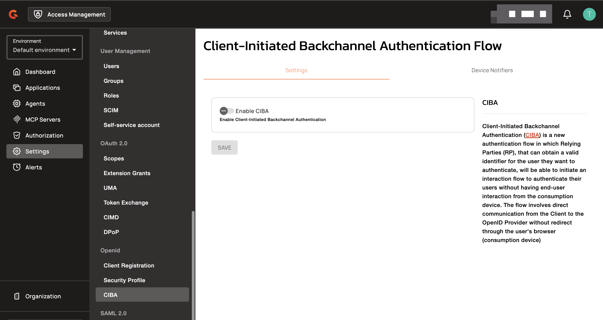
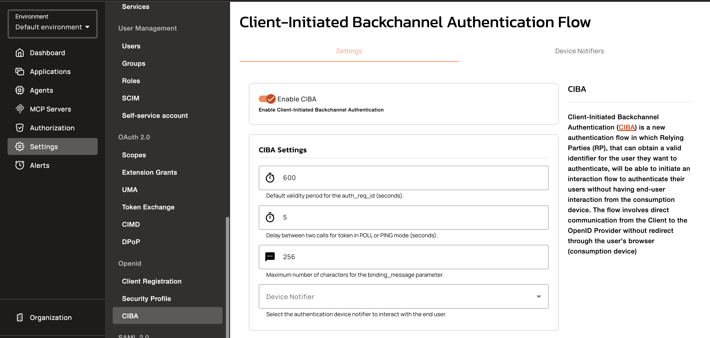
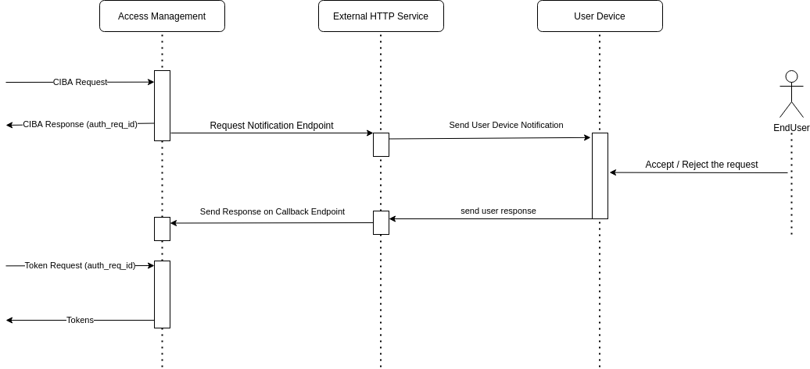
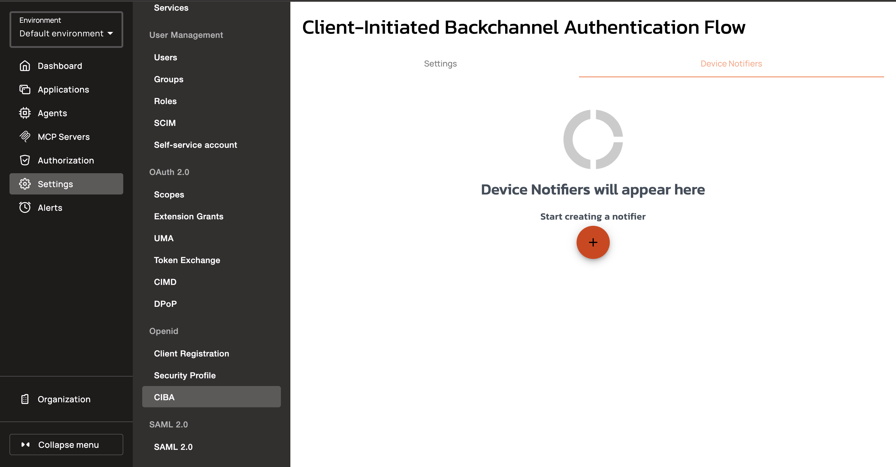
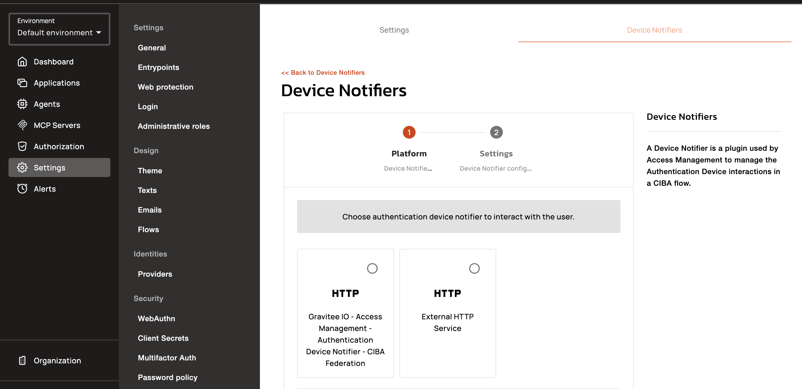
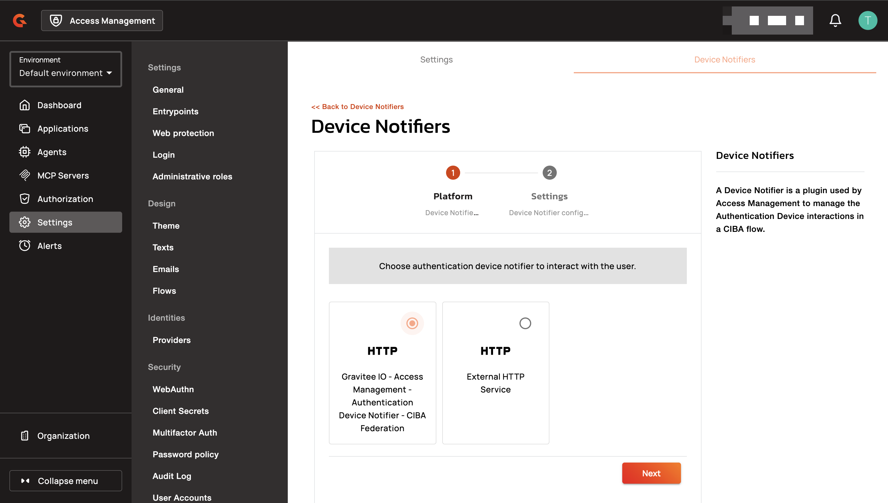
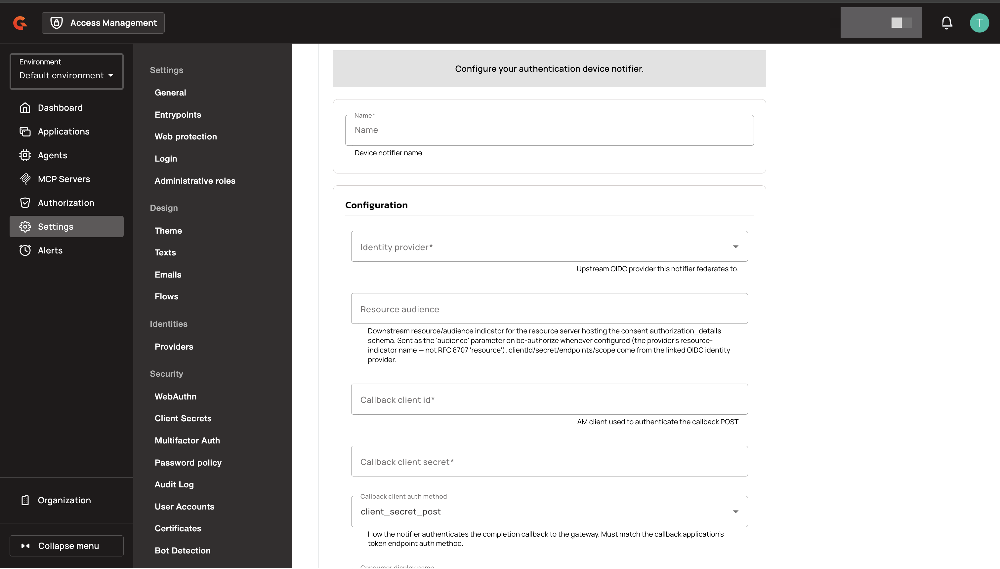

---
metaLinks:
  alternates:
    - https://app.gitbook.com/s/H4VhZJXn1S232OEmh8Wv/guides/auth-protocols/ciba
---

# CIBA

## Overview

[The Client-Initiated Backchannel Authentication Flow - Core 1.0 (CIBA)](https://openid.net/specs/openid-client-initiated-backchannel-authentication-core-1_0.html) is an authentication flow where the Relying Party communicates with the OpenID Provider without redirects through the user’s browser.

## Protocol

The purpose of the Client-Initiated Backchannel Authentication Flow (CIBA) is to authenticate a user without relying on browser redirects. With this flow, the Relying Parties (RPs), that can obtain a valid identifier for the user they want to authenticate, will be able to initiate an interaction flow to authenticate their users without having end-user interaction from the consumption device. The flow involves direct communication from the Client to the OpenID Provider (OP) without redirecting through the user’s browser (consumption device). In order to authenticate the user, the OP will initiate an interaction with an Authentication Device (AD) like a phone.

To activate CIBA on your security domain:

* Click **Settings > CIBA**
* Switch on the **Enable CIBA** toggle
* Adapt the CIBA Settings if necessary
* Save your choice

<figure><figcaption><p>Enable CIBA on the security domain</p></figcaption></figure>

### CIBA settings

There are three parameters for CIBA:

* The validity of the **auth\_req\_id** in second. The **auth\_req\_id** is generated by the [Authentication Backchannel Endpoint](https://openid.net/specs/openid-client-initiated-backchannel-authentication-core-1_0.html#auth_backchannel_endpoint) in order to request a token once the user has been authenticated with the Authentication Device.
* The interval in seconds that a client must wait between two calls on the token endpoint to obtain an `access_token` using a given **auth\_req\_id**.
* The maximum number of characters allowed for the `binding_message` parameter.

<figure><figcaption><p>CIBA settings</p></figcaption></figure>

The plugin is used to manage the Authentication Device interaction.

### Authentication device interaction plugins

In order to manage the interactions with the user devices, AM comes with a plugin mechanism to select the implementation that feat your needs. See the list of available [plugins](ciba.md#authentication-device-plugins) for more details.

## Client Registration

In order to provide a client configuration compatible with CIBA, the client has to register using the [Dynamic Client Registration](https://openid.net/specs/openid-connect-registration-1_0.html) endpoint.

For more information about the parameters related to CIBA, please see the [Registration and Discovery Metadata](https://openid.net/specs/openid-client-initiated-backchannel-authentication-core-1_0.html#registration) section of the specification.

## Hints

The [authentication request](https://openid.net/specs/openid-client-initiated-backchannel-authentication-core-1_0.html#auth_request) exposes 3 parameters to identify the end user: `login_hint`, `login_hint_token` and `id_token_hint`. The `id_token_hint` is the standard ID Token JWT so the `sub` claim will be used to identify the end user. The `login_hint` is a simple string value, AM only considers this parameter as representing the **username** or the user **email address**. Finally, the `login_hint_token` is an unspecified JWT that contains information that aims to identify the end-user. To manage this parameter, AM accepts the following payload for this JWT where:

* `format` specify the attribute used to identify the end-user (possible values are `username` and `email`)
* According to the format the second entry will be either `username` or `email` with the associated value.

```json
{
  "sub_id": {
    "format": "email",
    "email": "myuser@acme.com"
  }
}
```

## Authentication device plugins

The goal of CIBA is to avoid browser redirects in order to grab the user's authorization or identity. The common way to obtain this is to rely on the smartphone of the end user by sending a push notification on a mobile app.

This page introduces AM plugins that will allow you to manage these device notifications.

### External HTTP Service

The **External HTTP Service** plugin brings you the freedom of implementing the notification mechanism in the way you want to by delegating this responsibiltiy to an external HTTP service.

This service must follow the requirements hereafter :

* Be registered as an application on AM in order to provide client ID and client Secret on the AM callback endpoint
* Implement the [notification endpoint](https://raw.githubusercontent.com/gravitee-io/gravitee-docs/master/am/current/ciba_external_service/swagger.yml) to receive a notification request
* Call the AM [callback endpoint](https://raw.githubusercontent.com/gravitee-io/gravitee-docs/master/am/current/ciba/swagger.yml) to update the authentication request status

<figure><figcaption><p>External HTTP service example</p></figcaption></figure>

### CIBA Federation

The **CIBA Federation** plugin delegates the backchannel user authentication to an upstream OpenID Connect provider instead of notifying a device that AM manages. AM remains the CIBA OpenID Provider for the client application, and the user approves or denies the request through the notification channel of their existing provider. When the upstream provider reports the approval, AM establishes the user's identity from the upstream token response and creates or updates the user in the security domain. The user authenticates on the upstream provider only, and doesn't sign in to AM through a browser at any point.

#### Create a CIBA Federation notifier

1. In AM Console, select your security domain.
2. Click **Settings**.
3. Click **CIBA**.
4. Click the **Device Notifiers** tab.

    <figure><figcaption><p>Device Notifiers tab</p></figcaption></figure>
5. Click the plus icon.
6. Select the **CIBA Federation** notifier type.

    
    Both notifier cards display the HTTP logo. Select the card described as **Gravitee IO - Access Management - Authentication Device Notifier - CIBA Federation**. The card described as **External HTTP Service** is the [External HTTP Service](ciba.md#external-http-service) plugin.
    

    <figure><figcaption><p>CIBA Federation notifier card</p></figcaption></figure>
7. Click **Next**.

    <figure><figcaption><p>CIBA Federation notifier type selected</p></figcaption></figure>
8. Enter a **Name** for the notifier.

    <figure><figcaption><p>CIBA Federation notifier configuration</p></figcaption></figure>
9. Configure the notifier with the settings described in the following table.
10. Click **Create**.

<table>
    <thead>
        <tr>
            <th width="220">Property</th>
            <th width="400">Description</th>
            <th>Default</th>
            <th>Required</th>
        </tr>
    </thead>
    <tbody>
        <tr>
            <td>Identity provider</td>
            <td>The OpenID Connect identity provider that the notifier federates the backchannel authentication to.</td>
            <td>-</td>
            <td>Yes</td>
        </tr>
        <tr>
            <td>Resource audience</td>
            <td>Audience indicator for the resource server that hosts the consent <code>authorization_details</code> schema. When set, the notifier sends it as the <code>audience</code> parameter of the upstream backchannel authentication request.</td>
            <td>-</td>
            <td>No</td>
        </tr>
        <tr>
            <td>Callback client id</td>
            <td>Client ID of the callback application that the notifier uses to authenticate its calls to the CIBA callback endpoint.</td>
            <td>-</td>
            <td>Yes</td>
        </tr>
        <tr>
            <td>Callback client secret</td>
            <td>Client secret of the callback application.</td>
            <td>-</td>
            <td>Yes</td>
        </tr>
        <tr>
            <td>Callback client auth method</td>
            <td>How the notifier authenticates its calls to the CIBA callback endpoint: <code>client_secret_post</code> or <code>client_secret_basic</code>. Select the token endpoint authentication method of the callback application.</td>
            <td><code>client_secret_post</code></td>
            <td>No</td>
        </tr>
        <tr>
            <td>Consumer display name</td>
            <td>Display name of the requesting application. The notifier passes it to the consent relay transform when one is configured.</td>
            <td><code>the requesting application</code></td>
            <td>No</td>
        </tr>
        <tr>
            <td>Consent relay strategy</td>
            <td>Identifier of an installed consent relay transform. Leave blank to relay <code>authorization_details</code> to the upstream provider unchanged.</td>
            <td>-</td>
            <td>No</td>
        </tr>
        <tr>
            <td>Hint decoration strategy</td>
            <td>Identifier of an installed hint decoration transform. Leave blank to relay the CIBA hint to the upstream provider unchanged.</td>
            <td>-</td>
            <td>No</td>
        </tr>
        <tr>
            <td>Max auth lifetime (s)</td>
            <td>Maximum time in seconds that the notifier waits for the upstream provider to complete the authentication. The notifier uses the smaller of the upstream <code>expires_in</code> value and this value. The minimum is 1.</td>
            <td><code>120</code></td>
            <td>No</td>
        </tr>
    </tbody>
</table>

#### Select the notifier for the security domain

The AM Gateway uses the device notifier selected in the CIBA settings of the security domain.

1. Click the **Settings** tab.
2. In the **Device Notifier** list, select your CIBA Federation notifier.
3. Click **SAVE**.

Two conditions deny the transaction even when the upstream provider approved it:

* The upstream token response doesn't contain an ID token. The notifier can't establish the federated identity without one.
* The request carried `authorization_details`, and the details approved by the upstream provider differ from the details the notifier relayed.


Security domains that don't select a CIBA Federation notifier keep the existing CIBA behavior. AM rejects hints that don't resolve to a user of the security domain, and ignores the `authorization_details` parameter.

