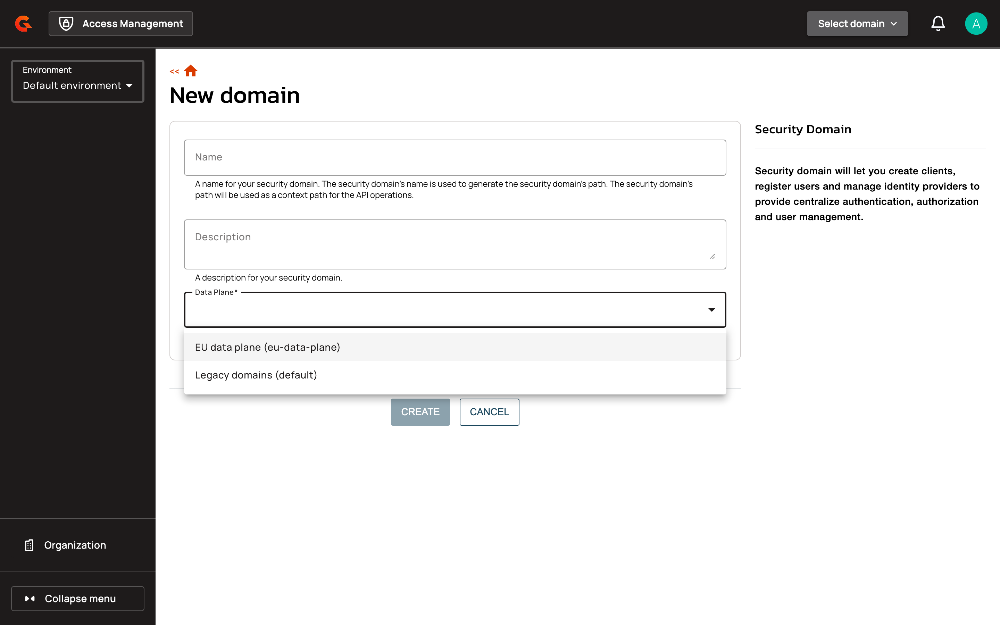

# Automation API

## Overview

The Automation API provides a machine-oriented HTTP interface for managing Access Management resources declaratively. It enables infrastructure-as-code workflows by exposing domain, identity provider, certificate, reporter, and data plane resources through a stable, versioned OpenAPI specification served at the configured entrypoint. The API is designed for CI/CD pipelines, Terraform providers, and other automation tools that require idempotent, key-based resource management.

## Key concepts

### Automation API vs Management REST API

The Automation API is a separate HTTP endpoint optimized for declarative resource management. Unlike the Management REST API, which uses database-generated identifiers, the Automation API uses stable, user-defined keys for all resources. Resources created through the Automation API are isolated from those created via the Management REST API or UI. For example, identity providers created outside the Automation API are not returned by Automation API list endpoints. The API is primarily documented via the generated OpenAPI specification served at the configured entrypoint when the API is enabled (`/openapi.json` and `/openapi.yaml` — also see [Automation API Reference](../reference/automation-api-reference.md)).

#### Timestamps

The Automation API serializes server-assigned timestamps — `createdAt`, `updatedAt`, and (for certificates) `expiresAt` - as **ISO-8601 / RFC 3339 strings in UTC**, with millisecond precision and a `Z` zone designator, for example `2026-06-17T10:00:00.000Z`. The fields are read-only: they're returned on `GET` but ignored on `PUT`, so they're safe to leave in a round-tripped document.

**This timestamp format differs from the Management REST API.** The Management REST API serializes the same fields as **epoch milliseconds** (a JSON number, e.g. `1718616600000`).

### Resource keys

Every resource in the Automation API is identified by a **key**: a stable, immutable identifier you define when creating the resource. Keys are scoped to their parent resource. For example, identity provider keys are unique within a domain. Once created, a resource's key can't be changed. Keys enable idempotent PUT operations — sending the same PUT request multiple times produces the same result.

Data planes are the exception: a data plane is identified by its `id` field instead of a `key`. For more information, see [Manage data planes](#manage-data-planes).

#### Example keys:

| Resource | Key Scope | Example Key |
|:---------|:----------|:------------|
| Domain | Environment | `example-domain` |
| Identity Provider | Domain | `corporate-ldap` |
| Certificate | Domain | `signing-cert` |
| Reporter | Domain | `audit-kafka` |

### System resources

Identity providers, reporters and certificates can be marked as **system resources** by setting `system: true`. System identity providers are built from the `domains.identities.default.*` configuration in `gravitee.yml` and require only a `key` field alongside `system: true` — all other configuration is inherited from the `gravitee.yml` configuration file. System resources are immutable through the Automation API. Re-PUTting a system resource is an idempotent no-op. Each domain can have at most one system identity provider, one system reporter and one system certificate.


**Automation-managed domains start empty.** Unlike domains created in the console, a domain created through the Automation API is **not** seeded with a default identity provider, reporter, or certificate. Declare whatever you need explicitly — including the built-in defaults via `system: true`.


### Declarative resource management

Every PUT carries the **complete desired state** of a resource, not a partial patch. To change a single field, read the resource, edit the returned document, and PUT the whole thing back. A `GET` → edit → `PUT` round-trip is lossless and idempotent.

Data planes are the exception: a `GET` never returns a data plane's `configuration`, so every data plane `PUT` carries it again.

### Resource visibility and ownership

Resources created through the Automation API are stamped as automation-managed. Addressed by `key`, the API only ever sees, updates, or deletes its **own** resources — resources created via the console or Management REST API are invisible to its list and get-by-key operations, and a key whose deterministic id collides with a non-automation resource is rejected. This ownership boundary is what keeps automation-driven and manually managed resources from interfering with each other. (To deliberately cross it, see [Brownfield resources](#brownfield-resources).)

### Brownfield resources

*Brownfield* resources are those the Automation API did **not** create — those provisioned earlier through the console or the Management REST API. They have a database-generated internal id and no automation `key`, so key-based addressing can't see them. To manage one, address it by its internal id with the `id:` prefix (for example `id:94157683-f481-45a9-9576-83f48145a9a0`) anywhere a reference is accepted — a path segment, the PUT body `key`, or a cross-resource reference. You can mix `key` and `id:` references in a single path.

`id:` addressing behaves differently from key addressing in a few important ways:

* **Update-only** — `GET`, `PUT`, and `DELETE` require the resource to already exist; there is no create-by-id. Creation is always by `key`.
* **Non-adopting** — a PUT edits the resource's fields in place and leaves its ownership untouched. The resource is not converted into an automation-managed resource and gains no key.
* **Scope-checked** — the id must belong to the addressed parent (a child to its domain, a domain to the path environment); a cross-scope or unknown id returns `404`.
* **Not enumerable** — `id:`-reached resources never appear in list responses, so brownfield management requires you to already know the id.

## Prerequisites

Before using the Automation API, ensure the following requirements are met:

* Automation API is enabled (See [Enabling the Automation API](../getting-started/configuration/configure-automation-api.md))
* A user with organization-level permissions
* Either a JWT bearer token or an opaque user service-account access token for authentication (see following)

## Authentication

Every Automation API request must include an `Authorization: Bearer <token>` header. The OpenAPI specification endpoints (`/openapi.json` and `/openapi.yaml`) are the only exceptions and can be fetched without authentication.

Example:

```bash
curl -H "Authorization: Bearer <TOKEN>" \
  "https://<am-host>/automation/organizations/<orgId>/environments/<envId>/domains"
```

The API accepts two bearer token types.

### JWT bearer token

A JWT bearer token is the short-lived access token issued by the AM Management API authentication endpoints. Use this approach for interactive tooling, local development, or any workflow where a human user signs in and exchanges credentials for a token.

To obtain a token, call the Management API token endpoint with the user's credentials. For details, see [Authorization](../reference/am-api-reference.md#authorization).

```bash
TOKEN=$(curl -s https://<am-host>/management/auth/token \
  -u admin:adminadmin \
  -d "grant_type=password&username=admin&password=adminadmin" | jq -r '.access_token')
```

JWTs are subject to session invalidation: tokens issued before the user's last logout or username reset are rejected.

### Service account token

An opaque service-account access token is the recommended authentication method for CI/CD pipelines, Terraform providers, and other non-interactive automation. Unlike a JWT, the token is an opaque, Base64-encoded value that does not expire on a fixed schedule but can be revoked individually.

#### Create a service account

To create a service account, follow these steps:

1. Log in to your AM Console.
2. Open **Organization** from the left navigation.
3. Click **Users** under **User Management**.
4. Click **Add User**.
5. In the **User Type** section, select the **Service Account** card.
6. In the **Service Name** field, enter a meaningful name for the service account.
7. Optional: in the **Email** field, enter an address to receive notifications related to this account.
8. Click **Create**.

Assign the service account the minimum organization and environment roles required for the Automation API operations it performs.

## Manage data planes

A data plane stores the runtime data of the security domains created on it, such as their users. With the Automation API, register a data plane in an environment while the Management API runs, then create security domains on it.

The data plane endpoints are under `/organizations/<orgId>/environments/<envId>`:

| Method | Path | Result |
|:-------|:-----|:-------|
| `GET` | `/dataplanes` | Lists the data planes the Automation API registered in the environment. |
| `PUT` | `/dataplanes` | Registers the data plane named by the `id` in the body, or updates it if the Automation API registered it. |
| `GET` | `/dataplanes/<id>` | Returns one data plane. |
| `DELETE` | `/dataplanes/<id>` | Deletes one data plane. |

The `ORGANIZATION_USER` and `ENVIRONMENT_USER` roles allow listing and reading data planes. Registering, updating, and deleting a data plane is allowed to the `ORGANIZATION_OWNER`, `ORGANIZATION_PRIMARY_OWNER`, `ENVIRONMENT_OWNER`, and `ENVIRONMENT_PRIMARY_OWNER` roles, and to any role that grants these actions on the organization or the environment. A request outside the caller's roles is rejected with `403`.

### Register or update a data plane

To register a data plane, send its full definition in a `PUT` request to `/dataplanes`:

```bash
curl -X PUT \
  -H "Authorization: Bearer <TOKEN>" \
  -H "Content-Type: application/json" \
  -d '{
    "id": "eu-data-plane",
    "name": "EU data plane",
    "type": "mongodb",
    "gatewayUrl": "https://gateway-eu.example.com",
    "configuration": {
      "mongodb": {
        "dbname": "gravitee-am-eu",
        "host": "mongo-eu.example.com",
        "port": 27017
      }
    }
  }' \
  "https://<am-host>/automation/organizations/<orgId>/environments/<envId>/dataplanes"
```

The body takes these properties:

| Property | Description | Default | Required |
|:---------|:------------|:--------|:---------|
| `id` | Identifier of the data plane, fixed at registration: up to 64 lowercase letters, digits, and hyphens, starting and ending with a letter or a digit. It's unique across all organizations and environments. `default` and the identifiers of the data planes declared in `gravitee.yml` are reserved. | - | Yes |
| `name` | Name of the data plane, up to 128 characters. | - | Yes |
| `type` | `mongodb` or `jdbc`, fixed at registration. Requires the matching data plane plugin on the Management API. | - | Yes |
| `gatewayUrl` | Base URL of the Gateway that serves the data plane, as an absolute `http` or `https` URL of up to 256 characters. | - | No |
| `configuration` | One block named after the `type`, with the connection settings of a data plane declared in `gravitee.yml`. The block names its database and its host, in a connection URI or in separate settings, which for `jdbc` also include the driver. A setting that the data plane plugin doesn't know is rejected with `400`. For the settings, see [Repositories & Data Plane](../getting-started/configuration/configure-repositories.md#data-plane). | - | Yes |

The response returns the data plane without its `configuration`, which no response includes. Instead, `database` and `hosts` show the database and the hosts the configuration points at, alongside `organizationId`, `environmentId`, `createdAt`, and `updatedAt`. `hosts` is empty when a connection URI lists several hosts. AM stores the `configuration` as sent, credentials included, in its management repository.

Every Management API node serves the new data plane without a restart: the node that handled the request at once, and by default the other nodes a few seconds later. Registering a data plane doesn't set up a Gateway for it. To serve its security domains, configure Gateways as described in [Configure the Gateways](../getting-started/install-and-upgrade-guides/configure-multiple-data-planes.md#configure-the-gateways).

A `PUT` with the `id` of a data plane the Automation API registered updates the data plane:

* The `PUT` carries the full definition, `configuration` included, because a `GET` doesn't return it. A `PUT` without `configuration` is rejected with `400`.
* The `PUT` replaces `name`, `gatewayUrl`, and `configuration`, so a `PUT` without `gatewayUrl` clears it. A different `type` is rejected with `400`.
* A `PUT` that repeats the stored `name`, `gatewayUrl`, and `configuration` leaves the data plane as it is: its `updatedAt` doesn't change, and no audit event is recorded.


An update that points `configuration` at another database or host doesn't copy any data. The Management API then reads and writes the data of the security domains on this data plane in the new store, while their users and other runtime data stay in the previous one. Gateways keep using the store that their own configuration names.


AM records every registration, update, and deletion in the [organization audit logs](audit-trail.md#organization-audit-logs).

### Create a security domain on a data plane

To create a security domain on a data plane, set `dataPlaneId` to the data plane's `id` in the `PUT` request that creates the security domain:

```bash
curl -X PUT \
  -H "Authorization: Bearer <TOKEN>" \
  -H "Content-Type: application/json" \
  -d '{
    "key": "example-domain",
    "name": "Example domain",
    "path": "/example-domain",
    "dataPlaneId": "eu-data-plane"
  }' \
  "https://<am-host>/automation/organizations/<orgId>/environments/<envId>/domains"
```

A security domain stays on the data plane it's created on. A later `PUT` that names another data plane is rejected with `400`, and a `PUT` without `dataPlaneId` keeps the current one.

Name the data plane in every request that creates a security domain, `default` included. On a self-hosted installation, a request without `dataPlaneId` creates the security domain on `default` only while `default` is the only data plane declared in `gravitee.yml` and no data plane registered in the environment is loaded. Otherwise, the request is rejected with `400`. A request that names a data plane registered in another environment is rejected with `400` and the message `Data Plane [<id>] is not linked to this environment.`

By default, AM creates a security domain on a registered data plane only after the data plane's database has answered a check, which runs when AM starts serving the data plane. If the database didn't answer, the request is rejected with `400` and the message `An error occurred while trying to create a domain. Data Plane [<id>] did not answer with the settings it was provisioned with.` AM checks again on a later request, so retry once the database answers. A successful data plane `PUT` doesn't prove that AM reaches the database.

When the Management API runs on several nodes, a node that hasn't loaded a new data plane yet rejects a request that names it with `400` and the message `An error occurred while trying to create a domain. Data Plane [<id>] is not loaded on this node.` Retry the request a few seconds later.

### Delete a data plane

To delete a data plane, send a `DELETE` request to `/dataplanes/<id>`. A data plane that a security domain uses isn't deleted: the request is rejected with `409` until every security domain on the data plane is deleted. A `DELETE` for a data plane that doesn't exist returns `204`, with or without `id:`. After deletion, the `id` is free to register again.

### Reach data planes registered another way

The list and every request by plain `id` reach only the data planes the Automation API registered:

* A data plane registered through the Management API internal API isn't listed. By plain `id`, a `GET` returns `404`, a `PUT` is rejected with `409`, and a `DELETE` returns `204` and leaves the data plane in place. To read, update, or delete it, prefix its identifier with `id:`, for example `id:dataplane3`. An update by `id:` doesn't add the data plane to the list.
* A data plane declared in `gravitee.yml` isn't reachable through the Automation API. A `PUT` with its plain identifier is rejected with `400`, and a `GET` or `PUT` with `id:` returns `404`.

## Verification

To verify the data plane registration is working as expected, follow these steps:

1. Send a `GET` request to `/dataplanes/<id>`. The response returns the data plane with its `database` and `hosts`.
2. In AM Console, click the security domain name at the top right of the page, or **Select domain** when no security domain is open.
3. Click **New**.
4. Click the **Data Plane** list, which appears when more than one data plane is available. The list offers the data plane as its name followed by its `id`.

    <figure><figcaption><p>A registered data plane in the Data Plane list of the New domain page</p></figcaption></figure>
