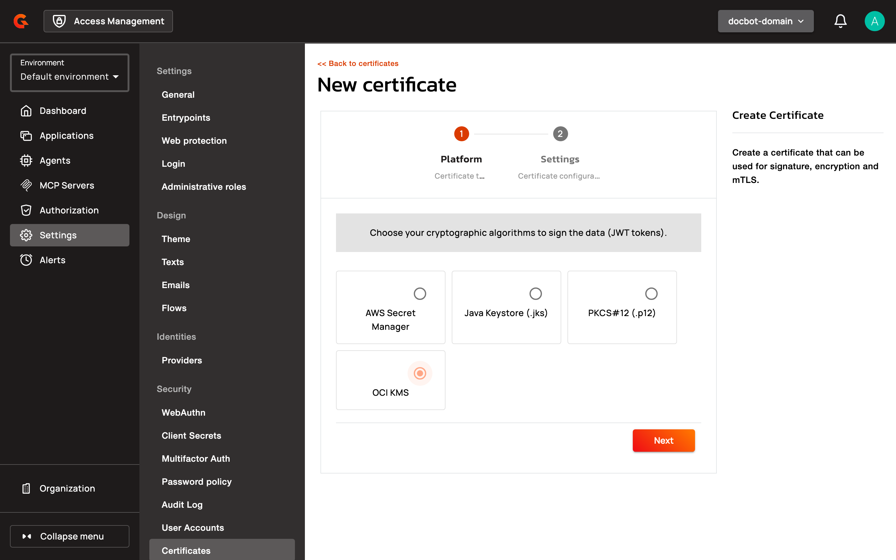
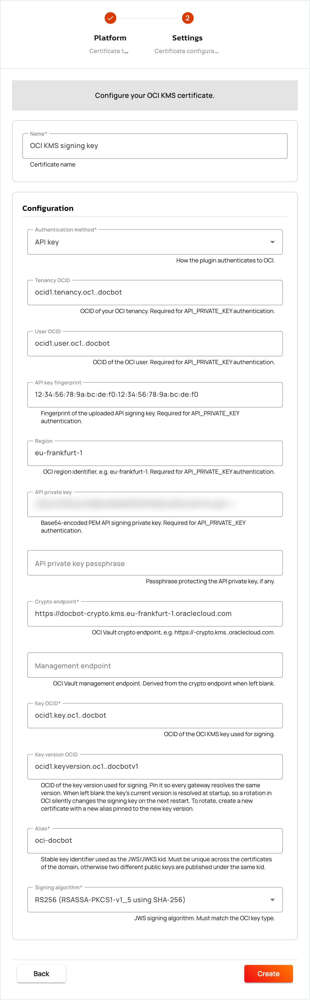
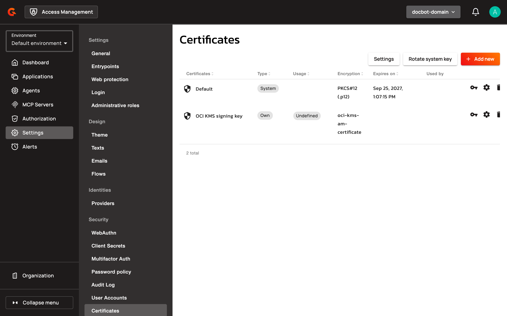

# Configure the OCI KMS certificate plugin

## Overview

The OCI KMS certificate plugin signs the tokens of a security domain with a key stored in an Oracle Cloud Infrastructure (OCI) Vault. AM reads the key's public key from the vault and sends every signing operation to OCI KMS.


The OCI KMS certificate plugin is an Enterprise Edition plugin and requires a license that contains the `enterprise-secret-manager` pack.


## Prerequisites

Before you create the certificate, set up the following in OCI:

* An RSA or ECDSA key in an OCI Vault. Note the OCID of the key and the endpoints of the vault. For more information, see the [OCI Vault documentation](https://docs.oracle.com/en-us/iaas/Content/KeyManagement/home.htm).
* An identity for AM that can read the key and its key versions, and sign with the key. For the policy syntax, see the [OCI Vault policy reference](https://docs.oracle.com/en-us/iaas/Content/Identity/Reference/keypolicyreference.htm).
* Network access from every AM Management API and AM Gateway instance to the endpoints of the vault.

## Install the plugin

The OCI KMS certificate plugin isn't bundled with AM. Install it on every AM Management API and AM Gateway instance. The Management API checks the certificate when you create it, and the Gateway signs tokens with it.

### Install from the .zip file

1. Download the plugin `.zip` file from [download.gravitee.io](https://download.gravitee.io/#graviteeio-ee/am/plugins/certificates/gravitee-am-certificate-oci/).
2. Copy the `.zip` file to the `plugins` directory of each AM Management API and AM Gateway instance.
3. Restart the AM Management API and the AM Gateway.

### Install with Helm

Add the plugin URL to the `additionalPlugins` list of the Management API and the Gateway in your `values.yaml` file. Replace `<version>` with the plugin version to install.

```yaml
api:
  additionalPlugins:
    - https://download.gravitee.io/graviteeio-ee/am/plugins/certificates/gravitee-am-certificate-oci/gravitee-am-certificate-oci-<version>.zip

gateway:
  additionalPlugins:
    - https://download.gravitee.io/graviteeio-ee/am/plugins/certificates/gravitee-am-certificate-oci/gravitee-am-certificate-oci-<version>.zip
```

## Create the certificate

To create the certificate in the security domain whose tokens it signs, complete the following steps:

1. Log in to AM Console.
2. Select the security domain.
3. Open **Settings**.
4. Click **Certificates**.
5. Click **Add new**.
6. Select **OCI KMS**.

    <figure><figcaption></figcaption></figure>
7. Click **Next**.
8. In the **Name** field, enter a name for the certificate.
9. Select an **Authentication method**.
10. Enter the settings that the authentication method requires. For more information, see [Authentication methods](#authentication-methods).
11. Enter the key settings. For more information, see [Key settings](#key-settings).

    <figure><figcaption></figcaption></figure>
12. Click **Create**.

Before AM creates or updates the certificate, it reads the key from the vault and signs a test token with it. If this check fails, AM doesn't save the certificate, and the AM Management API log records the reason.


If OCI KMS can't sign a token, AM signs it with the fallback certificate of the domain when one is configured. Otherwise, the token request fails. For more information, see [Configure Domain Certificate Fallback](configure-domain-certificate-fallback.md).


### Authentication methods

The **Authentication method** sets how AM authenticates to OCI. The default is **API key**.

| Authentication method | Settings to enter |
| --- | --- |
| **API key** | **Tenancy OCID**, **User OCID**, **API key fingerprint**, **Region**, and **API private key**. Optional: **API private key passphrase**. |
| **OCI config file** | **Config file path**. Optional: **Config file profile**. If you leave the profile blank, AM uses the `DEFAULT` profile. |
| **Instance principals (OCI compute)** | None |
| **Resource principals (OCI Functions)** | None |
| **OKE workload identity** | None |

For **API private key**, enter the PEM file of the API signing key encoded in base64 on a single line. For example:

```sh
base64 < oci_api_key.pem | tr -d '\n'
```

**API private key** and **API private key passphrase** accept secret values. For more information, see [Plugins support](../../getting-started/configuration/domain-secrets/plugins-support.md).

For **OCI config file**, place the config file at the **Config file path** on every AM Management API and AM Gateway instance.

The instance principals, resource principals, and OKE workload identity methods take no credentials from the form. For how OCI grants an identity to a compute instance or a Kubernetes workload, see the OCI documentation for [instance principals](https://docs.oracle.com/en-us/iaas/Content/Identity/Tasks/callingservicesfrominstances.htm) and [OKE workload identity](https://docs.oracle.com/en-us/iaas/Content/ContEng/Tasks/contenggrantingworkloadaccesstoresources.htm).

### Key settings

The key settings identify the key that signs tokens and the algorithm AM uses with it.

| Setting | Description | Default | Required |
| --- | --- | --- | --- |
| **Crypto endpoint** | The endpoint of the vault that AM sends signing requests to, for example `https://<vault>-crypto.kms.<region>.oraclecloud.com`. | - | Yes |
| **Management endpoint** | The management endpoint of the vault. If you leave it blank, AM replaces `-crypto.` with `-management.` in the **Crypto endpoint**. Set it when the **Crypto endpoint** doesn't contain `-crypto.`. | Derived from the **Crypto endpoint** | No |
| **Key OCID** | The OCID of the key that signs tokens. | - | Yes |
| **Key version OCID** | The key version that signs tokens. If you leave it blank, AM uses the current version of the key each time it loads the certificate, for example when the AM Gateway restarts. If the key version you set isn't enabled in OCI, AM rejects the certificate. | The current version of the key | No |
| **Alias** | The key ID (`kid`) in the header of the tokens the certificate signs, and in the JWKS of the domain. Use an alias that no other certificate in the domain uses. AM rejects a duplicate alias. | - | Yes |
| **Signing algorithm** | `RS256`, `RS384`, `RS512`, `PS256`, `PS384`, or `PS512` for an RSA key. `ES256`, `ES384`, or `ES512` for an ECDSA key on the P-256, P-384, or P-521 curve. AM rejects an algorithm that doesn't match the key. | `RS256` | Yes |

## Rotate the signing key

To rotate the signing key, create a new certificate for the new key version:

1. Create a new version of the key in OCI.
2. Create an OCI KMS certificate with a new **Alias**, and set **Key version OCID** to the new key version.
3. Select the new certificate for each application that uses the previous one. For more information, see [Apply the certificate to your application](README.md#apply-the-certificate-to-your-application).

## Verification

To verify the OCI KMS certificate is working as expected, follow these steps:

1. Open **Settings**.
2. Click **Certificates**. The list shows the new certificate. Its usage reads **Undefined**, because the OCI KMS form has no **Usage** field.

    <figure><figcaption></figcaption></figure>
3. Select the certificate for an application. For more information, see [Apply the certificate to your application](README.md#apply-the-certificate-to-your-application).
4. Request an access token for the application.
5. Decode the header of the token. The `kid` value is the **Alias** of the certificate, and the `alg` value is its **Signing algorithm**.
