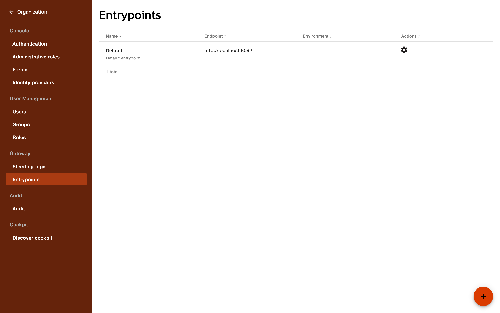
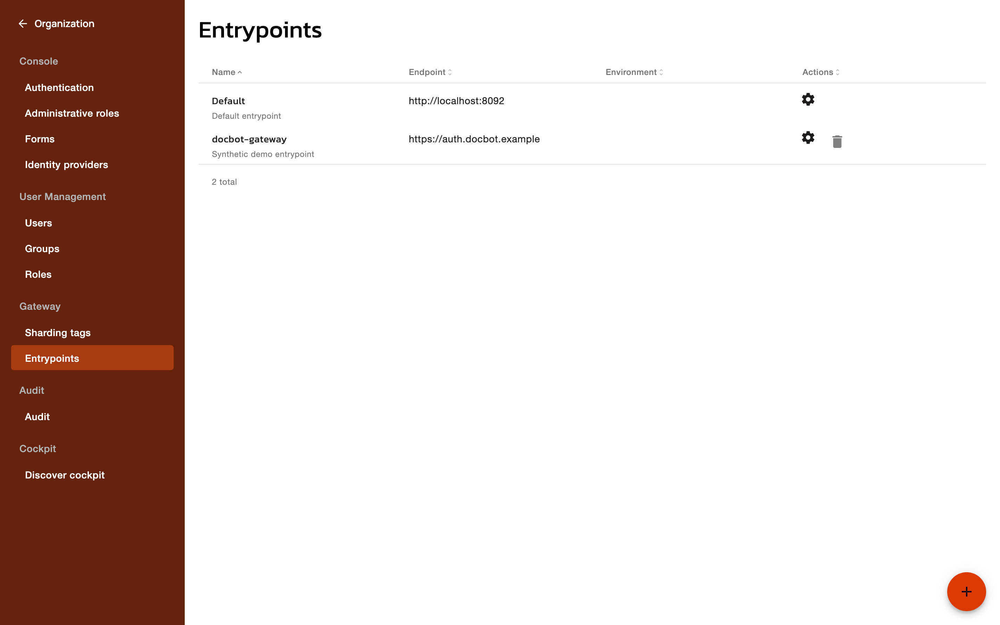

# Configure entrypoints

An entrypoint defines a base URL that the AM Gateway is reached on. AM builds user-facing URLs from entrypoints, such as the **Domain entrypoint url** that AM Console shows for a security domain and the links in the emails that AM sends.

## View the entrypoints of your organization

1. In AM Console, click **Organization**.
2. Under **Gateway**, click **Entrypoints**.

The table lists each entrypoint's **Name**, **Endpoint**, and **Environment**.

<figure><figcaption>
The Entrypoints list
</figcaption></figure>

## Manage entrypoints on a self-hosted installation

On a self-hosted installation, AM creates a default entrypoint named **Default**, whose URL comes from the `gateway.url` property of the Management API configuration and defaults to `http://localhost:8092`.

To add an entrypoint, follow these steps:

1. Click the **+** button.
2. In the **New Entrypoint** form, enter a **Name** and optionally a **Description**.
3. Enter the **Entrypoint url**. The URL starts with `http://` or `https://`.
4. Click **CREATE**.

To edit an entrypoint, click its settings icon, and then adjust its **Name**, **Description**, **Entrypoint url**, or **Sharding tags**.

To delete an entrypoint, click its delete icon, and then confirm in the **Delete Entrypoint** dialog. The default entrypoint can't be deleted.

## Entrypoints on Gravitee-managed deployments

On a Gravitee-managed deployment, Gravitee Cloud manages the entrypoints, and each environment gets its own:

* When Gravitee Cloud provisions or updates an environment, AM stores each gateway access point of the environment as an entrypoint of that environment. The entrypoint takes the access point's host as its name and `https://` followed by that host as its URL, and the **Environment** column of the list shows the environment it belongs to.
* Adding, editing, and deleting entrypoints in AM Console is disabled, because Gravitee Cloud is the source of truth.
* When a custom domain is attached to the environment, AM prefers the custom domain over the environment's default Gravitee Cloud URL when it builds URLs.
* AM doesn't create the organization-level default entrypoint.

On the **Entrypoints** page of a security domain, under **Settings**, switching between the context-path and virtual hosts modes and editing virtual hosts are also unavailable on Gravitee-managed deployments.

## Where AM uses the environment entrypoint

On a Gravitee-managed deployment, the entrypoint of the domain's environment drives the URLs AM produces:

* The **Domain entrypoint url** shown on the security domain's **Entrypoints** page resolves from the domain's environment.
* Emails sent by the Management API and by the Gateway build their links from the environment's entrypoint. When the triggering request arrived on the host of one of the environment's entrypoints, AM uses that entrypoint, and otherwise it falls back to the environment's preferred entrypoint.
* WebAuthn ceremonies verify against the origin of the entrypoint that matches the request. A relying party ID set explicitly in the security domain's WebAuthn settings is preserved.

On a self-hosted installation, AM builds these URLs from the `gateway.url` of the security domain's data plane, or from the Management API's global `gateway.url`. See [Configure Multiple Data Planes](../getting-started/install-and-upgrade-guides/configure-multiple-data-planes.md).

## Verification

To verify an entrypoint is configured as expected on a self-hosted installation, follow these steps:

1. Add an entrypoint. The list shows it with its **Name** and **Endpoint**.
2. Delete the entrypoint, and then confirm in the **Delete Entrypoint** dialog. The list no longer shows it.

<figure><figcaption>
The created entrypoint
</figcaption></figure>
