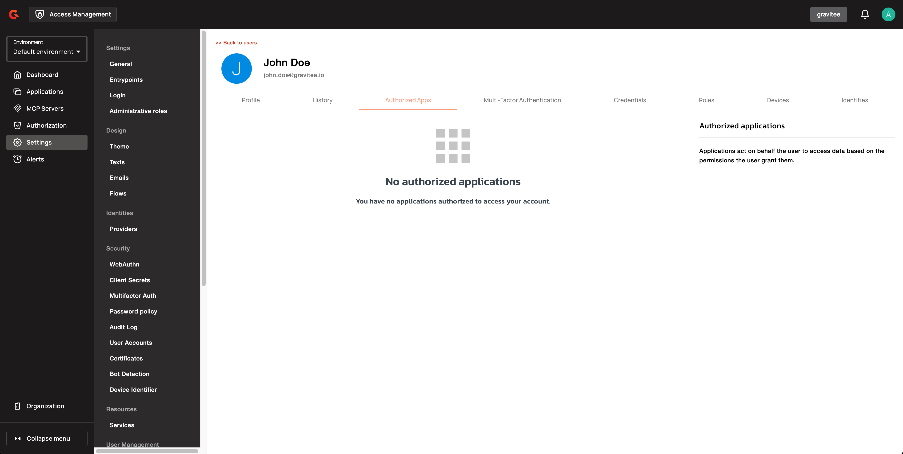

# User Consent

## User consent

As described in [RFC 6819](https://tools.ietf.org/html/rfc6819#section-5.1.3), users should always be in control of authorization processes and have the necessary information to make informed decisions.

To have users acknowledge and accept that they're giving an app access to their data, you can configure Access Management to display a consent page during the OAuth 2.0/OIDC authentication flow.

Gravitee Access Management provides fine-grained control over how users grant permissions during OAuth 2.0 authorization flows. Administrators can configure whether scopes are preselected or require explicit opt-in on the consent page, and can mark specific scopes as mandatory, ensuring users can't proceed without granting critical permissions.


You can change the look and feel of the user consent form. For more information, see [Custom pages](../branding/README.md#custom-pages).


### Scope preselection

By default, no requested scopes are preselected (checked) on the consent page, allowing users to select individual permissions they want to grant. When scope preselection is enabled, users must explicitly **uncheck** each permission they don't want to approve.


Applications created prior to 4.13 have **Preselect consent for all scopes** checked automatically to preserve existing behavior. New applications created using the Management Console have **Preselect consent for all scopes** unchecked by default.


### Required scopes

A required scope is a permission that can't be deselected by the user during consent. Required scopes are always displayed as checked and disabled on the consent page. If the user rejects the entire consent request, all scopes are denied.

## Configure scope selection controls

To configure opt-in scope selection and required scopes for an OAuth 2.0 application, complete the following steps:

1. In the Management Console, navigate to **Applications → [Your Application] → Settings → OAuth2 / OIDC → Scopes**.
2. Toggle **Preselect consent for all scopes** to control the default selection behavior. When enabled, all requested scopes are checked by default on the consent page. When disabled, users must explicitly select each scope they wish to grant.
3. Add scopes to the table to define the permissions this client is allowed to request. Only the scopes listed here can be granted during authorization. Any scope a client requests outside this list is rejected.
4. Check the **Default** column for a scope to add it to the authorization request automatically when the client starts an authorization flow without requesting any specific scopes. When **Enhance scopes** is enabled, the authenticating user's role scopes are also granted when the request carries no scope, or only `openid`.
5. Check the **Required** column for a scope to mark it as mandatory. Required scopes can't be deselected by the user on the consent screen when they're requested. They must be consented to for the authorization request to be allowed.
6. Select a **User consent** duration from the dropdown to control how long the user's approval of the scope is remembered before consent is requested again.

The following table describes options in the scopes configuration:

| Field | Description |
|:------|:------------|
| **Preselect consent for all scopes** | When enabled, all requested scopes are checked by default on the consent page. Users can still change individual selections before approving. When disabled, no scopes are preselected and users must explicitly opt in to each permission. |
| **Default** | Adds the scope to the authorization request automatically when the client starts an authorization flow without requesting any specific scopes. |
| **Required** | Marks the scope as mandatory. The user can't deselect it on the consent screen, and the authorization request fails if the scope isn't granted. |
| **User consent** | Controls how long the user's approval of the scope is remembered before consent is requested again. |

### Consent persistence

Only the scopes presented on the current consent page are persisted when the user submits the form. These are the scopes not already approved in a previous session. Previously approved scopes aren't re-submitted or overwritten unless the authorization request includes `prompt=consent`, which forces all requested scopes to be re-presented and re-evaluated.

## Revoke user consent

You can view a list of applications for which each user has provided consent. To revoke access to an application, complete the following steps:

1. Log in to Access Management Console.
2. Click **Settings > Users**.
3. Select the user.
4. In the **Authorized Apps** tab, revoke the application.

    <figure><figcaption>
Revoke user consent for an application
</figcaption></figure>


Revoking consent can also be done using the [Access Management Management API](../../reference/am-api-reference.md).

