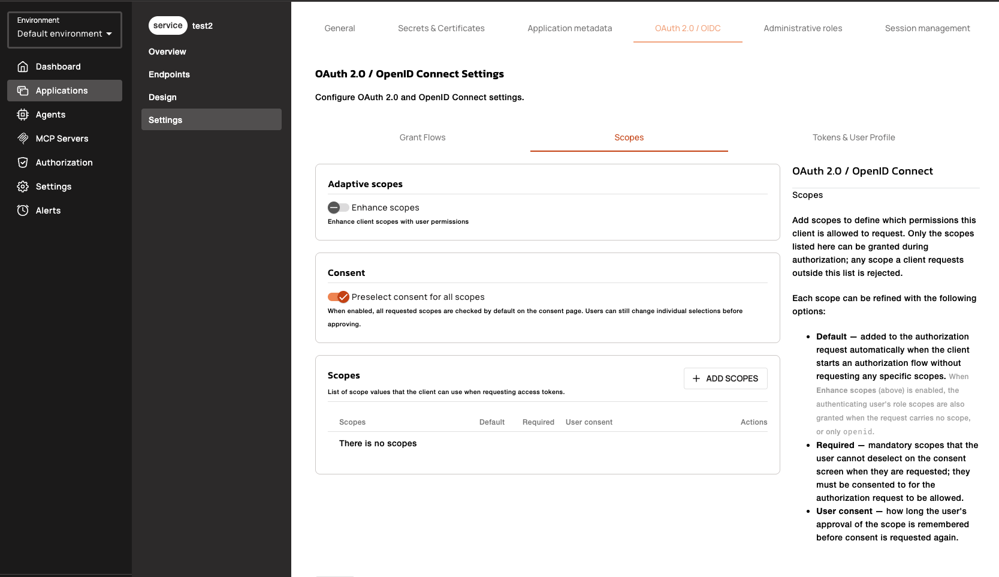
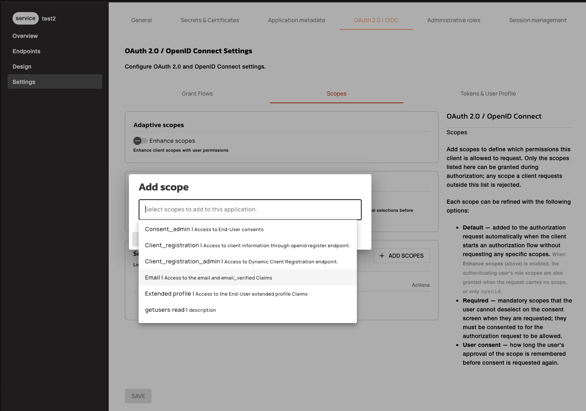
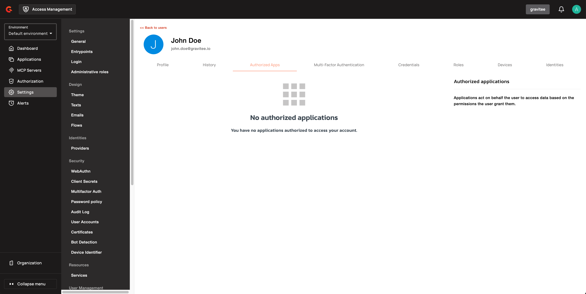

---
metaLinks:
  alternates:
    - >-
      https://app.gitbook.com/s/H4VhZJXn1S232OEmh8Wv/guides/user-management/user-consent
---

# User Consent

## User consent

As described in [RFC 6819](https://tools.ietf.org/html/rfc6819#section-5.1.3), users should always be in control of authorization processes and have the necessary information to make informed decisions.

If you want users to acknowledge and accept that they are giving an app access to their data, you can configure AM to display a consent page during the OAuth 2.0/OIDC authentication flow.


You can change the look and feel of the user consent form. See [custom pages](../branding/README.md#custom-pages) for more information.


## Select scopes to consent

From AM 4.13.0, the consent page presents each scope of the authorization request with its own checkbox. Users adjust the selection to the scopes they agree to grant, then click **Allow**. Clicking **Deny** rejects the whole authorization request.

AM continues the flow with the approved scopes only. The authorization response and the issued tokens carry the approved scopes, and the stored consent records the other presented scopes as denied.

Two application settings control what the consent page does: the **Preselect consent for all scopes** toggle and the per-scope **Required** checkbox.

### Preselect consent for all scopes

This toggle sets the initial state of the checkboxes on the consent page:

* Toggle on: every presented scope starts checked, and users clear the scopes they don't want to grant. This matches the consent behavior of AM versions earlier than 4.13.0.
* Toggle off: no scope starts checked, and users check each scope they agree to grant.

The toggle's starting value depends on how the application was created:

<table>
    <thead>
        <tr>
            <th width="300">Application</th>
            <th>Preselect consent for all scopes</th>
        </tr>
    </thead>
    <tbody>
        <tr>
            <td>Existed before the upgrade to 4.13.0</td>
            <td>On, so the consent page behaves as it did before the upgrade</td>
        </tr>
        <tr>
            <td>Created in AM Console or through the AM Management API</td>
            <td>Off</td>
        </tr>
        <tr>
            <td>Registered through Dynamic Client Registration</td>
            <td>On</td>
        </tr>
    </tbody>
</table>

Recommended: turn the toggle off for clients that request a large number of scopes, and leave it on for applications where approval of the full set is expected.

### Required scopes

Mark a scope as **Required** when the application depends on it to function. AM presents a required scope first, labels it **Required**, and locks its checkbox, so users grant it whenever they allow the request. Clicking **Deny** still rejects the whole request, including the required scopes.

Marking a scope as required only affects authorization requests that ask for it. AM doesn't add required scopes to a request that omits them.


AM validates the submitted consent against the authorization request. Scopes that weren't part of the request are ignored, and a submission that doesn't grant a presented required scope is rejected with an `access_denied` error.


### Consent reuse

AM remembers each approved scope until its **User consent** duration expires. A later authorization request presents only the requested scopes that aren't approved yet, and leaves the existing approvals untouched. To present the full list of requested scopes again, add `prompt=consent` to the authorization request.

## Configure scope consent for an application

1. Log in to AM Console.
2. Click **Applications**.
3. Select your application.
4. Click **Settings**.
5. Click **OAuth 2.0 / OIDC**.
6. Click the **Scopes** tab.
7. Scroll to the **Consent** section and set the **Preselect consent for all scopes** toggle.

    <figure><figcaption>
Preselect consent for all scopes toggle
</figcaption></figure>

8. Optional: to add a scope to the application, scroll to the **Scopes** section and click **ADD SCOPES**. In the **Add scope** dialog, select the scopes to add, then click **Add**.

    <figure><figcaption>
Add scope dialog
</figcaption></figure>

9. Select the **Required** checkbox for each scope the application depends on.

    <!-- TODO: Screenshot of the scopes table with the Required column -->
    <figure><figcaption>
Required column in the scopes table
</figcaption></figure>

10. Click **SAVE**.


Both settings are also available through the [AM Management API](../../reference/am-api-reference.md) application operations: `optInScopeSelection` on the application's OAuth settings, and `requiredScope` on each entry of the `scopeSettings` list.


## Verification

To verify scope consent is working as expected, follow these steps:

1. Start an authorization request for your application that includes several scopes, with at least one scope marked as required.
2. Log in as a test user. The consent page lists each requested scope with a checkbox, and the required scopes are checked, locked, and labeled **Required**.
3. Check a subset of the optional scopes and click **Allow**.
4. Inspect the token response. The `scope` value contains the scopes you checked and the required scopes, and none of the scopes you left unchecked.
5. Start the same authorization request again. AM doesn't prompt again for the scopes that are already approved. Add `prompt=consent` to the request to present the full list again.

## Revoke user consent

You can view a list of applications for which each user has provided consent. To revoke access to an application:

1. Log in to AM Console.
2. Open **Settings**.
3. Click **Users**.
4. Select the user.
5. Click the **Authorized Apps** tab and revoke the application.

<figure><figcaption></figcaption></figure>


Revoking consent can also be done via the [AM Management API](../../reference/am-api-reference.md).

