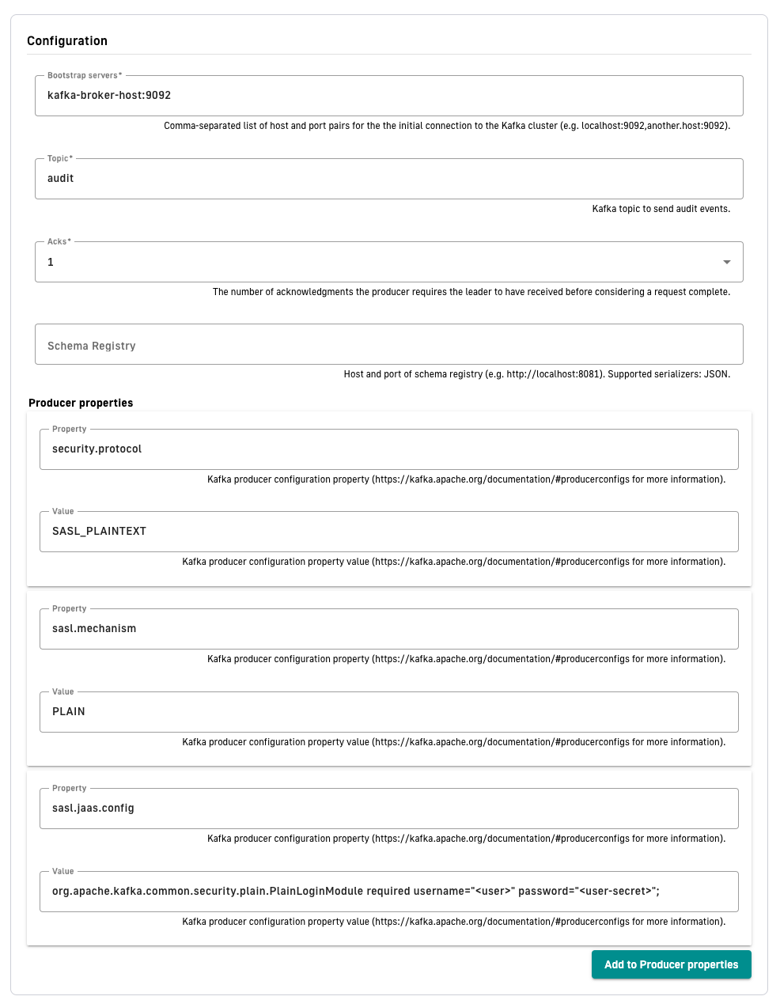
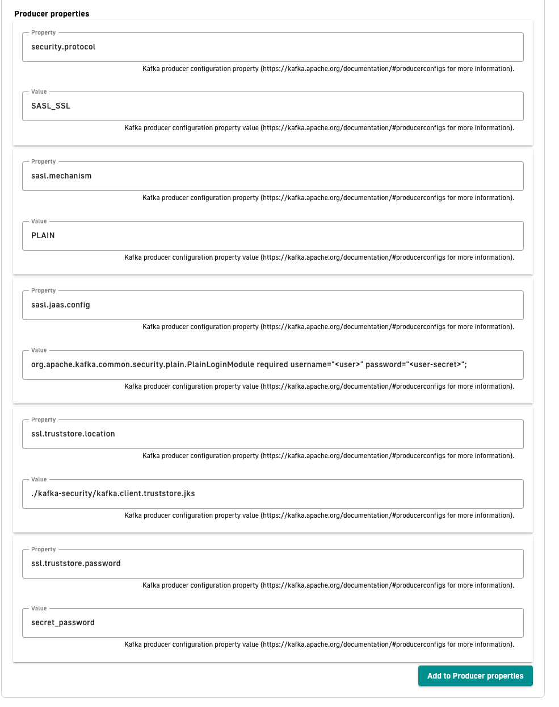

# Reporters

## Overview

Reporters are used by AM Gateway and API instances to report many types of events:

* Administration metrics: administrative tasks (CRUD on resources)
* Authentication / Authorization metrics: (sign-in activity, sign-up activity)

A default reporter is created using a MongoDB or JDBC implementation according to the backend configured in the `gravitee.yml` file.

From AM version 3.6, you can create additional reporters.

## File reporter

This implementation is a file-based reporter for writing events to a dedicated file. You can use it for ingesting events into a third party system.

### Configuration

File reporters are configurable in the `gravitee.yml` file `reporter` section with the following properties:

<table><thead><tr><th width="121">property</th><th width="83">type</th><th width="97">required</th><th>description</th></tr></thead><tbody><tr><td>directory</td><td>string</td><td>N</td><td>Path to the file creation directory. The directory must exist (default: <code>${gravitee.home}/audit-logs/</code>)</td></tr><tr><td>output</td><td>string</td><td>N</td><td>Format used to export events. Possible values: JSON, MESSAGE_PACK, ELASTICSEARCH, CSV (default: JSON)</td></tr></tbody></table>

```yaml
reporters:
  file:
    #directory:  # directory where the files are created (this directory must exist): default value = ${gravitee.home}/audit-logs/
    #output: JSON # JSON, ELASTICSEARCH, MESSAGE_PACK, CSV
```

Audit logs will be created in a directory tree that represents the resource hierarchy from the organization to the domain. For example, audit logs for domain `my-domain` in environment `dev` and organization `my-company` will be created in the following directory tree: `${reporters.file.directory}/my-company/dev/my-domain/audit-2021_02_11.json`


There is currently no retention period for the audit logs, so you need to create a separate process to remove old logs.


For details on how to create a file reporter for a domain, see the [Audit trail](../../guides/audit-trail.md) documentation.

## Kafka reporter

This reporter sends all audit logs to Kafka Broker using JSON serialization.

### **Minimal configuration**

The following table shows the properties that Kafka reporter requires:

| Property          | Description                                                                                                            |
| ----------------- | ---------------------------------------------------------------------------------------------------------------------- |
| Name              | The reporter human readable name used to identify the plugin in the UI                                                 |
| Bootstrap servers | Comma-separated list of host and port pairs for the the initial connection to the Kafka cluster                        |
| Topic             | Kafka topic to send audit events.                                                                                      |
| Acks              | The number of acknowledgments the producer requires the leader to have received before considering a request complete. |

### **Additional properties**

To add additional properties to the producer, add property config name and value to the Producers properties section. For more information about supported properties, go to [Kafka](https://kafka.apache.org/documentation/#producerconfigs).

### **Schema Registry**

Kafka reporter supports Schema registry. This configuration is optional. When the schema registry URL is not provided, then messages is sent to Kafka Broker in JSON format. When the schema registry URL is provided, then the schema of the message will be stored in Schema Registry and ID and version of the schema is attached at the beginning of the JSON message.

Currently, only JSON schema is supported.

### **Partition key**

Kafka reporter sends all messages to separate partitions based on domain id or organization id. This means that all audit log messages from one domain is sent to the same partition key.

### Secured Kafka connection

#### SASL/PLAIN

1. To create secured connection between Kafka Reporter and Kafka Broker, configure your Kafka broker.
2. As described in the following Kafka documentation, add to your broker configuration JAAS configuration:

* [https://kafka.apache.org/documentation/#security\_sasl\_jaasconfig](https://kafka.apache.org/documentation/#security_sasl_jaasconfig)
* [https://kafka.apache.org/documentation/#security\_sasl\_brokerconfig](https://kafka.apache.org/documentation/#security_sasl_brokerconfig)

3. When you configure your broker correctly, add additional **Producer properties** to your Kafka Reporter:

`security.protocol = SASL_PLAINTEXT`

`sasl.mechanism = PLAIN`

`sasl.jaas.config = org.apache.kafka.common.security.plain.PlainLoginModule required username="<user>" password="<user-secret>";`

<figure><figcaption><p>Kafka plaintext security config</p></figcaption></figure>

**TLS/SSL encryption**

If the Kafka broker is using SSL/TLS encryption, you must add additional steps to secure this connection.

1. Place trusted truststore certificate along with AM Management installation.
2. Specify location and password of this trust store and change `security.protocol` in **Producer properties:**

\
`security.protocol = SASL_SSL`

`sasl.mechanism = PLAIN`

`sasl.jaas.config = org.apache.kafka.common.security.plain.PlainLoginModule required username="<user>" password="<user-secret>";`

`ssl.truststore.location = "/path/to/kafka.client.truststore.jks`

`ssl.truststore.password = "secret_password"`

<figure><figcaption><p>Kafka TLS/SSL security config</p></figcaption></figure>
