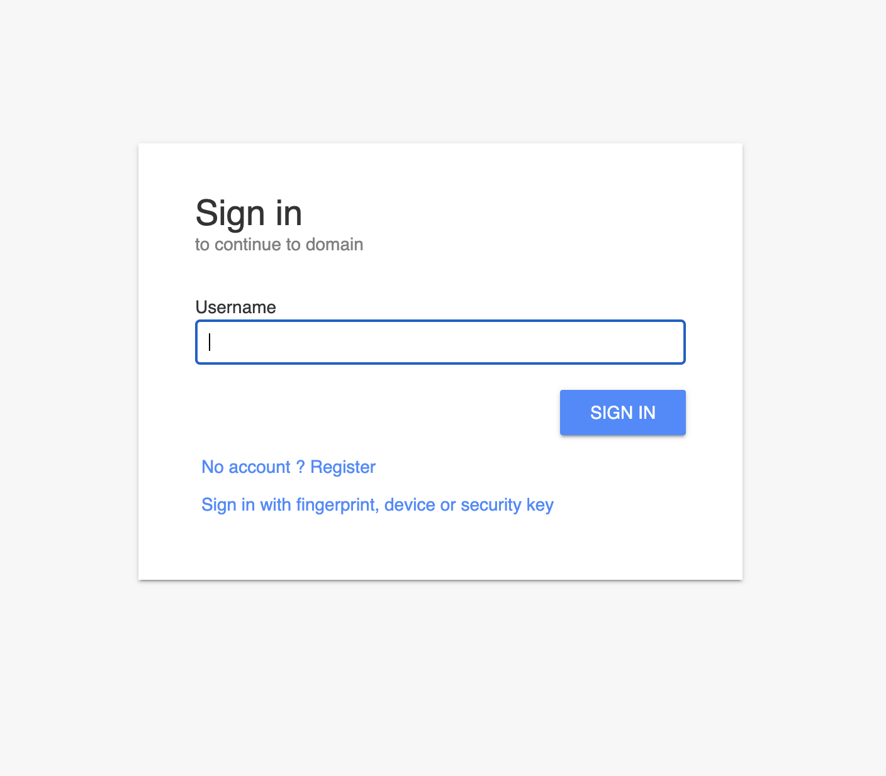
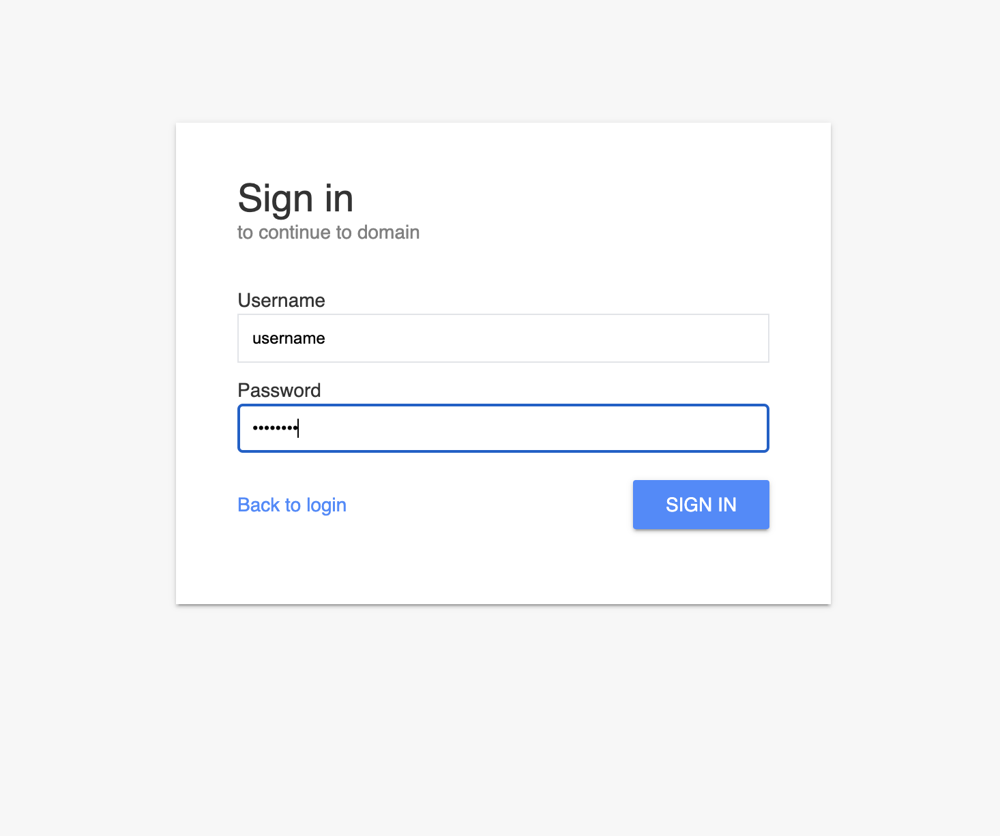
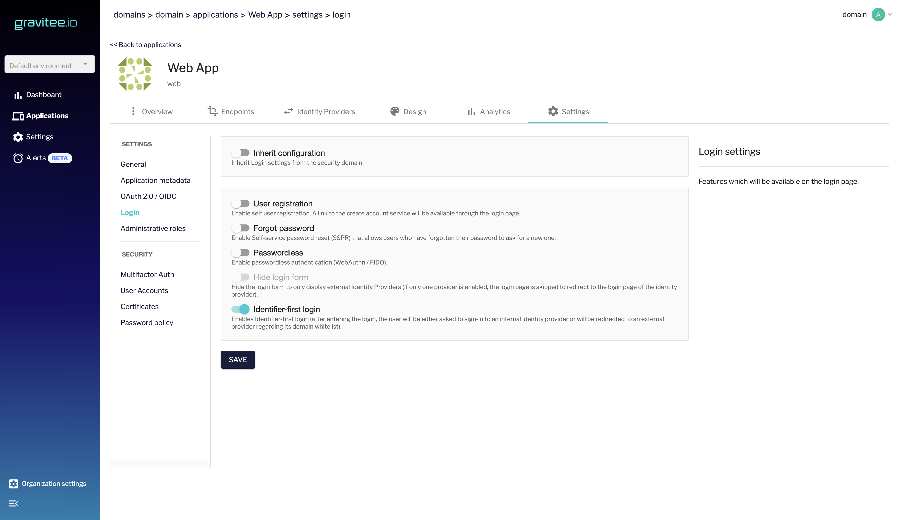
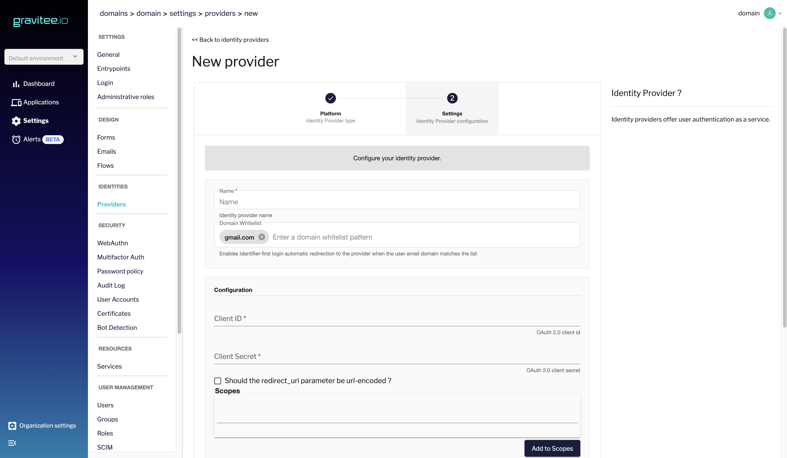

# Identifier-first Login Flow

## Overview

Identifier-first login authentication enables the login flow to be split into two steps:

* The first step consists in a page containing a single form field where you can input your username

<figure><figcaption>
Split login first step
</figcaption></figure>

* Regarding the input submitted, the user gets redirected to the login form and is asked to input your password
* If the username is an email, the user gets redirected to an external provider matching your domain based on a whitelist

<figure><figcaption>
Split login second step
</figcaption></figure>

## Activate Identifier-first Login

To activate Identifier-first login Flow:

1. Log in to AM Console.
2. Go to **Settings > Login** or **Application > "Your app" > Settings > Login**.
3. Switch on **Identifier-first login** and click **SAVE**.

<figure><figcaption>
Enable identifier-first login
</figcaption></figure>

## Identity providers allowed domain list

External Identity providers now enable you to enter domain whitelists so that if the username submitted is an email and its domain does not match the whitelisted domains after a login attempt, they won’t be allowed to login.

If you don’t input any domain however, everyone will be able to login.

1. Go to **Settings > Providers**.
2. Create a new provider or Edit an existing one
3. Enter the domains you wish to allow
4. Complete the provider’s form and click **SAVE**.

<figure><figcaption>
Add provider to domain list
</figcaption></figure>
