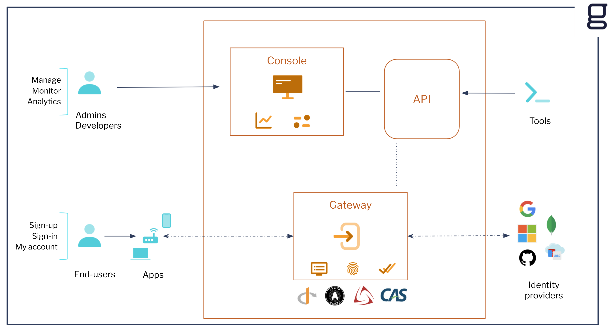
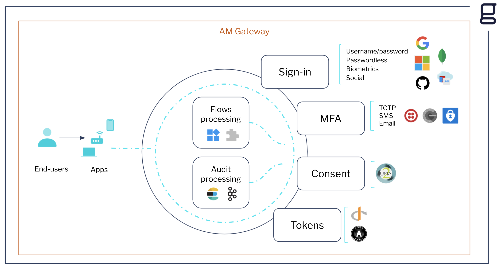

# AM Architecture

This page provides details on Gravitee Access Management's (AM) architecture. Before you install and use the product, take a few moments to get to know the AM architecture.

## Global Architecture

<figure><figcaption>
AM global architecture
</figcaption></figure>

## AM Gateway

AM Gateway is the core component of the AM platform. It acts as a trust broker with your identity providers and provides an authentication and authorization flow for your users.

<figure><figcaption>
AM - Internal Gateway
</figcaption></figure>
