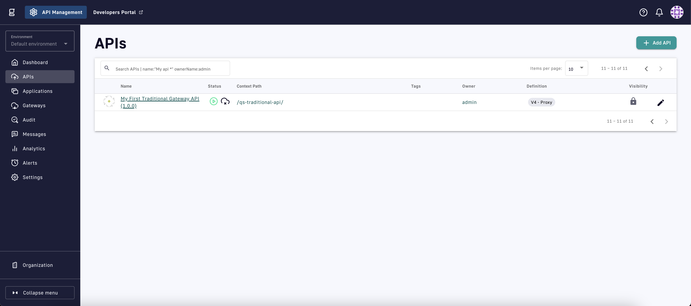
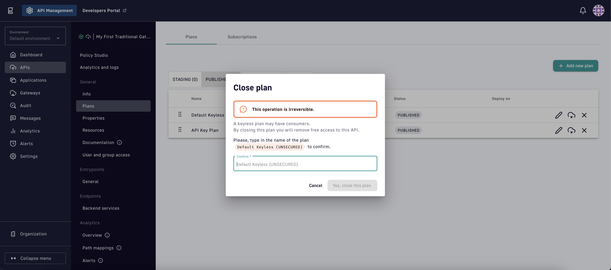

# Plans and Policies 101


This is the second section of the Quickstart Guide. By this point, you should already have [created a Gateway API](broken-reference). The relevant steps will be provided for both traditional proxy and message proxy Gateway APIs.


## Overview

The next two core Gravitee API Management (APIM) concepts we will focus on are plans and policies:

* **Plans:** an access layer around APIs that provides API publishers with a method to secure, monitor, and transparently communicate details around access for different subsets of API consumers.
* **Policies:** customizable rules or logic the Gateway executes during an API transaction. Policies generally fall into the categories of security, transformation, restrictions, performance, routing, or monitoring & testing.

Plans and policies are managed by the API publisher, the owner of the backend resources, to add different layers of security and functionality to their backend resources.

<figure><figcaption><p>Gateway plans and policies</p></figcaption></figure>

### Plans

There are many possible types of API access scenarios, which can be difficult to encode into your backend services. Plans are a powerful way to decouple the business logic from the access control of your backend services.&#x20;

In APIM, all APIs require at least one plan before they can be deployed on the Gateway. The most important part of plan configuration is selecting the security type. APIM supports the following five security types:

* Keyless (public)
* Push
* API Key
* OAuth 2.0
* JWT

APIM intelligently routes API consumers to plans [based on specific criteria](../../guides/api-exposure-plans-applications-and-subscriptions/plans.md#plan-selection) in the API request. APIM then uses an application-based subscription model to decide whether to accept or deny an incoming API request.&#x20;

<details>

<summary>Applications and subscriptions</summary>

Plans are an access layer around APIs. An _application_ allows an API consumer to register and agree to this plan. If the registration is approved by the API publisher, the result is a successful contract or _subscription_.

To access your APIs, consumers must register an application and submit a subscription request to a published API plan. Applications act on behalf of the user to request tokens, provide user identity information, and retrieve protected resources from remote services and APIs.

API publishers can modify a subscription at any time which includes transferring API consumers to a different plan, pausing the subscription, setting an expiration date, or permanently closing a subscription.

#### **Keyless plan subscriptions**

APIs with keyless plans do not require the API consumer to create an application or submit a subscription request as no authorization is required with this plan. Deployed APIs with a keyless plan will be publicly available on the Gateway's network.

</details>

### Policies

A policy modifies the behavior of the request or response handled by APIM Gateway. Policies can be considered like a proxy controller, guaranteeing that a given business rule is fulfilled during request/response processing.

The request and response of an API transaction are broken up into _phases_. Policies can applied to these phases in policy chains of arbitrary length.

<details>

<summary>Phases</summary>

Gateway APIs have the following phases:

* **Request:** This phase is executed before invoking the backend services for both traditional and message proxy APIs. Policies can act on the headers and the content for traditional proxy APIs.
* **Publish:** This phase occurs after the request phase and allows policies to act on each incoming message before being sent to the backend service. This phase only applies to message proxy APIs.
* **Response:** This phase is executed after invoking the backend services for both traditional proxy and message proxy APIs. Policies can act on the headers and the content for traditional proxy APIs.
* **Subscribe:** This phase is executed after the response phase and allows policies to act on each outgoing message before being sent to the client application. This phase only applies to message proxy APIs.

</details>

Policies are scoped to different API consumers through _flows_. Flows are essentially a method to control where, and under what conditions, a group of policies act on an API transaction.&#x20;

### Example

Let's say you have a backend API server architected around flight data. The data itself is not sensitive, and you want to allow anyone to easily read the data. However, the data itself is supplied by verified airlines; therefore, you want to limit data modifications to specific API consumers that are explicitly granted permission.&#x20;

APIM makes this easy and does not require any modifications to the backend API server.&#x20;

In APIM, you could create two plans: a keyless plan and a JWT plan. The keyless plan does not require API consumers to create an application or submit a subscription request. The keyless plan allows API consumers on the Gateway's network to immediately begin sending requests to this API through the available entrypoints.

However, you also configure the keyless plan with a flow containing a resource filtering policy applied to the request phase. This policy is configured to only grant read access to the backend API. All other types of API requests (e.g. POST, PUT, DELETE, etc.) will be denied.

The flow with the resource filtering policy does not apply to the JWT plan. Therefore, API consumers subscribed to the JWT plan can modify data associated with their airline. But to be granted access, users must first create an application and submit a subscription request that must be approved by you, the API publisher.&#x20;

***

## Add a policy

Let's see how to add a simple policy to modify the behavior of the Gateway API we created in the [first part of the Quickstart guide](broken-reference).

### Access API

First, we need to open the API in the APIM Console. You may already have the API open from the previous part of the Quickstart guide.

If not, simply head back over to **APIs** home screen and select the API you created.

<figure><figcaption><p>APIs homescreen</p></figcaption></figure>

> * [x] Select **APIs** in the sidebar
> * [x] Select the API you created in Gateway APIs 101

### Policy Studio

Once you're back to your API's **General Info** page, we need to go to the **Policy Studio**.&#x20;

<figure><figcaption><p>API General Info page</p></figcaption></figure>

> * [x] Select **Policy Studio** in the inner sidebar

#### Creating a flow

The Policy Studio is a powerful interface for visually designing flows and applying policies to your APIs. Remember, flows are a way to group policies and set conditions that determine what API requests trigger the flow.

The first way to condition a flow is by plan. Every plan that is added to an API can have its own set of flows. You should see your **Default Keyless (UNSECURED)** plan on the left side of the Policy Studio.&#x20;

Additionally, you should see **Common flows**. Let's add a flow here to ensure our policy applies to all consumers of our API, regardless of the plan they are subscribed to.

<figure><figcaption><p>Adding a flow under Common flows</p></figcaption></figure>

> * [x] Select the **+ icon** to the right of Common flows
> * [x] Provide a name for the flow and select **Create**

<details>

<summary>Flow conditions</summary>

We are purposefully keeping this flow very simple. However, the conditions that trigger a flow can be fine-tuned far beyond just assigning the flow to a plan.&#x20;

* **Operator and path:** Use this condition to trigger a flow based on the path of the API request. This condition is evaluated for every request and the flow will only trigger if this condition evaluates to `true`
* **Methods:** Select the HTTP methods this flow will apply to
* **Expression Language Condition:** Use [Gravitee's Expression Language (EL)](../../guides/gravitee-expression-language.md) to provide custom conditions. This condition is evaluated for every request and the flow will only trigger if this condition evaluates to `true`

</details>

#### Adding a policy

Creating the flow will open up the flow editor. This screen will look different based on whether you are working with a traditional or message proxy API. Follow the instructions that match your API's proxy type:

* **Traditional proxy:** These APIs only have two phases available, request and response. We will be adding the policy to the response phase.

<figure><figcaption><p>Add policy to the response phase of traditional proxy API</p></figcaption></figure>

> * [x] Select the **+ icon** in the **Response phase**

* **Message proxy:** These APIs have four phases available, request, response, publish, and subscribe. The publish and subscribe phase allows the policy to be applied on the message level. We will be adding the policy to the subscribe phase.

<figure><figcaption><p>Add policy to the subscribe phase of a message proxy API</p></figcaption></figure>

> * [x] Select the **Event messages** tab in the flow editor
> * [x] Select the **+ icon** in the **Subscribe phase**

The next steps will look the same for both traditional and message proxy APIs.

The previous actions will open up the policy selector. We are going to add an Assign Content policy that allows us to modify the content of the payload before it reaches the API consumer.

<figure><figcaption><p>Adding an Assign Content policy</p></figcaption></figure>

> * [x] Click Select under the **Assign content** policy

Every policy allows you to provide a **Description** and a **Trigger condition**. Trigger conditions for policies are just like trigger conditions for flows except these allow you to set independent conditions for each policy.&#x20;

Additionally, every policy has configuration settings specific to that policy. For the Assign Content policy, we can override the payload of the response or individual message by supplying a string in the **Body content** input box.

<figure><figcaption><p>Configuring the Assign Content policy</p></figcaption></figure>

> * [x] Type a string in the **Body content** input box
> * [x] Select **Add policy** to add it the flow
> * [x] Select **Save** in the top right of the flow editor

You should now see the Assign Content policy added to the correct phase of the flow.

#### Redeploy an API

After saving, you'll notice a banner appearing at the top of the Console that says **This API is out of sync**. This means the changes you have made in the Console are saved but have not yet been propagated to the Gateway.&#x20;

To ensure these changes are synced to the Gateway, the API must be redeployed.&#x20;

<figure><figcaption><p>Redeploying an API</p></figcaption></figure>

> * [x] Select **Deploy API** in the top right
> * [x] Select **Deploy** in the modal that pop-ups on the screen

This is an essential concept to understand. Deploying an API is a sync mechanism between the Console and Gateway. Changes in the Console must be synced to the Gateway for them to have any impact on the API consumers actually sending requests to the Gateway.

### Test your policy

Try sending the same request from the first part of the Quickstart guide.


```sh
curl -X GET -i "https://your-gateway-server/your-context-path"
```



Regardless of whether it's a traditional or message proxy API, the payload of the response will be set to whatever you provided as the body content of the Assign Content policy.


## Add a plan

Now let's see how we can manage the plans for this same API.

### Manage your API's plans

From the Policy Studio, we need to go to the **Plans** page.&#x20;

<figure><figcaption><p>Policy Studio</p></figcaption></figure>

> * [x] Select **Plans** in the inner sidebar

From here, we can manage all the plans and subscriptions for this API. Currently, the only plan you should see is the **Default Keylesss (UNSECURED)** plan that was added by default when creating the API.

This plan is currently in the published state. Plans can be in one of four states: staging, published, deprecated, or closed.

<figure><figcaption><p>Four stages of a plan</p></figcaption></figure>

<details>

<summary>Plan stages explained</summary>

**Staging:** This is the first stage of a plan. View it as a draft mode. You can configure your plan but it won’t be accessible to users.

**Published:** Once your plan is ready, you can publish it to let API consumers view and subscribe on the APIM Portal and consume the API through it. A published plan can still be edited.

**Deprecated (optional state):** You can deprecate a plan so it won’t be available on the APIM portal and API Consumers won’t be able to subscribe to it. Existing subscriptions remain so it doesn’t impact your existing API consumers.

**Closed:** Once a plan is closed, all associated subscriptions are closed too. This can not be undone. API consumers subscribed to this plan won’t be able to use your API.

</details>

Let's go ahead and add an API key plan for some security:

<figure><figcaption><p>API Plans page</p></figcaption></figure>

> * [x] Select **+ Add new plan** in the top right
> * [x] Select **API Key** in the dropdown

This will open the **General** page of the plan creation wizard. The only required configuration is providing the plan a name.

<figure><figcaption><p>General page of plan creation wizard</p></figcaption></figure>

> * [x] Provide a **Name** for the plan
> * [x] Scroll down to the bottom and select **Next**

The next step is to configure the security settings specific to the plan type you selected. For our API key plan, we will just keep the defaults.

<figure><figcaption><p>Security configuration page of plan creation wizard</p></figcaption></figure>

> * [x] Leave the defaults and select **Next**

Finally, if desired, you can add some restriction policies directly to the plan as part of the creation process.

<figure><figcaption><p>Restrictions page of the plan creation wizard</p></figcaption></figure>

> * [x] Leave the defaults and select **Create**

This will create the plan in the **Staging** state. To make it available to API consumers, we need to publish it.

<figure><figcaption><p>Publish the new API key plan</p></figcaption></figure>

> * [x] Select the **publish icon** to the far right of plan
> * [x] Select **Publish** in the modal that pop-ups on the screen

This will change the API key plan from a staging to published state.&#x20;

To ensure our new API key plan can't be bypassed, we want to go ahead and close the keyless plan and then sync all the changes we've made to the Gateway.

<figure><figcaption><p>Closing the keyless plan </p></figcaption></figure>

> * [x] Select the **delete icon** to the far right of the keyless plan
> * [x] Confirm the delete by typing in the name of the plan and then selecting **Yes, close this plan**
> * [x] Sync these changes to the Gateway by selecting **Deploy API** in the banner&#x20;

### Test the plan

One more time, try sending the same request from the first part of the Quickstart guide.


```sh
curl -X GET -i "https://your-gateway-server/your-context-path"
```



The request will be denied with an HTTP **`401 Unauthorized`** error response status code.&#x20;


Although an error response, this is a success as it confirms the keyless plan was removed and all requests are now routed to the API key plan. We will need to subscribe and pass the proper authorization token with each request to continue to use the API.

## Next steps

You should now be starting to grasp the power and the versatility of the Gravitee APIM platform that allows it to address a huge diversity of use cases.&#x20;

For the final part of the Quickstart guide, we will be diving into the Developer Portal to show how API publishers can expose and catalog their APIs, and how API consumers can create applications and subscribe to APIs in that catalog.

<table data-card-size="large" data-view="cards"><thead><tr><th></th><th></th><th></th><th data-hidden data-card-target data-type="content-ref"></th></tr></thead><tbody><tr><td></td><td>Developer Portal 101</td><td></td><td><a href="broken-reference">Broken link</a></td></tr></tbody></table>
