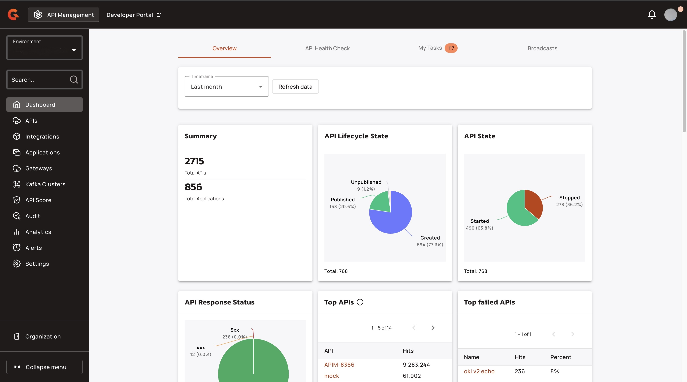
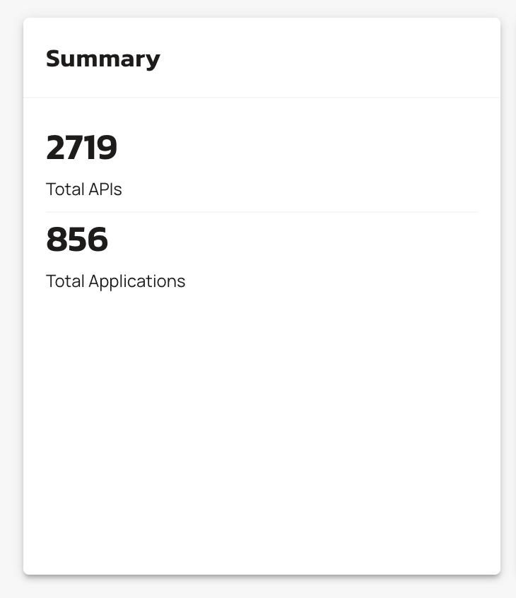
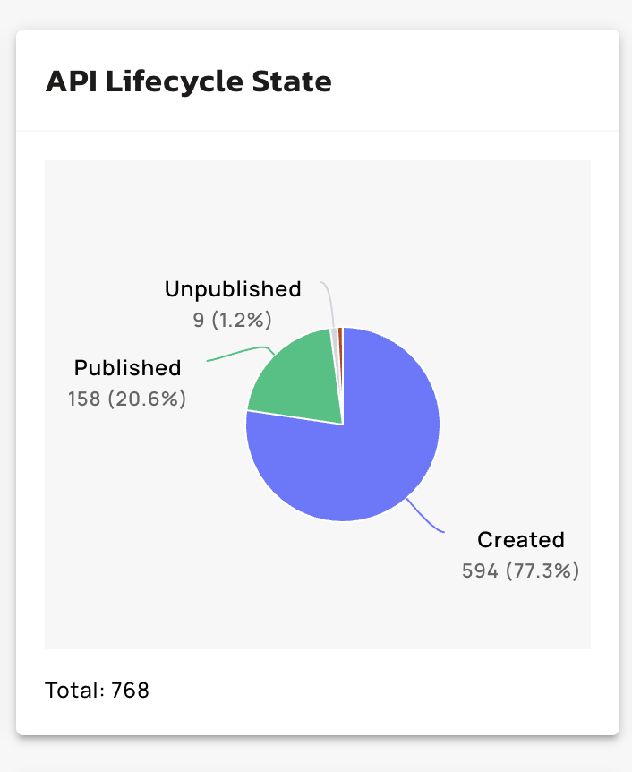
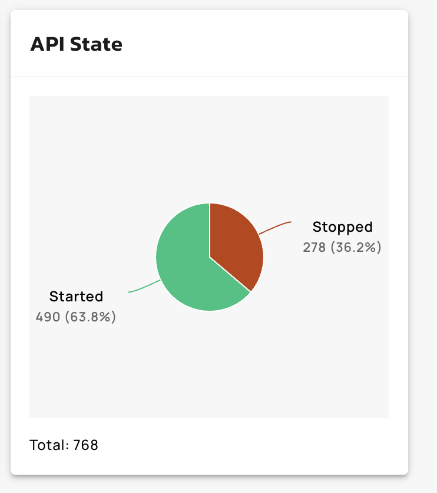
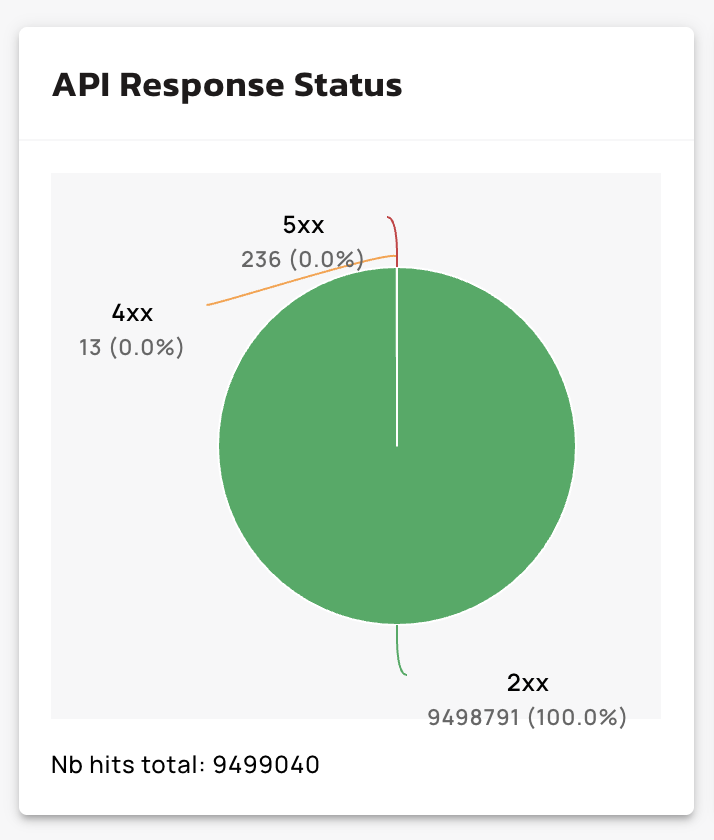
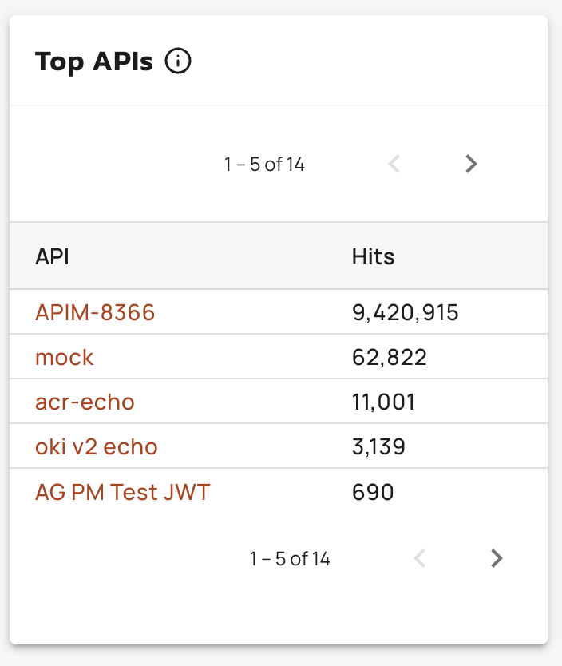
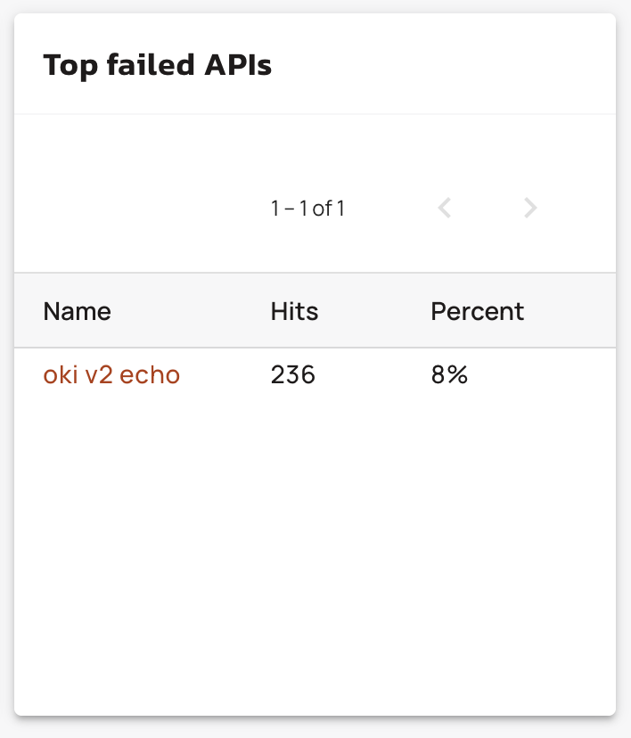
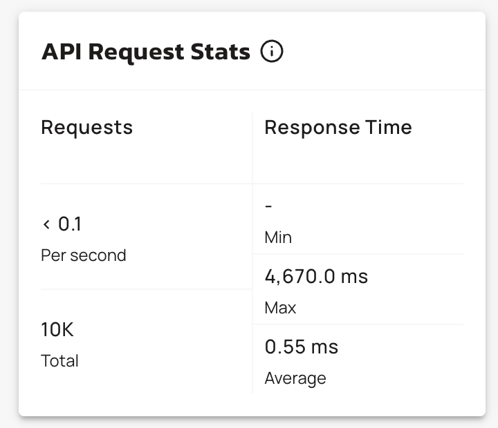

# Overview dashboard

## Overview

The Overview Dashboard provides you with clear visibility into the API performance and traffic patterns for all of your APIs at the environment level. These metrics include a Summary of the total APIs and total applications, API lifecycle and state, API request statistics, and response status. 

<figure><figcaption></figcaption></figure>

## Available metrics

*   **Summary.** This metrics shows your total number of APIs and your total number of applications. 

    <figure><figcaption></figcaption></figure>
*   **API Lifecycle state**. This graph shows the number of APIs in each stage of the lifecycle. 

    <figure><figcaption></figcaption></figure>
*   **API State.** This graph shows the number of APIs in each state. 

    <figure><figcaption></figcaption></figure>
*   **API Response Status**. This graph show the number of each API response and the total number of hits. 

    <figure><figcaption></figcaption></figure>
*   **Top APIs**. This table ranks your APIs based on the amount of hits that they received within a specific period of time. 

    <figure><figcaption></figcaption></figure>
*   **Top failed APIs**. This table ranks the APIs with the most failures based on the amount of hits that the APIs received within a specific period of time. 

    <figure><figcaption></figcaption></figure>
*   **API Request Stats**. This table shows the total number of API request and the average response time per second. Also, this table shows the minimum, maximum response time, and the average response time in milliseconds. 

    <figure><figcaption></figcaption></figure>
* **Top applications**. This table ranks your applications by the number of hits that the applications received within a specific period of time.
