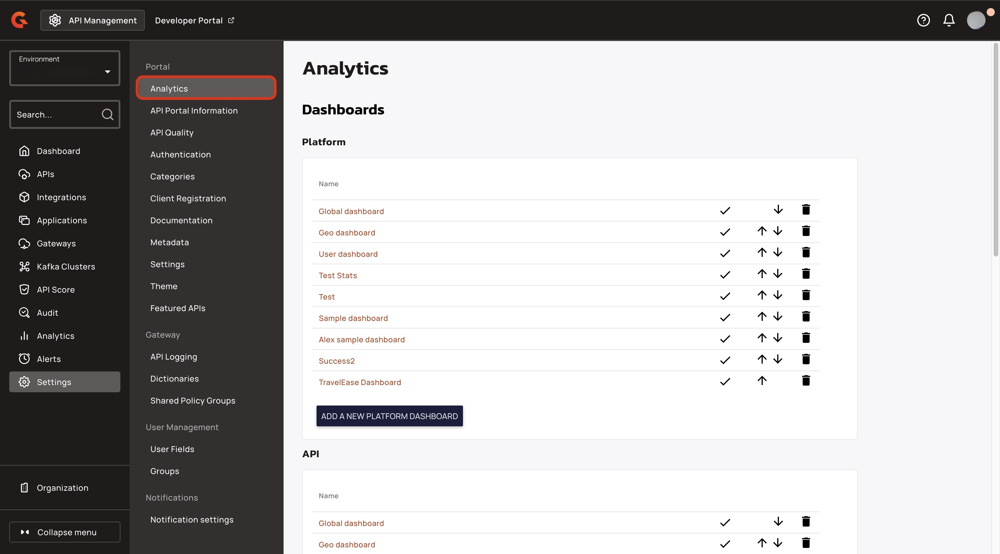
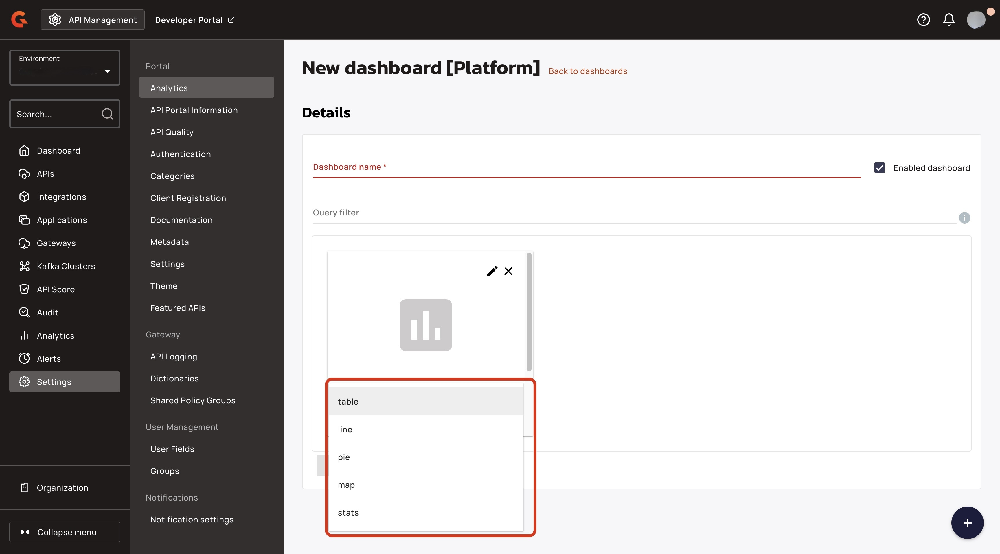
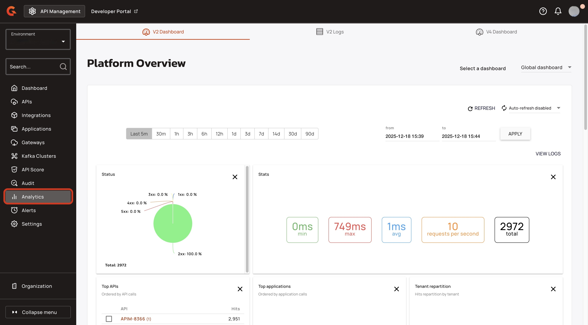

# V2 API analytics dashboards

## Overview

The V2 API analytics dashboard provides you with clear visibility into the API performance and traffic patterns for all of your V2 APIs at the environment level. It displays real-time analytics with configurable dashboard tabs and an API Events log.

The Dashboard is fully customizable. For more information about creating configuring a V2 API analytics dashboard, see [#create-a-dashboard](v2-api-analytics-dashboards.md#create-a-dashboard "mention").

## Access the Dashboards

*   From the **Dashboard**, click **Analytics**. 

    <figure><figcaption></figcaption></figure>

The Analytics section opens on the v2 API analytics Dashboard.

<figure><figcaption></figcaption></figure>

## Create a dashboard

You can configure your Gravitee Dashboard by creating dashboard charts for three different categories: **Platform (v2 APIs only)**, **API**, and **Applications**. To create a chart:

1.  From the **Dashboard**, click **Settings**. 

    <figure><figcaption></figcaption></figure>
2.  From the **Settings** menu, click **Analytics**.  

    <figure><figcaption></figcaption></figure>
3. Add your new platform dashboard, API dashboard, or application dashboard. To add a new dashboard, follow the steps for the dashboard that you want to create:
4.  Click **ADD A NEW PLATFORM DASHBOARD**, **ADD A NEW API DASHBOARD**, or **ADD A NEW APPLICATION DASHBOARD**. 

    <figure><figcaption></figcaption></figure>
5. In the **Dashboard** name field, type a name for your Dashboard. For example, `sample dashboard`.
6. (Optional) Clear the **Enabled dashboard**.
7. (Optional) In the **Query filter** field, type a query filter for your dashboard. For example, to get hits geo-localized in France, use `geoip.country_iso_code:FR`.
8.  Click the **plus (+)** button to add a widget. A blank widget appears on the screen. 

    <figure><figcaption></figcaption></figure>
9. From the **Widget type** dropdown menu, select one of the following widgets:
   * table
   * line
   * pie
   * map
   *   stats 

       <figure><figcaption></figcaption></figure>
10. Configure your widget. To configure your widget, follow the steps for the widget you selected in step 10:



1) In the **Title** field, type a name for your widget.&#x20;
2) (Optional) In the **Subtitle** field, type a subtitle for your widget.&#x20;
3) From the **Field dropdown menu**, select one of the following options:
   * API
   * Application&#x20;
   * Plan
   * Path
   * Mapped path&#x20;
   * HTTP Status
   * Tenant
   * Host&#x20;
   * Consumer IP&#x20;
   * Country&#x20;
   * City
   * User
   * User agent&#x20;
   * Operating system&#x20;
   * Zone
4) From the **Projection** dropdown menu, select one of the following options:
   * Hits
   * Global latency (ms)
   * API latency (ms)
   * Proxy latency (ms)
   * Request content length (byte)
   * Response content length (byte)
5) From the **Order** dropdown menu, select one of the following options:
   * Desc&#x20;
   * Asc
6) (Optional) Select the **Display percentage** checkbox.
7)  Click **the pencil icon**.  

    <figure><figcaption></figcaption></figure>



1. In the **Title** field, type a name for your widget.&#x20;
2. (Optional) In the **Subtitle** field, type a subtitle for your widget.&#x20;
3. From the **Field dropdown menu**, select one of the following options:
   * Average global latency ms
   * Average api latency ms
   * Average proxy latency ms&#x20;
   * Average request content length byte&#x20;
   * Average response content length byte&#x20;
   * By api&#x20;
   * By application&#x20;
   * By plan&#x20;
   * By path&#x20;
   * By mapped path&#x20;
   * By http status&#x20;
   * By tenant&#x20;
   * By host&#x20;
   * By consumer ip
   * By country&#x20;
   * By city&#x20;
   * By user agent&#x20;
   * By operating system
   * By zone
4. (Optional) Select the **Display stacked** checkbox.&#x20;
5. (Optional) Select the **Allows to check a field filter** checkbox.
6.  Click **the pencil icon**.  

    <figure><figcaption></figcaption></figure>



1. In the **Title** field, type a name for your widget.&#x20;
2. (Optional) In the **Subtitle** field, type a subtitle for your widget.&#x20;
3. From the **Field dropdown menu**, select one of the following options:
   * HTTP Status&#x20;
   * Global latency (ms)
   * API Latency (ms)&#x20;
   * Proxy latency (ms)&#x20;
   * Request content length (byte)
   * Response content length (byte)
4. Click **the plus icon.**&#x20;
5. In the **Min** field, type a minimum number for your pie section.
6. In the **Max** field, type a maximum number for your pie sectio&#x6E;**.**&#x20;
7. In the **label** field, type a label name for your pie section.
8.  Use the **color** selector to pick a color for your pie section.  

    <figure><figcaption></figcaption></figure>
9.  Click **the pencil icon**. 

    <figure><figcaption></figcaption></figure>




1. In the **Title** field, type a name for your widget.&#x20;
2. (Optional) In the **Subtitle** field, type a subtitle for your widget.&#x20;
3.  Click **the pencil icon**.  

    <figure><figcaption></figcaption></figure>



1. In the **Title** field, type a name for your widget.&#x20;
2. (Optional) In the **Subtitle** field, type a subtitle for your widget.&#x20;
3. From the **Field** dropdown menu, select from the following options:
   * Global latency (ms)
   * API latency (ms)
   * Proxy latency (ms)
   * Request content length (byte)
   * Response content length (byte)
4. From the **Stats** menu, select from the following options:
   * min
   * max
   * avg
   * requests per second&#x20;
   * total
   * sum
5.  Click **the pencil icon**.  

    <figure><figcaption></figcaption></figure>



12. (Optional) Move your widget to a new location. To move your widget, click and hold the widget and then move the widget to a new location on your dashboard.
13. (Optional) Adjust the size of the widget. To adjust the size of the widget, navigate to the edges of the widget or the corner of the widgets, click and hold the widget, and then drag the widget to adjust the size.&#x20;
14. (Optional) Enable a preview of your dashboard. To enable a preview of your dashboard, click **ENABLE PREVIEW**. 

    <figure><figcaption></figcaption></figure>
15. Click **SAVE**.

### Verification

1.  From the **Dashboard**, click **Analytics**. 

    <figure><figcaption></figcaption></figure>
2.  Click the **Select a Dashboard dropdown menu**. Your Dashboard appears in the dropdown menu.  

    <figure><figcaption></figcaption></figure>

## View your dashboard

1.  From the **Dashboard**, click **Analytics**. 

    <figure><figcaption></figcaption></figure>
2.  From the **Select a dashboard**, select the dashboard that you want to view.  

    <figure><figcaption>
View your dashboard
</figcaption></figure>

## Edit an existing dashboard

1.  From the **Dashboard**, click **Settings**. 

    <figure><figcaption></figcaption></figure>
2. From the **Settings** menu, click **Analytics**.
3.  Click the name of the dashboard that you want to view. 

    <figure><figcaption></figcaption></figure>
4. Edit your dashboard and widgets. For more information about editing your dashboard, see [#create-a-dashboard](v2-api-analytics-dashboards.md#create-a-dashboard "mention").
5. Click **SAVE.**
